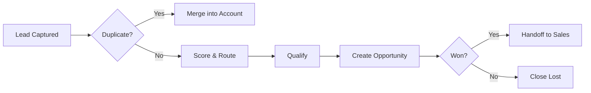

# Volume 06 - Customer Relationship Management (CRM)

| Field | Value |
|---|---|
| Document ID | WORLD-VOL06-006 |
| Title | CRM |
| Version | 1.0 |
| Status | Approved |
| Classification | Internal |
| Founder | Mahesh Choudhary |

## Purpose

The CRM module is the system of engagement for every relationship the enterprise holds with prospects, leads, and existing customers. It captures, structures, and enriches relationship data so that the AI Business Partner (Volume 03) can reason over the full commercial context of an account and act on the operator's behalf. CRM operationalizes the customer-centric principles of the Business Foundation (Volume 02) and persists its records on the ERP Foundation (Volume 05).

## Scope

This document covers lead capture, qualification, contact and account management, opportunity tracking, activity logging, and the handoff to the Sales module. It excludes quotation-to-cash execution (see WORLD-VOL06-007 Sales), point-of-sale checkout (WORLD-VOL06-008), and physical data schemas, which belong to Volume 09.

## Business Value

CRM converts scattered, tacit relationship knowledge into a governed, queryable asset. It shortens sales cycles, raises win rates, prevents relationship loss when staff change, and gives the AI Business Partner the substrate to recommend next-best actions. The measurable outcome is higher pipeline velocity and predictable revenue.

## Objectives

- Maintain a single, deduplicated record of every account and contact.
- Qualify inbound and outbound leads consistently against a shared rubric.
- Track opportunities through a disciplined stage model with reliable forecasts.
- Surface relationship risk and expansion signals proactively.
- Feed clean, structured data to Sales, POS, E-Commerce, and Business Intelligence (Volume 04).

## Responsibilities

The module owns the lifecycle of relationship master data and engagement transactions. It is responsible for lead scoring, ownership assignment, activity capture, and opportunity stage integrity. It is not responsible for order fulfilment or invoicing, which it triggers by handoff.

## Business Process

A lead enters through a marketing channel, e-commerce sign-up, or manual entry. It is deduplicated against existing accounts, scored, and routed to an owner. The owner qualifies it, converts it into an opportunity, and advances it through defined stages until it is won or lost. A won opportunity is handed to Sales for quotation and order creation.

## Master Data

| Entity | Description | Key Attributes |
|---|---|---|
| Account | Organization or individual customer | Name, industry, region, owner, status |
| Contact | Person linked to an account | Name, role, email, phone, consent flag |
| Lead | Unqualified interest | Source, score, stage, owner |
| Opportunity | Qualified revenue prospect | Amount, stage, probability, close date |

## Transactions

Activity logs (calls, meetings, emails), stage changes, lead conversions, opportunity updates, and ownership reassignments are the transactional events. Each is timestamped and attributed, providing the audit trail the ERP Foundation (Volume 05) requires.

## Business Rules

- A lead cannot become an opportunity without a mandatory qualification record.
- Duplicate accounts are merged, never silently overwritten.
- Opportunity probability is bound to its stage and cannot be set arbitrarily.
- Consent flags gate all outbound marketing communication.

## Workflow

Leads follow a routing workflow; opportunities follow a stage-gate workflow with approval checkpoints on discounting thresholds delegated to Sales. Escalations trigger when an opportunity stalls beyond a stage-specific SLA.

## Inputs

Marketing campaign data, e-commerce registrations (WORLD-VOL06-009), inbound enquiries, imported contact lists, and AI-enriched firmographic data.

## Outputs

Qualified opportunities to Sales, engagement history to Business Intelligence (Volume 04), and relationship context to the AI Business Partner.

## Dependencies

Depends on the ERP Foundation (Volume 05) for identity, audit, and multi-entity partitioning; on the Business Foundation (Volume 02) for the customer definition; and feeds the Sales module (WORLD-VOL06-007).

## KPIs

Lead-to-opportunity conversion rate, opportunity win rate, average sales cycle length, pipeline coverage ratio, and activities per opportunity.

## Reports

Pipeline by stage, conversion funnel, activity summary by owner, and aging opportunities report.

## Dashboards

An operator dashboard shows live pipeline value, weighted forecast, at-risk deals, and today's recommended actions surfaced by the AI Business Partner.

## Roles

Sales Representative, Sales Manager, Marketing Coordinator, and CRM Administrator.

## Permissions

| Role | Read | Create | Edit | Delete |
|---|---|---|---|---|
| Sales Representative | Own & team | Yes | Own | No |
| Sales Manager | All | Yes | All | Merge only |
| Marketing Coordinator | Leads | Yes | Leads | No |
| CRM Administrator | All | Yes | All | Yes |

## AI Features

The AI Business Partner (Volume 03) scores and prioritizes leads, drafts contextual outreach, predicts opportunity slippage, and recommends next-best actions. Example: for a stalled 50,000 USD renewal with a manufacturing account, it flags declining engagement, drafts a re-engagement email, and proposes a value-based discount within policy.

## Future Expansion

Relationship graph analytics, sentiment analysis on communications, and predictive account-based marketing orchestration.

## Cross-References

- [Sales](../section-b-sales-and-customer/07-sales.md)
- [E-Commerce](../section-b-sales-and-customer/09-e-commerce.md)
- [Volume 02 - Business Foundation](../../volume-02-business-foundation/README.md)
- [Volume 05 - ERP Foundation](../../volume-05-erp-foundation/README.md)

## References

- [Volume 01 - Vision and Philosophy](/docs/blueprint/volume-01-vision-and-philosophy/README.md)
- [Document Standards](/docs/governance/document-standards.md)

## Change Log

| Version | Date | Author | Notes |
|---|---|---|---|
| 1.0 | 2026-07-12 | Lead Software Engineer | Initial approved version. |
