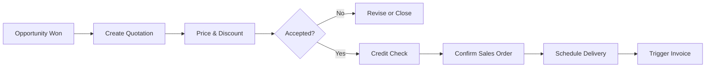

# Volume 06 - Sales

| Field | Value |
|---|---|
| Document ID | WORLD-VOL06-007 |
| Title | Sales |
| Version | 1.0 |
| Status | Approved |
| Classification | Internal |
| Founder | Mahesh Choudhary |

## Purpose

The Sales module executes the quotation-to-order lifecycle. It takes qualified opportunities from CRM (WORLD-VOL06-006) and converts them into priced quotations, confirmed sales orders, deliveries, and the trigger for invoicing. It operationalizes the pricing and commercial policy defined in the Business Foundation (Volume 02) and records every commitment on the ERP Foundation (Volume 05).

## Scope

Covers quotations, sales orders, pricing and discounting, credit checks, delivery scheduling, and invoice triggering. Excludes relationship management (CRM), retail checkout (POS, WORLD-VOL06-008), storefront transactions (E-Commerce, WORLD-VOL06-009), and physical schemas (Volume 09).

## Business Value

Sales turns intent into contracted, fulfillable revenue with governed pricing and margin control. It reduces revenue leakage from unauthorized discounts, accelerates order turnaround, and gives the AI Business Partner (Volume 03) the levers to optimize deal structure and cash conversion.

## Objectives

- Produce accurate, policy-compliant quotations quickly.
- Enforce pricing, discount, and credit controls automatically.
- Convert accepted quotations into confirmed orders without re-keying.
- Coordinate delivery and trigger timely, accurate invoicing.
- Protect and report contribution margin on every deal.

## Responsibilities

The module owns quotations and sales orders, price determination, discount authorization, and the fulfilment and billing handoffs. It does not own inventory movement or the general ledger posting, which it triggers in downstream modules.

## Business Process

A representative creates a quotation from an opportunity, the system determines price and applies discount rules, the customer accepts, a credit check runs, the order is confirmed, delivery is scheduled, and invoicing is triggered on fulfilment.

## Master Data

| Entity | Description | Key Attributes |
|---|---|---|
| Price List | Governed price by product and segment | Currency, validity, tier |
| Discount Policy | Authorized discount bands | Threshold, approver, limit |
| Payment Terms | Credit terms per customer | Days, method, limit |
| Product | Sellable item reference | SKU, unit, tax class |

## Transactions

Quotations, sales orders, order amendments, delivery notes, and invoice triggers. Each transaction is versioned and auditable per the ERP Foundation (Volume 05).

## Business Rules

- Discounts beyond a role's authority require approval before the order confirms.
- Orders cannot confirm if the customer exceeds credit limit without override.
- Prices are drawn only from active, valid price lists.
- A quotation is immutable once accepted; changes create a new version.

## Workflow

Quotation approval routes by discount depth; order confirmation routes through credit control; delivery scheduling coordinates with inventory availability. Exceptions escalate to the Sales Manager.

## Inputs

Qualified opportunities from CRM, active price lists, customer credit profiles, and product availability from the ERP Foundation.

## Outputs

Confirmed sales orders to fulfilment, invoice triggers to finance, and revenue signals to Business Intelligence (Volume 04).

## Dependencies

Depends on CRM (WORLD-VOL06-006) for opportunities, the Business Foundation (Volume 02) for pricing policy, and the ERP Foundation (Volume 05) for credit, tax, and audit.

## KPIs

Quote-to-order conversion rate, average order value, average discount percentage, order cycle time, and gross margin per order.

## Reports

Sales order register, discount exception report, margin analysis by product, and backlog aging.

## Dashboards

A sales operations dashboard tracks booked revenue, open orders, margin trend, and discount leakage with AI-flagged anomalies.

## Roles

Sales Representative, Sales Manager, Credit Controller, and Sales Administrator.

## Permissions

| Role | Quote | Confirm Order | Approve Discount | Override Credit |
|---|---|---|---|---|
| Sales Representative | Yes | Within limit | No | No |
| Sales Manager | Yes | Yes | Yes | No |
| Credit Controller | No | No | No | Yes |
| Sales Administrator | Yes | Yes | No | No |

## AI Features

The AI Business Partner (Volume 03) recommends optimal price points, predicts acceptance probability, flags margin-eroding discounts, and auto-drafts quotations. Example: for a 200,000 USD tender it proposes a tiered volume price that holds a 32 percent margin, predicts a 74 percent win probability, and routes the required approval automatically.

## Future Expansion

Dynamic AI-driven pricing, subscription and usage billing models, and guided configure-price-quote for complex products.

## Cross-References

- [CRM](../section-b-sales-and-customer/06-crm.md)
- [POS](../section-b-sales-and-customer/08-pos.md)
- [Volume 04 - Business Intelligence](../../volume-04-business-intelligence/README.md)
- [Volume 05 - ERP Foundation](../../volume-05-erp-foundation/README.md)

## References

- [Volume 01 - Vision and Philosophy](/docs/blueprint/volume-01-vision-and-philosophy/README.md)
- [Document Standards](/docs/governance/document-standards.md)

## Change Log

| Version | Date | Author | Notes |
|---|---|---|---|
| 1.0 | 2026-07-12 | Lead Software Engineer | Initial approved version. |
