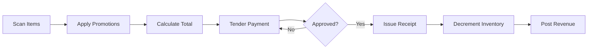

# Volume 06 - Point of Sale (POS)

| Field | Value |
|---|---|
| Document ID | WORLD-VOL06-008 |
| Title | POS |
| Version | 1.0 |
| Status | Approved |
| Classification | Internal |
| Founder | Mahesh Choudhary |

## Purpose

The POS module executes fast, in-person retail transactions at the counter. It captures sales, tenders payment, applies promotions, updates inventory, and posts revenue in real time. POS extends the Sales commercial policy of the Business Foundation (Volume 02) to the physical storefront and records every sale on the ERP Foundation (Volume 05).

## Scope

Covers checkout, payment capture, returns and exchanges, cash and shift management, promotions at point of sale, and offline resilience. Excludes B2B quotations (Sales, WORLD-VOL06-007), online storefront (E-Commerce, WORLD-VOL06-009), and physical schemas (Volume 09).

## Business Value

POS reduces checkout time, guarantees accurate cash and inventory reconciliation, and unifies in-store sales with the same ledger and customer record as every other channel. It gives the AI Business Partner (Volume 03) live floor data to optimize staffing, stock, and promotions.

## Objectives

- Complete a checkout in seconds with minimal keystrokes.
- Support multiple tender types including cash, card, and wallet.
- Keep inventory and revenue accurate in real time.
- Reconcile cash drawers and shifts without manual spreadsheets.
- Operate reliably during network interruptions.

## Responsibilities

The module owns the checkout transaction, tender capture, receipt issuance, shift and drawer reconciliation, and the real-time inventory decrement. It does not own procurement or general ledger closing, which it feeds downstream.

## Business Process

A cashier scans items, the system prices and applies promotions, the customer tenders payment, a receipt is issued, inventory decrements, and revenue posts. At shift end the drawer is counted and reconciled.

## Master Data

| Entity | Description | Key Attributes |
|---|---|---|
| Product | Sellable retail item | SKU, barcode, price, tax class |
| Terminal | Physical POS device | Location, drawer, status |
| Promotion | In-store offer | Type, rule, validity |
| Tender Type | Accepted payment method | Method, currency, settlement |

## Transactions

Sales receipts, returns, exchanges, void and refund transactions, cash drops, and shift reconciliations. Each is timestamped and tied to a cashier and terminal for the ERP Foundation (Volume 05) audit trail.

## Business Rules

- A sale cannot complete without full tender or authorized suspension.
- Returns require the original receipt or a supervisor override.
- Promotions apply only within their active validity window.
- Offline transactions queue and sync automatically on reconnection.

## Workflow

Checkout follows a scan-tender-receipt workflow; refunds route through supervisor approval; shift close follows a count-reconcile-post workflow with variance escalation.

## Inputs

Product catalog and prices from the ERP Foundation, active promotions, customer identity from CRM (WORLD-VOL06-006), and payment gateway responses.

## Outputs

Real-time inventory decrements, posted revenue to finance, loyalty accrual to CRM, and sales velocity signals to Business Intelligence (Volume 04).

## Dependencies

Depends on the ERP Foundation (Volume 05) for inventory and ledger, CRM (WORLD-VOL06-006) for customer and loyalty, and the Business Foundation (Volume 02) for pricing and tax policy.

## KPIs

Transactions per hour, average basket value, checkout duration, cash variance, and return rate.

## Reports

Daily sales summary, cashier performance, shift reconciliation, and returns analysis.

## Dashboards

A store manager dashboard shows live sales, basket trends, terminal status, and AI-recommended staffing and restock actions.

## Roles

Cashier, Store Supervisor, Store Manager, and POS Administrator.

## Permissions

| Role | Sell | Refund | Override Price | Close Shift |
|---|---|---|---|---|
| Cashier | Yes | No | No | No |
| Store Supervisor | Yes | Yes | Limited | Yes |
| Store Manager | Yes | Yes | Yes | Yes |
| POS Administrator | Yes | Yes | Yes | Yes |

## AI Features

The AI Business Partner (Volume 03) forecasts hourly demand, recommends dynamic bundling, detects fraud patterns in refunds, and predicts stockouts. Example: on a festival Saturday it forecasts a 40 percent footfall rise, recommends opening a third terminal at 11:00, and pre-triggers a replenishment order for a fast-moving SKU nearing depletion.

## Future Expansion

Self-checkout and mobile POS, biometric and wallet payments, and unified basket across online and in-store channels.

## Cross-References

- [Sales](../section-b-sales-and-customer/07-sales.md)
- [E-Commerce](../section-b-sales-and-customer/09-e-commerce.md)
- [CRM](../section-b-sales-and-customer/06-crm.md)
- [Volume 05 - ERP Foundation](../../volume-05-erp-foundation/README.md)

## References

- [Volume 01 - Vision and Philosophy](/docs/blueprint/volume-01-vision-and-philosophy/README.md)
- [Document Standards](/docs/governance/document-standards.md)

## Change Log

| Version | Date | Author | Notes |
|---|---|---|---|
| 1.0 | 2026-07-12 | Lead Software Engineer | Initial approved version. |
