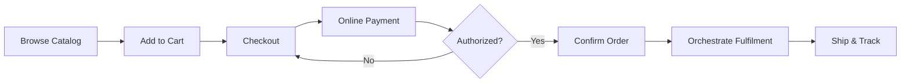

# Volume 06 - E-Commerce

| Field | Value |
|---|---|
| Document ID | WORLD-VOL06-009 |
| Title | E-Commerce |
| Version | 1.0 |
| Status | Approved |
| Classification | Internal |
| Founder | Mahesh Choudhary |

## Purpose

The E-Commerce module runs the online storefront: catalog browsing, cart, checkout, digital payment, and order orchestration across the web and mobile channels. It projects the enterprise catalog and commercial policy of the Business Foundation (Volume 02) to a self-service audience and records every online order on the ERP Foundation (Volume 05).

## Scope

Covers storefront catalog, cart and checkout, online payment, order orchestration, fulfilment coordination, and returns for the digital channel. Excludes in-store checkout (POS, WORLD-VOL06-008), B2B quotations (Sales, WORLD-VOL06-007), and physical schemas (Volume 09).

## Business Value

E-Commerce opens a 24/7 revenue channel with near-zero marginal cost per transaction, extends market reach beyond physical locations, and captures rich behavioral data. It gives the AI Business Partner (Volume 03) the signals to personalize merchandising and recover abandoned revenue.

## Objectives

- Present an accurate, real-time catalog with live pricing and stock.
- Provide a frictionless, secure checkout across devices.
- Orchestrate orders to fulfilment and keep customers informed.
- Personalize the shopping experience to lift conversion.
- Reconcile online revenue on the same ledger as every channel.

## Responsibilities

The module owns the storefront session, cart, online order, payment capture, and fulfilment handoff. It does not own warehouse execution or ledger closing, which it triggers downstream, nor the underlying customer master, which it shares with CRM.

## Business Process

A shopper browses the catalog, adds items to a cart, checks out, pays online, and receives an order confirmation. The order is orchestrated to fulfilment, shipped, and tracked to delivery.

## Master Data

| Entity | Description | Key Attributes |
|---|---|---|
| Catalog Item | Online product listing | SKU, media, price, stock, tax class |
| Customer Account | Registered shopper | Identity, address, consent |
| Shipping Method | Delivery option | Carrier, cost, SLA |
| Payment Gateway | Online tender channel | Provider, currency, settlement |

## Transactions

Cart sessions, online orders, payment authorizations and captures, shipment events, and returns. Each is timestamped and auditable per the ERP Foundation (Volume 05).

## Business Rules

- Orders confirm only after successful payment authorization.
- Catalog stock and price reflect the ERP Foundation in real time.
- Guest checkout still creates a governed customer record for CRM.
- Returns follow the published policy window and condition rules.

## Workflow

Checkout follows a cart-pay-confirm workflow; order orchestration routes by fulfilment location and stock; returns route through eligibility validation and refund approval.

## Inputs

Catalog, pricing, and stock from the ERP Foundation, customer identity from CRM (WORLD-VOL06-006), promotions, and payment gateway responses.

## Outputs

Confirmed online orders to fulfilment, revenue to finance, behavioral and loyalty data to CRM, and conversion signals to Business Intelligence (Volume 04).

## Dependencies

Depends on the ERP Foundation (Volume 05) for catalog, inventory, and ledger, CRM (WORLD-VOL06-006) for customer identity, and the Business Foundation (Volume 02) for pricing, tax, and policy.

## KPIs

Conversion rate, cart abandonment rate, average order value, page-to-checkout time, and return rate.

## Reports

Online sales summary, abandonment analysis, channel conversion funnel, and fulfilment SLA compliance.

## Dashboards

A digital commerce dashboard shows live sessions, conversion, revenue by category, and AI-recommended merchandising and recovery actions.

## Roles

Store Merchandiser, E-Commerce Manager, Fulfilment Coordinator, and Storefront Administrator.

## Permissions

| Role | Manage Catalog | Manage Orders | Issue Refund | Configure Store |
|---|---|---|---|---|
| Store Merchandiser | Yes | View | No | No |
| E-Commerce Manager | Yes | Yes | Yes | Limited |
| Fulfilment Coordinator | View | Yes | No | No |
| Storefront Administrator | Yes | Yes | Yes | Yes |

## AI Features

The AI Business Partner (Volume 03) personalizes product recommendations, predicts and recovers cart abandonment, optimizes search ranking, and prices dynamically within policy. Example: when a shopper abandons a 3,000 USD cart, it detects hesitation on shipping cost, triggers a timed free-shipping offer within margin limits, and recovers the order, logging the interaction to CRM.

## Future Expansion

Headless commerce APIs, conversational AI shopping assistants, marketplace integration, and unified omnichannel basket with POS.

## Cross-References

- [POS](../section-b-sales-and-customer/08-pos.md)
- [CRM](../section-b-sales-and-customer/06-crm.md)
- [Volume 04 - Business Intelligence](../../volume-04-business-intelligence/README.md)
- [Volume 05 - ERP Foundation](../../volume-05-erp-foundation/README.md)

## References

- [Volume 01 - Vision and Philosophy](/docs/blueprint/volume-01-vision-and-philosophy/README.md)
- [Document Standards](/docs/governance/document-standards.md)

## Change Log

| Version | Date | Author | Notes |
|---|---|---|---|
| 1.0 | 2026-07-12 | Lead Software Engineer | Initial approved version. |
