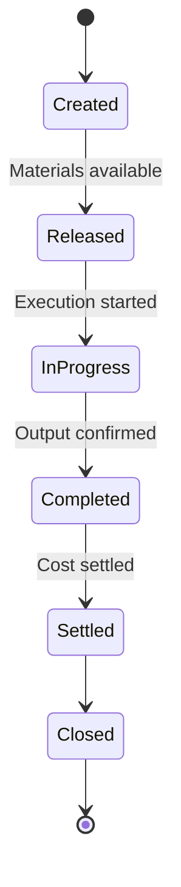

# Volume 06 - Production

| Field | Value |
|---|---|
| Document ID | WORLD-VOL06-010 |
| Title | Production |
| Version | 1.0 |
| Status | Approved |
| Classification | Internal |
| Founder | Mahesh Choudhary |

## Purpose

The Production module governs the conversion of materials into finished and semi-finished goods within WORLD. It is the management layer that authorizes what is produced, in what quantity, against which demand, and at what cost. Production sits on the ERP Foundation (Volume 05) as the authoritative system of record for production orders, material consumption, and output receipt, and exposes governed operations that the AI Business Partner (Volume 03) can observe and orchestrate.

## Scope

This chapter covers production order management: order creation, release, material staging, output confirmation, order settlement, and closure. It relies on the Bill of Materials (BOM) and routing as master data, and coordinates with Production Planning (Chapter 11) for order proposals and with Manufacturing (Chapter 12) for shop-floor execution. Physical database schemas are defined in Volume 09 and are out of scope here.

## Business Value

Production converts demand signals into governed, costed, traceable output. A single production order model eliminates reconciliation between planning, shop floor, and finance, giving accurate work-in-progress (WIP) valuation, real-time order status, and a defensible audit trail from raw material to finished good. Because production events are recorded in an AI-consumable form, the AI Business Partner can detect variance early, propose corrective action, and reduce cost of poor production without manual data collection.

## Objectives

- Provide one authoritative production order lifecycle for discrete and process production.
- Guarantee accurate material consumption and output receipt against every order.
- Deliver reliable WIP valuation and order costing to Finance (Chapter 15).
- Enable full genealogy and traceability from component lot to finished lot.
- Expose production state so the AI Business Partner can monitor and optimize output.

## Responsibilities

The module owns the production order as the central operational document. It is responsible for allocating and consuming components per the BOM, sequencing operations per the routing, recording good and scrap quantities, calculating order cost, and settling variances. It is not responsible for capacity scheduling (Production Planning) or operation-level machine confirmation (Manufacturing); it consumes those results.

## Business Process

The end-to-end flow moves a planned order through release, execution, and settlement.

**Enterprise example:** A pump manufacturer receives a planned order for 500 centrifugal pumps. Production converts it to a released order, stages the BOM components (impeller, casing, seal kit) from Inventory, sequences the four routing operations across three work centers, confirms 496 good units and 4 scrap, routes output to Quality, and settles the order. Finance receives WIP relief and finished-goods valuation automatically.

## Master Data

| Master Data | Description | Source |
|---|---|---|
| Bill of Materials | Component structure and quantities per finished item | Business Foundation (Vol 02) |
| Routing | Ordered operations, work centers, and standard times | Manufacturing (Vol06-012) |
| Work Center | Capacity and cost resource where operations run | Manufacturing (Vol06-012) |
| Item Master | Finished, semi-finished, and component definitions | ERP Foundation (Vol 05) |
| Production Version | Valid BOM and routing combination for an item | Production |

## Transactions

- Production Order (create, release, confirm, settle, close).
- Goods Issue for component consumption.
- Goods Receipt for finished and semi-finished output.
- Scrap and rework posting.
- Order cost settlement and variance posting.

## Business Rules

- An order may be released only when a valid BOM and routing (production version) exist.
- Component consumption cannot exceed order quantity plus permitted tolerance without approval.
- Output receipt is blocked until mandatory operations are confirmed.
- Order settlement requires all confirmations posted and quality disposition complete.
- All postings inherit company, tenant, and location dimensions from the ERP Foundation (Volume 05).

## Workflow

## Inputs

- Planned production orders from Production Planning (Chapter 11).
- Material availability and stock from Inventory (Chapter 02).
- BOM, routing, and work center master data.
- Standard cost estimates from Finance.

## Outputs

- Released and confirmed production orders.
- Component goods issues and finished-goods receipts.
- WIP and variance postings to Finance.
- Traceability and genealogy records for Quality.

## Dependencies

- **Production Planning (Ch 11)** supplies order proposals and schedules.
- **Manufacturing (Ch 12)** executes operations and returns confirmations.
- **Quality (Ch 13)** dispositions produced output.
- **Inventory (Ch 02)** provides components and receives finished goods.
- **Finance (Ch 15)** consumes cost settlement postings.

## KPIs

| KPI | Definition | Target |
|---|---|---|
| Production Order Cycle Time | Release to closure duration | Minimize |
| Yield | Good output / total input | > 98% |
| Scrap Rate | Scrap quantity / total produced | < 2% |
| Cost Variance | Actual vs. standard order cost | Within +/- 3% |
| On-Time Completion | Orders closed by due date | > 95% |

## Reports

- Production Order Status Report.
- Material Consumption vs. Standard Report.
- Yield and Scrap Analysis Report.
- Order Cost and Variance Report.

## Dashboards

- Live Production Order Board (status by work center).
- Yield and Scrap Trend Dashboard.
- WIP Valuation Dashboard feeding Business Intelligence (Volume 04).

## Roles

| Role | Responsibility |
|---|---|
| Production Manager | Owns output, cost, and order approval |
| Production Planner | Converts and schedules orders |
| Shop-Floor Supervisor | Oversees execution and confirmations |
| Cost Accountant | Reviews settlement and variance |

## Permissions

- Create/Release order: Production Planner, Production Manager.
- Confirm output: Shop-Floor Supervisor.
- Settle/Close order: Production Manager, Cost Accountant.
- View only: Business Intelligence and audit roles.

## AI Features

The AI Business Partner (Volume 03) monitors live production orders to forecast completion, flag emerging yield loss, and recommend re-sequencing or expediting. It detects abnormal consumption against BOM standards, proposes scrap-reduction actions, and can autonomously convert approved planned orders to released orders within governed policy limits, always writing through the same ERP transaction set a human would use.

## Future Expansion

Planned expansion includes digital-twin simulation of production orders, carbon and energy accounting per order, and closed-loop autonomous scheduling where the AI Business Partner balances cost, due date, and sustainability constraints in real time.

## Cross-References

- [Production Planning](/docs/blueprint/volume-06-business-modules/section-c-manufacturing-and-operations/11-production-planning.md)
- [Manufacturing](/docs/blueprint/volume-06-business-modules/section-c-manufacturing-and-operations/12-manufacturing.md)
- [Volume 05 - ERP Foundation](/docs/blueprint/volume-05-erp-foundation/README.md)

## References

- [Volume 01 - Vision and Philosophy](/docs/blueprint/volume-01-vision-and-philosophy/README.md)
- [Document Standards](/docs/governance/document-standards.md)

## Change Log

| Version | Date | Author | Notes |
|---|---|---|---|
| 1.0 | 2026-07-12 | Lead Software Engineer | Initial approved version. |
