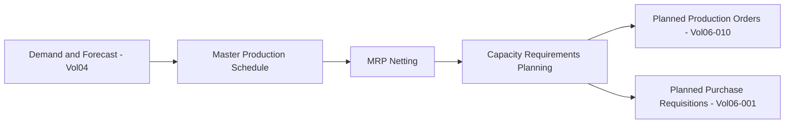
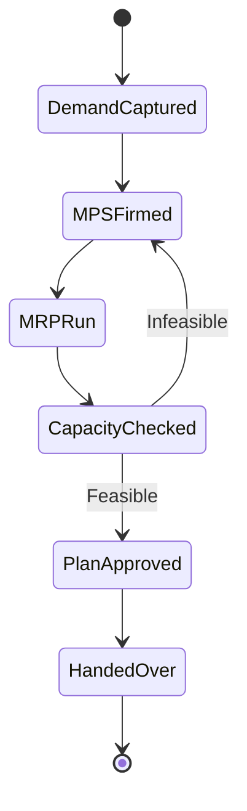

# Volume 06 - Production Planning

| Field | Value |
|---|---|
| Document ID | WORLD-VOL06-011 |
| Title | Production Planning |
| Version | 1.0 |
| Status | Approved |
| Classification | Internal |
| Founder | Mahesh Choudhary |

## Purpose

The Production Planning module translates demand into an executable, capacity-feasible supply plan. It produces the Master Production Schedule (MPS), runs Material Requirements Planning (MRP), and performs capacity and finite scheduling so that production orders are proposed with the right quantity, timing, and resource. It builds on the ERP Foundation (Volume 05) and operationalizes the planning policies defined in the Business Foundation (Volume 02).

## Scope

This chapter covers demand consolidation, MPS, MRP, capacity requirements planning, and the generation of planned production and purchase proposals. Execution of released orders belongs to Production (Chapter 10) and Manufacturing (Chapter 12); this module ends where a planned order is handed over for release.

## Business Value

Planning is where service level, inventory, and capacity are balanced. Accurate planning reduces stockouts and expediting while lowering excess inventory and idle capacity. Because WORLD unifies demand, inventory, and capacity in one governed model, the AI Business Partner (Volume 03) can continuously re-plan against live signals, converting planning from a periodic batch exercise into a continuous, self-correcting process.

## Objectives

- Convert forecast and firm demand into a feasible master production schedule.
- Net requirements against stock, in-transit, and open orders through MRP.
- Validate plans against finite work center capacity before release.
- Minimize total cost of inventory, changeover, and expediting.
- Provide planned orders to Production with defensible timing and sizing.

## Responsibilities

The module owns demand consolidation, the MPS, the MRP run, and capacity leveling. It generates planned production orders (for make items) and planned purchase requisitions (for buy items), and maintains planning master data such as lead times, lot-sizing rules, and safety stock. It does not release or execute orders.

## Business Process

**Enterprise example:** A consumer-appliance plant loads a 12-week forecast and firm sales orders. MPS levels weekly output for three models; MRP nets component demand against 4 warehouses and open purchase orders, generating 180 planned production orders and 42 purchase requisitions. Capacity planning detects an overload on the assembly work center in week 6 and shifts 15% of load to week 5, which the planner approves for release.

## Master Data

| Master Data | Description | Source |
|---|---|---|
| Bill of Materials | Component requirements for netting | Business Foundation (Vol 02) |
| Routing and Work Center | Capacity, lead time, and load basis | Manufacturing (Vol06-012) |
| Planning Parameters | Lot size, safety stock, planning horizon | Production Planning |
| Demand Plan | Forecast and firm demand | Business Intelligence (Vol 04) |
| Calendar | Working days and shift capacity | ERP Foundation (Vol 05) |

## Transactions

- MPS creation and firming.
- MRP planning run (regenerative and net-change).
- Capacity requirements calculation and leveling.
- Planned order and requisition generation.
- Planning conversion handover to Production.

## Business Rules

- MRP nets demand only against valid, active BOM and item master records.
- Planned orders respect lot-sizing rules and minimum/maximum order quantities.
- Capacity leveling cannot violate finite work center availability without override approval.
- Safety stock and reorder policies are inherited from Business Foundation (Volume 02).
- Every planned order carries company, tenant, and location dimensions.

## Workflow

## Inputs

- Demand forecasts and sales orders from Business Intelligence (Volume 04) and Sales (Chapter 07).
- Current stock and open orders from Inventory (Chapter 02) and Procurement (Chapter 01).
- BOM, routing, and work center capacity data.

## Outputs

- Approved master production schedule.
- Planned production orders for Production (Chapter 10).
- Planned purchase requisitions for Procurement (Chapter 01).
- Capacity utilization and load reports.

## Dependencies

- **Production (Ch 10)** releases the planned orders this module creates.
- **Manufacturing (Ch 12)** supplies routing and capacity definitions.
- **Procurement (Ch 01)** consumes planned purchase requisitions.
- **Business Intelligence (Vol 04)** supplies demand forecasts.

## KPIs

| KPI | Definition | Target |
|---|---|---|
| Forecast Accuracy | 1 - (abs error / demand) | > 85% |
| Plan Adherence | Released vs. planned quantity | > 95% |
| Capacity Utilization | Load / available capacity | 80-90% |
| Planning Cycle Time | Demand to approved plan | Minimize |
| Inventory Days of Supply | On-hand / average daily use | On target |

## Reports

- Master Production Schedule Report.
- MRP Requirements and Pegging Report.
- Capacity Load and Overload Report.
- Planned vs. Firm Order Reconciliation.

## Dashboards

- Capacity Load Heatmap by work center.
- Demand vs. Supply Balance Dashboard.
- Planning Exception Dashboard feeding Business Intelligence (Volume 04).

## Roles

| Role | Responsibility |
|---|---|
| Master Scheduler | Owns MPS and plan approval |
| Material Planner | Runs MRP and manages requisitions |
| Capacity Planner | Levels load across work centers |
| Demand Planner | Maintains forecast inputs |

## Permissions

- Firm MPS: Master Scheduler.
- Run MRP: Material Planner, Master Scheduler.
- Approve capacity override: Capacity Planner, Production Manager.
- View only: Business Intelligence and audit roles.

## AI Features

The AI Business Partner (Volume 03) continuously re-plans against live demand, stock, and capacity signals, proposing net-change adjustments before exceptions become disruptions. It recommends optimal lot sizes, detects forecast bias, simulates what-if scenarios for demand surges, and can auto-approve low-risk planned orders within governed thresholds while escalating capacity conflicts to the Master Scheduler.

## Future Expansion

Roadmap items include probabilistic multi-echelon planning, AI-driven demand sensing from external market signals, and autonomous closed-loop planning that jointly optimizes procurement, production, and distribution across the network.

## Cross-References

- [Production](/docs/blueprint/volume-06-business-modules/section-c-manufacturing-and-operations/10-production.md)
- [Manufacturing](/docs/blueprint/volume-06-business-modules/section-c-manufacturing-and-operations/12-manufacturing.md)
- [Volume 04 - Business Intelligence and Decision Science](/docs/blueprint/volume-04-business-intelligence-and-decision-science/README.md)

## References

- [Volume 01 - Vision and Philosophy](/docs/blueprint/volume-01-vision-and-philosophy/README.md)
- [Document Standards](/docs/governance/document-standards.md)

## Change Log

| Version | Date | Author | Notes |
|---|---|---|---|
| 1.0 | 2026-07-12 | Lead Software Engineer | Initial approved version. |
