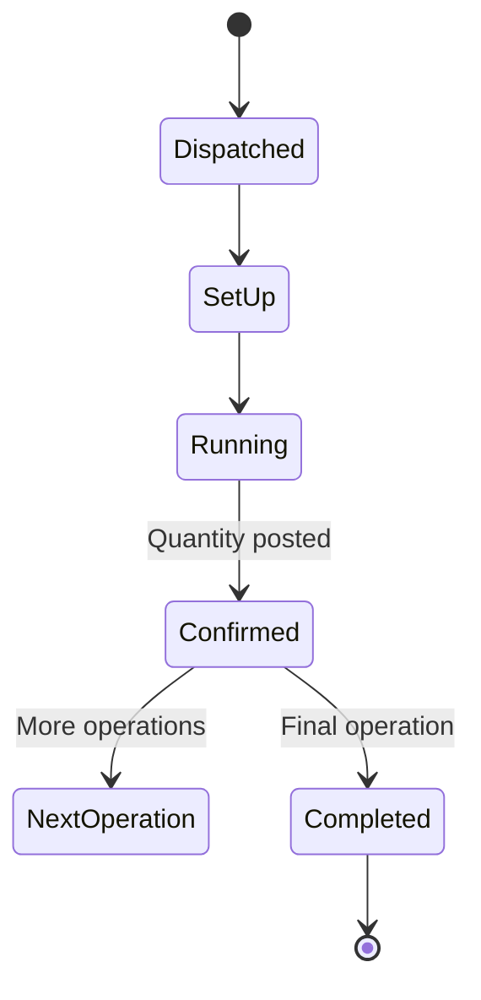

# Volume 06 - Manufacturing

| Field | Value |
|---|---|
| Document ID | WORLD-VOL06-012 |
| Title | Manufacturing |
| Version | 1.0 |
| Status | Approved |
| Classification | Internal |
| Founder | Mahesh Choudhary |

## Purpose

The Manufacturing module is WORLD's shop-floor execution layer, the Manufacturing Execution System (MES) that turns released production orders into physical output. It governs work center dispatch, operation-level confirmation, machine and labor data capture, and work-in-progress (WIP) tracking. It maintains routing and work center master data used across Production (Chapter 10) and Production Planning (Chapter 11), and records execution events as governed facts on the ERP Foundation (Volume 05).

## Scope

This chapter covers execution of operations against a routing: dispatching operations to work centers, capturing start/stop and quantity confirmations, recording downtime and setup, and reporting WIP progress. Order authorization and settlement belong to Production (Chapter 10); quality disposition belongs to Quality (Chapter 13).

## Business Value

Manufacturing execution is where plan meets reality. Real-time operation confirmation gives accurate WIP visibility, precise labor and machine costing, and immediate detection of bottlenecks and downtime. Digitizing the shop floor removes paper travelers and manual tallies, and the resulting event stream lets the AI Business Partner (Volume 03) optimize throughput and Overall Equipment Effectiveness (OEE) continuously.

## Objectives

- Execute routing operations at work centers with accurate confirmations.
- Capture machine, labor, setup, and downtime data at the source.
- Provide real-time WIP and operation status to Production and Planning.
- Maximize throughput and OEE across work centers.
- Produce a complete, traceable execution record per production order.

## Responsibilities

The module owns operation dispatch lists, confirmations, and shop-floor data capture. It maintains routings (operation sequences, standard times) and work center definitions (capacity, cost rate, and calendar). It is responsible for reporting good, scrap, and rework quantities per operation, and for feeding WIP progress back to the production order.

## Business Process

**Enterprise example:** A released order for 500 pumps arrives on the machining work center dispatch list. The operator scans the order, records a 20-minute setup, runs 4 hours capturing spindle time, and confirms 500 machined units. The order advances to the assembly work center, where 496 units are confirmed good and 4 sent to rework. OEE for the machining center is calculated live at 82%.

## Master Data

| Master Data | Description | Source |
|---|---|---|
| Routing | Operation sequence, standard setup and run times | Manufacturing |
| Work Center | Capacity, cost rate, shift calendar | Manufacturing |
| Operation | Individual task with control key and standards | Manufacturing |
| Machine/Resource | Physical asset linked to a work center | Maintenance (Vol06-014) |
| Item Master | Semi-finished and finished item definitions | ERP Foundation (Vol 05) |

## Transactions

- Operation dispatch and reassignment.
- Setup, start, and finish confirmation.
- Quantity confirmation (good, scrap, rework).
- Downtime and reason-code posting.
- Labor and machine time posting.

## Business Rules

- An operation may be confirmed only for a released order with a valid routing.
- Predecessor operations must be confirmed before successor operations begin.
- Confirmed good plus scrap plus rework cannot exceed the order operation quantity.
- Downtime and scrap must carry a mandatory reason code.
- All execution events carry company, tenant, location, and work center dimensions.

## Workflow

## Inputs

- Released production orders from Production (Chapter 10).
- Routing, work center, and operation master data.
- Machine signals and shop-floor terminal entries.
- Maintenance status of machines from Maintenance (Chapter 14).

## Outputs

- Operation confirmations and WIP progress to Production.
- Labor and machine cost postings to Finance (Chapter 15).
- Downtime, scrap, and OEE data to Business Intelligence (Volume 04).
- Genealogy records to Quality (Chapter 13).

## Dependencies

- **Production (Ch 10)** provides orders and receives completion.
- **Production Planning (Ch 11)** consumes capacity and routing data.
- **Maintenance (Ch 14)** provides machine availability.
- **Quality (Ch 13)** inspects in-process and final output.

## KPIs

| KPI | Definition | Target |
|---|---|---|
| Overall Equipment Effectiveness | Availability x Performance x Quality | > 80% |
| Throughput | Good units per shift | Maximize |
| Setup Time Ratio | Setup time / total operation time | Minimize |
| Unplanned Downtime | Downtime hours / available hours | < 5% |
| Confirmation Accuracy | Confirmed vs. actual quantity | > 99% |

## Reports

- Work Center Load and Confirmation Report.
- OEE and Downtime Analysis Report.
- Labor and Machine Utilization Report.
- WIP Aging Report.

## Dashboards

- Live Shop-Floor / Andon Board.
- OEE Dashboard by work center and shift.
- Downtime Pareto Dashboard feeding Business Intelligence (Volume 04).

## Roles

| Role | Responsibility |
|---|---|
| Shop-Floor Supervisor | Manages dispatch and execution |
| Machine Operator | Confirms operations and captures data |
| Manufacturing Engineer | Maintains routings and standards |
| Maintenance Technician | Restores machine availability |

## Permissions

- Confirm operation: Machine Operator, Shop-Floor Supervisor.
- Maintain routing/work center: Manufacturing Engineer.
- Post downtime: Shop-Floor Supervisor, Maintenance Technician.
- View only: Business Intelligence and audit roles.

## AI Features

The AI Business Partner (Volume 03) analyzes the live execution stream to predict bottlenecks, recommend optimal operation sequencing, and flag machines trending toward failure for the Maintenance module. It calculates OEE in real time, suggests setup-time reductions, and can dynamically re-dispatch operations across interchangeable work centers within governed policy to protect throughput and due dates.

## Future Expansion

Planned capabilities include IoT sensor fusion for real-time condition monitoring, computer-vision quality capture at the operation, autonomous line balancing, and human-robot collaborative work center orchestration driven by the AI Business Partner.

## Cross-References

- [Production](/docs/blueprint/volume-06-business-modules/section-c-manufacturing-and-operations/10-production.md)
- [Quality](/docs/blueprint/volume-06-business-modules/section-c-manufacturing-and-operations/13-quality.md)
- [Maintenance](/docs/blueprint/volume-06-business-modules/section-c-manufacturing-and-operations/14-maintenance.md)

## References

- [Volume 01 - Vision and Philosophy](/docs/blueprint/volume-01-vision-and-philosophy/README.md)
- [Document Standards](/docs/governance/document-standards.md)

## Change Log

| Version | Date | Author | Notes |
|---|---|---|---|
| 1.0 | 2026-07-12 | Lead Software Engineer | Initial approved version. |
