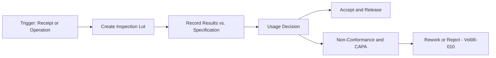
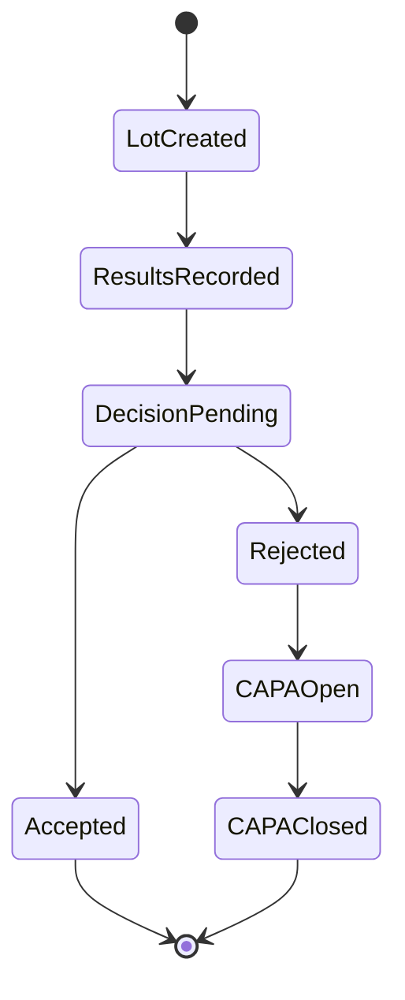

# Volume 06 - Quality

| Field | Value |
|---|---|
| Document ID | WORLD-VOL06-013 |
| Title | Quality |
| Version | 1.0 |
| Status | Approved |
| Classification | Internal |
| Founder | Mahesh Choudhary |

## Purpose

The Quality module is WORLD's Quality Management System (QMS). It ensures that incoming materials, in-process output, and finished goods meet defined specifications through inspection planning, inspection execution, non-conformance handling, and corrective and preventive action (CAPA). It operationalizes the quality standards defined in the Business Foundation (Volume 02) and records quality facts on the ERP Foundation (Volume 05).

## Scope

This chapter covers inspection plans and characteristics, inspection lots, results recording, usage decisions, non-conformance reports (NCR), CAPA, and certificates of analysis. It integrates with Manufacturing (Chapter 12) for in-process inspection and with Production (Chapter 10) for final disposition. Statistical Process Control (SPC) is included; laboratory instrument schemas belong to Volume 09.

## Business Value

Quality directly protects revenue, brand, and compliance. A governed QMS reduces defect escape, warranty cost, and recall risk, while providing audit-ready evidence for regulated industries. Because quality events are captured as structured data against orders and lots, the AI Business Partner (Volume 03) can predict quality risk, isolate root cause faster, and prevent defects rather than merely detect them.

## Objectives

- Enforce inspection at receiving, in-process, and final stages.
- Provide clear usage decisions (accept, reject, rework) per inspection lot.
- Manage non-conformances and drive CAPA to closure.
- Maintain full traceability and certificates for every lot.
- Feed quality signals to production and planning for continuous improvement.

## Responsibilities

The module owns inspection plans, inspection lots, results, and usage decisions. It manages non-conformance reports, quality holds, and CAPA workflows, and issues certificates of analysis and conformance. It is responsible for quality master data such as characteristics, sampling procedures, and specification limits.

## Business Process

**Enterprise example:** A batch of 496 finished pumps completes assembly. Quality auto-creates an inspection lot, samples 32 units per the plan, records pressure-test results against specification limits, and finds 2 units out of tolerance. The usage decision accepts 494 units, raises an NCR for 2, and triggers a CAPA that traces the deviation to a seal supplier lot. A certificate of analysis is issued for the accepted units.

## Master Data

| Master Data | Description | Source |
|---|---|---|
| Inspection Plan | Characteristics, methods, sampling for an item | Quality |
| Quality Characteristic | Measurable attribute with specification limits | Business Foundation (Vol 02) |
| Sampling Procedure | Sample size and acceptance criteria | Quality |
| Catalog / Defect Codes | Standardized defect classification | Quality |
| Item and Lot Master | Inspected material and lot identity | ERP Foundation (Vol 05) |

## Transactions

- Inspection lot creation (receiving, in-process, final).
- Results recording and valuation.
- Usage decision (accept, reject, rework).
- Non-conformance report and quality hold.
- CAPA creation, action, and closure.

## Business Rules

- Stock under inspection is blocked from unrestricted use until a usage decision is made.
- Every rejected lot must generate a non-conformance report.
- CAPA cannot be closed without documented root cause and effectiveness check.
- Certificates are issued only for lots with a completed accept decision.
- Inspection results and decisions carry company, tenant, location, and lot dimensions.

## Workflow

## Inputs

- Goods receipts from Procurement (Chapter 01) and Inventory (Chapter 02).
- Operation and final output from Manufacturing (Chapter 12) and Production (Chapter 10).
- Specifications and standards from Business Foundation (Volume 02).

## Outputs

- Usage decisions and quality holds to Inventory and Production.
- Non-conformance and CAPA records.
- Certificates of analysis and conformance.
- Quality metrics to Business Intelligence (Volume 04).

## Dependencies

- **Manufacturing (Ch 12)** triggers in-process inspection.
- **Production (Ch 10)** consumes final disposition.
- **Procurement (Ch 01)** relies on incoming inspection results.
- **Business Intelligence (Vol 04)** consumes quality analytics.

## KPIs

| KPI | Definition | Target |
|---|---|---|
| First Pass Yield | Units passing first inspection / total | > 97% |
| Defect Rate (PPM) | Defects per million opportunities | Minimize |
| Non-Conformance Rate | NCRs / inspection lots | < 2% |
| CAPA Closure Time | Open to effective closure duration | < 30 days |
| Cost of Poor Quality | Scrap, rework, warranty cost | Minimize |

## Reports

- Inspection Lot and Results Report.
- Non-Conformance and CAPA Status Report.
- Supplier Quality Scorecard.
- Cost of Poor Quality Report.

## Dashboards

- Quality Control Dashboard (pass/fail by item).
- SPC Control Chart Dashboard.
- CAPA Aging Dashboard feeding Business Intelligence (Volume 04).

## Roles

| Role | Responsibility |
|---|---|
| Quality Manager | Owns QMS and CAPA governance |
| Quality Inspector | Executes inspections and records results |
| Quality Engineer | Maintains plans and drives root cause |
| Production Manager | Acts on disposition and rework |

## Permissions

- Record results: Quality Inspector.
- Make usage decision: Quality Inspector, Quality Manager.
- Approve CAPA closure: Quality Manager, Quality Engineer.
- View only: Business Intelligence and audit roles.

## AI Features

The AI Business Partner (Volume 03) applies SPC and pattern detection to predict when a process is trending out of control, recommends sampling adjustments based on risk, and accelerates root-cause analysis by correlating defects with work centers, operators, shifts, and supplier lots. It can auto-raise non-conformances, suggest CAPA actions from historical resolutions, and escalate systemic quality risk before defects reach the customer.

## Future Expansion

Roadmap items include computer-vision automated defect detection, AI-generated inspection plans from engineering specifications, predictive supplier-quality scoring, and closed-loop feedback that automatically tightens process parameters in Manufacturing when quality drift is detected.

## Cross-References

- [Manufacturing](/docs/blueprint/volume-06-business-modules/section-c-manufacturing-and-operations/12-manufacturing.md)
- [Production](/docs/blueprint/volume-06-business-modules/section-c-manufacturing-and-operations/10-production.md)
- [Volume 02 - Business Foundation](/docs/blueprint/volume-02-business-foundation/README.md)

## References

- [Volume 01 - Vision and Philosophy](/docs/blueprint/volume-01-vision-and-philosophy/README.md)
- [Document Standards](/docs/governance/document-standards.md)

## Change Log

| Version | Date | Author | Notes |
|---|---|---|---|
| 1.0 | 2026-07-12 | Lead Software Engineer | Initial approved version. |
