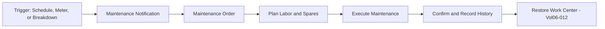
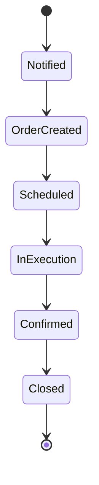

# Volume 06 - Maintenance

| Field | Value |
|---|---|
| Document ID | WORLD-VOL06-014 |
| Title | Maintenance |
| Version | 1.0 |
| Status | Approved |
| Classification | Internal |
| Founder | Mahesh Choudhary |

## Purpose

The Maintenance module is WORLD's Enterprise Asset Management (EAM) and Computerized Maintenance Management System (CMMS). It preserves the availability, reliability, and safety of equipment and work centers through preventive, predictive, and corrective maintenance. It ensures that the machines behind manufacturing work centers remain capable, and records all maintenance activity as governed facts on the ERP Foundation (Volume 05).

## Scope

This chapter covers the equipment and functional-location register, maintenance plans, maintenance orders, spare-parts management, and breakdown handling. It integrates tightly with Manufacturing (Chapter 12), which depends on machine availability, and with Assets (Chapter 19) for asset accounting. Sensor data schemas belong to Volume 09.

## Business Value

Unplanned downtime is one of the largest hidden costs in operations. Structured maintenance raises equipment uptime, extends asset life, reduces emergency repair cost, and protects safety and compliance. Because maintenance and production events share one model, the AI Business Partner (Volume 03) can shift the organization from reactive repair to predictive intervention, scheduling maintenance around production windows to minimize disruption.

## Objectives

- Maintain a complete register of equipment and functional locations.
- Execute preventive and predictive maintenance on schedule.
- Resolve breakdowns quickly with governed corrective orders.
- Ensure spare-parts availability without excess inventory.
- Maximize equipment availability and reliability for Manufacturing.

## Responsibilities

The module owns the equipment master, maintenance plans and task lists, maintenance orders, and the maintenance history log. It is responsible for scheduling preventive work, dispatching corrective work on breakdown, reserving and consuming spare parts, and reporting reliability metrics such as Mean Time Between Failures (MTBF) and Mean Time To Repair (MTTR).

## Business Process

**Enterprise example:** A CNC machine linked to the machining work center reaches a 500-hour meter reading. Maintenance auto-generates a preventive maintenance order, reserves a spindle-bearing kit, and schedules the work in a planned production gap identified with Production Planning. A technician completes the task in 2 hours, records the history, and the work center is released back to Manufacturing, avoiding an unplanned mid-shift stoppage.

## Master Data

| Master Data | Description | Source |
|---|---|---|
| Equipment | Maintainable physical asset and its attributes | Maintenance |
| Functional Location | Hierarchical location of equipment | Maintenance |
| Maintenance Plan | Preventive schedule (time or meter based) | Maintenance |
| Task List | Standard maintenance operations and spares | Maintenance |
| Work Center Link | Equipment mapped to a manufacturing work center | Manufacturing (Vol06-012) |

## Transactions

- Maintenance notification (breakdown, request, activity report).
- Maintenance order (preventive, corrective, predictive).
- Spare-parts reservation and goods issue.
- Labor and time confirmation.
- Order completion and history posting.

## Business Rules

- A maintenance order requires a valid equipment or functional location reference.
- Preventive orders are auto-generated from active maintenance plans on schedule or meter trigger.
- Safety-critical work orders require permit and lockout confirmation before execution.
- Spare-parts issue is validated against Inventory (Chapter 02) availability.
- Maintenance events carry company, tenant, location, and equipment dimensions.

## Workflow

## Inputs

- Machine meter readings and condition signals from Manufacturing (Chapter 12).
- Breakdown notifications from shop-floor operators.
- Maintenance plans and task lists.
- Spare-parts stock from Inventory (Chapter 02).

## Outputs

- Completed maintenance orders and equipment history.
- Equipment availability status to Manufacturing.
- Maintenance cost postings to Finance (Chapter 15) and Assets (Chapter 19).
- Reliability metrics to Business Intelligence (Volume 04).

## Dependencies

- **Manufacturing (Ch 12)** depends on equipment availability and provides meter data.
- **Inventory (Ch 02)** supplies spare parts.
- **Assets (Ch 19)** links equipment to fixed-asset accounting.
- **Business Intelligence (Vol 04)** consumes reliability analytics.

## KPIs

| KPI | Definition | Target |
|---|---|---|
| Equipment Availability | Uptime / scheduled time | > 95% |
| Mean Time Between Failures | Operating time / number of failures | Maximize |
| Mean Time To Repair | Total repair time / number of repairs | Minimize |
| Preventive Compliance | PM completed on time / PM due | > 95% |
| Maintenance Cost Ratio | Maintenance cost / replacement value | On target |

## Reports

- Maintenance Order Backlog Report.
- Equipment Reliability (MTBF/MTTR) Report.
- Preventive Maintenance Compliance Report.
- Maintenance Cost by Equipment Report.

## Dashboards

- Equipment Health and Availability Dashboard.
- Maintenance Backlog and Schedule Dashboard.
- Reliability Trend Dashboard feeding Business Intelligence (Volume 04).

## Roles

| Role | Responsibility |
|---|---|
| Maintenance Manager | Owns asset reliability strategy |
| Maintenance Planner | Schedules orders and spares |
| Maintenance Technician | Executes and confirms work |
| Reliability Engineer | Analyzes failures and improves plans |

## Permissions

- Create notification: any shop-floor role.
- Create/schedule order: Maintenance Planner, Maintenance Manager.
- Confirm work: Maintenance Technician.
- Approve safety permit: Maintenance Manager.
- View only: Business Intelligence and audit roles.

## AI Features

The AI Business Partner (Volume 03) analyzes meter readings, vibration, and failure history to predict impending failures and generate condition-based maintenance orders before breakdown. It optimizes maintenance timing against the production schedule to minimize downtime, recommends optimal spare-parts stock levels, and can autonomously raise and schedule low-risk preventive orders within governed policy while escalating safety-critical work for approval.

## Future Expansion

Planned capabilities include full IoT condition-monitoring integration, digital-twin failure simulation, prescriptive maintenance that specifies the exact intervention, and autonomous maintenance orchestration that self-schedules around live production and workforce constraints.

## Cross-References

- [Manufacturing](/docs/blueprint/volume-06-business-modules/section-c-manufacturing-and-operations/12-manufacturing.md)
- [Production](/docs/blueprint/volume-06-business-modules/section-c-manufacturing-and-operations/10-production.md)
- [Volume 05 - ERP Foundation](/docs/blueprint/volume-05-erp-foundation/README.md)

## References

- [Volume 01 - Vision and Philosophy](/docs/blueprint/volume-01-vision-and-philosophy/README.md)
- [Document Standards](/docs/governance/document-standards.md)

## Change Log

| Version | Date | Author | Notes |
|---|---|---|---|
| 1.0 | 2026-07-12 | Lead Software Engineer | Initial approved version. |
