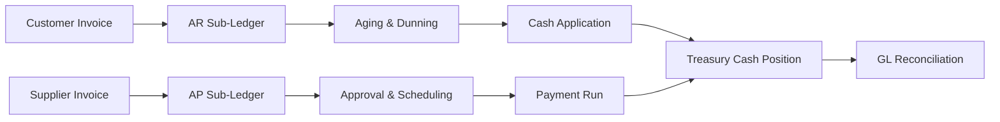
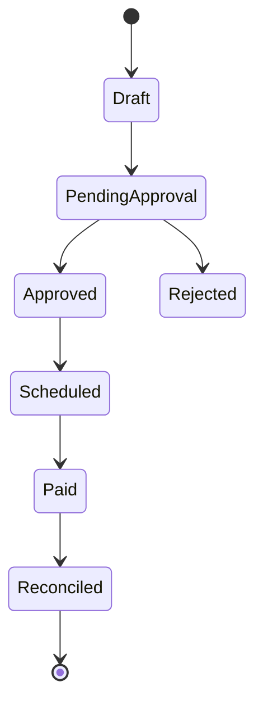

# Volume 06 - Finance

| Field | Value |
|---|---|
| Document ID | WORLD-VOL06-015 |
| Title | Finance |
| Version | 1.0 |
| Status | Approved |
| Classification | Internal |
| Founder | Mahesh Choudhary |

## Purpose

The Finance module is the financial control tower of WORLD. It governs the flow of money across the enterprise, providing unified oversight of accounts receivable (AR), accounts payable (AP), treasury, cash positioning, and working capital. Where the Accounting module (WORLD-VOL06-016) is responsible for the mechanics of recording economic events into the General Ledger (GL) through double-entry postings, Finance is responsible for the *management* of financial resources: ensuring the business is liquid, solvent, and optimally capitalized. It operationalizes the fiscal principles established in the Business Foundation (Vol 02) and executes on the transactional infrastructure of the ERP Foundation (Vol 05).

## Scope

This module covers customer credit and collections (AR), supplier obligations and disbursements (AP), cash and liquidity management (treasury), inter-company settlements, and financial risk oversight (currency, credit, and liquidity risk). It integrates with sub-ledgers that ultimately reconcile to the GL owned by Accounting. It excludes statutory GL close, tax computation, and consolidated statement production, which belong to Accounting, and excludes physical schema definitions, which belong to Vol 09.

## Business Value

Finance converts operational activity into disciplined cash outcomes. By actively managing the cash conversion cycle it releases trapped working capital, reduces the cost of capital, prevents late-payment penalties, and protects the enterprise against liquidity shocks. It transforms finance from a reactive, month-end function into a continuous, forward-looking capability that safeguards enterprise value.

## Objectives

- Maintain daily visibility of the consolidated cash position across all bank accounts and entities.
- Reduce Days Sales Outstanding (DSO) and optimize Days Payable Outstanding (DPO) without damaging supplier or customer relationships.
- Ensure every receivable and payable is authorized, aged, and settled under policy.
- Guarantee sub-ledger integrity so all AR/AP balances reconcile to the GL.
- Provide the AI Business Partner (Vol 03) with the liquidity signals it needs to advise leadership.

## Responsibilities

Finance owns credit policy execution, collections, cash forecasting, payment runs, bank relationship data, and treasury oversight. It is accountable for the accuracy of the AR and AP sub-ledgers and for the timeliness of cash movements. It is *not* accountable for the GL chart of accounts structure or statutory reporting, which are Accounting responsibilities.

## Business Process

The order-to-cash and procure-to-pay cycles are the two arteries of Finance. Receivables originate from Sales invoices and flow through aging, dunning, and cash application. Payables originate from approved supplier invoices matched to purchase orders and goods receipts, flowing through approval, scheduling, and disbursement. Treasury continuously nets these flows into a rolling cash forecast.

## Master Data

| Entity | Description | Owner |
|---|---|---|
| Customer Credit Profile | Credit limit, terms, risk rating | Finance |
| Supplier Payment Profile | Payment terms, bank details, priority | Finance |
| Bank Account Master | Account, currency, entity linkage | Finance / Banking |
| Payment Method | ACH, wire, card, cheque | Finance |
| Currency & FX Rate | Rate source and effective date | Treasury |

## Transactions

Key transactions include customer invoice recognition, credit memo issuance, cash receipt and application, supplier invoice posting, payment scheduling, payment execution, and inter-company settlement. Each transaction generates a sub-ledger entry that Accounting posts to the GL.

## Business Rules

- No customer order releases beyond an approved credit limit without override authorization.
- No supplier payment executes without three-way match (PO, receipt, invoice) or documented exception.
- Every cash receipt must be applied or held in a suspense sub-ledger within two business days.
- Sub-ledger control totals must reconcile to GL control accounts at every period close.

## Workflow

A concrete example: an enterprise customer places a USD 500,000 order. Finance checks the customer credit profile, finds USD 120,000 of available limit, and routes the excess for override approval. Once shipped, a customer invoice posts to the AR sub-ledger; 38 days later the cash receipt is auto-applied, DSO is updated, and the movement is reconciled to the GL cash and AR control accounts.

## Inputs

Sales invoices, approved purchase orders, goods receipts, bank statements (via the Banking module), FX rates, and customer/supplier master data.

## Outputs

Cash position reports, aged AR/AP schedules, payment files for bank submission, cash forecasts, and reconciled sub-ledger balances feeding the GL.

## Dependencies

Finance depends on Accounting (WORLD-VOL06-016) for GL posting, Banking (WORLD-VOL06-017) for statement and payment rails, Budgeting (WORLD-VOL06-018) for spend control, and the ERP Foundation (Vol 05) for the transaction backbone.

## KPIs

| KPI | Definition | Target |
|---|---|---|
| DSO | Average collection period | < 45 days |
| DPO | Average payment period | 30-60 days |
| Cash Conversion Cycle | DSO + DIO - DPO | Minimized |
| Forecast Accuracy | Actual vs. forecast cash | > 95% |

## Reports

Aged Receivables, Aged Payables, Daily Cash Position, Rolling 13-Week Cash Forecast, and Sub-Ledger Reconciliation reports.

## Dashboards

A Treasury dashboard presents real-time cash by entity and currency; a Collections dashboard tracks overdue balances by risk band; a Payables dashboard shows scheduled disbursements against available liquidity.

## Roles

Treasurer, Credit Controller, AP Clerk, AR Clerk, and Finance Manager.

## Permissions

| Role | Create | Approve | Execute Payment | View |
|---|---|---|---|---|
| AP Clerk | Yes | No | No | Yes |
| Finance Manager | Yes | Yes | No | Yes |
| Treasurer | Yes | Yes | Yes | Yes |
| Auditor | No | No | No | Yes |

## AI Features

The AI Business Partner (Vol 03) predicts payment behavior to sharpen the cash forecast, recommends optimal payment timing to maximize discounts while preserving liquidity, flags at-risk receivables for proactive collection, and detects anomalous disbursements as a fraud safeguard.

## Future Expansion

Dynamic discounting marketplaces, supply-chain financing, embedded FX hedging, and real-time treasury via open-banking APIs.

## Cross-References

- [Accounting](/docs/blueprint/volume-06-business-modules/section-d-finance/16-accounting.md)
- [Banking](/docs/blueprint/volume-06-business-modules/section-d-finance/17-banking.md)
- [ERP Foundation](/docs/blueprint/volume-05-erp-foundation/README.md)
- [Business Foundation](/docs/blueprint/volume-02-business-foundation/README.md)

## References

- [Vision and Philosophy](/docs/blueprint/volume-01-vision-and-philosophy/README.md)
- [Document Standards](/docs/governance/document-standards.md)

## Change Log

| Version | Date | Author | Notes |
|---|---|---|---|
| 1.0 | 2026-07-12 | Lead Software Engineer | Initial approved version. |
