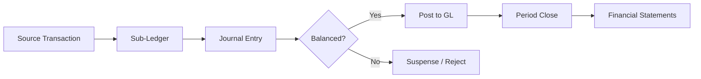
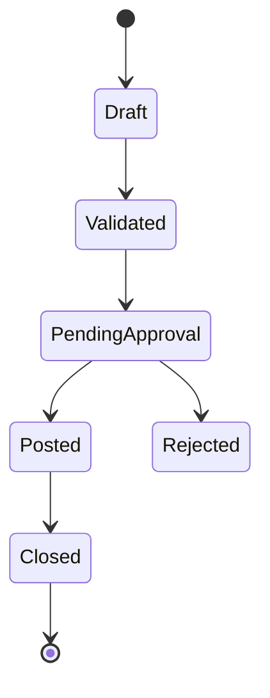

# Volume 06 - Accounting

| Field | Value |
|---|---|
| Document ID | WORLD-VOL06-016 |
| Title | Accounting |
| Version | 1.0 |
| Status | Approved |
| Classification | Internal |
| Founder | Mahesh Choudhary |

## Purpose

The Accounting module is the system of record for all financial truth in WORLD. It maintains the Chart of Accounts (COA), the General Ledger (GL), and the journal entry engine that enforces double-entry integrity. Every economic event in the enterprise ultimately resolves into balanced debits and credits posted here. Where Finance (WORLD-VOL06-015) manages the flow of money, Accounting records it, ensuring the books are complete, accurate, auditable, and compliant. It gives concrete accounting form to the fiscal governance principles of the Business Foundation (Vol 02).

## Scope

This module covers the COA, GL, manual and automated journal entries, sub-ledger integration, period-end close, accruals, allocations, inter-company eliminations, and statutory financial statement production. It excludes cash movement and collections (Finance), and excludes physical database schemas (Vol 09).

## Business Value

Accounting produces the single, reconciled financial narrative that regulators, auditors, investors, and leadership rely upon. By automating posting and close it compresses the reporting cycle, eliminates manual error, and provides a trustworthy foundation for the Business Intelligence layer (Vol 04). Sound books are the precondition of every credible business decision.

## Objectives

- Maintain a coherent, hierarchical COA aligned to statutory and management reporting needs.
- Guarantee that every posting is balanced and traceable to a source transaction.
- Reduce the financial close cycle while improving accuracy.
- Ensure sub-ledgers (AR, AP, assets, inventory) reconcile perfectly to GL control accounts.
- Produce compliant financial statements on demand.

## Responsibilities

Accounting owns the COA, the GL, the journal engine, close orchestration, accruals and deferrals, and statutory reporting. It is accountable for the integrity of the double-entry framework and the correctness of financial statements. It consumes sub-ledger detail from Finance, Assets, and other modules but is not responsible for originating cash movements.

## Business Process

Economic events flow from source modules into sub-ledgers, which summarize into journal entries. Journals are validated for balance, posted to the GL, and periodically closed. Adjusting entries, accruals, and allocations refine the picture before statements are produced.

## Master Data

| Entity | Description | Owner |
|---|---|---|
| Chart of Accounts | Account codes and hierarchy | Accounting |
| GL Account | Ledger account with type and rules | Accounting |
| Cost Center | Organizational cost dimension | Accounting |
| Fiscal Calendar | Periods and close windows | Accounting |
| Journal Template | Recurring entry patterns | Accounting |

## Transactions

Manual journal entries, automated sub-ledger postings, accruals, reversals, allocations, revaluations, inter-company eliminations, and period-close entries.

## Business Rules

- Every journal must balance: total debits equal total credits.
- No posting is permitted to a closed period without reopening authorization.
- Each journal line must reference a valid, active GL account and cost center.
- Sub-ledger control accounts are posted only through automated integration, never manually.

## Workflow

A concrete example: at month end a supplier invoice for services received but not yet billed requires an accrual. Accounting posts a balanced journal debiting the expense account and crediting an accrued-liabilities account; the entry auto-reverses on the first day of the next period, and both movements are traceable in the GL audit trail.

## Inputs

Sub-ledger summaries from Finance, Assets, Inventory, and Payroll; manual journal requests; FX rates; and the fiscal calendar.

## Outputs

Balanced GL postings, trial balance, income statement, balance sheet, cash flow statement, and audit trails.

## Dependencies

Accounting depends on Finance (WORLD-VOL06-015) and Assets (WORLD-VOL06-019) for sub-ledger detail, on the ERP Foundation (Vol 05) for the posting infrastructure, and feeds Business Intelligence (Vol 04).

## KPIs

| KPI | Definition | Target |
|---|---|---|
| Days to Close | Business days to close period | < 5 days |
| Journal Accuracy | Postings without correction | > 99% |
| Reconciliation Rate | Sub-ledgers tied to GL | 100% |
| Unposted Backlog | Journals awaiting posting | 0 at close |

## Reports

Trial Balance, General Ledger Detail, Income Statement, Balance Sheet, Cash Flow Statement, and Journal Audit Report.

## Dashboards

A Close dashboard tracks task completion and days-to-close; a GL Health dashboard highlights suspense balances and reconciliation gaps; a Statement dashboard previews live P&L and balance sheet movement.

## Roles

General Accountant, GL Controller, Financial Controller, and Auditor.

## Permissions

| Role | Create Journal | Post | Close Period | View |
|---|---|---|---|---|
| General Accountant | Yes | No | No | Yes |
| GL Controller | Yes | Yes | No | Yes |
| Financial Controller | Yes | Yes | Yes | Yes |
| Auditor | No | No | No | Yes |

## AI Features

The AI Business Partner (Vol 03) auto-classifies transactions to the correct GL account, proposes accrual and allocation entries, detects posting anomalies before close, narrates variance drivers in financial statements, and continuously reconciles sub-ledgers to the GL.

## Future Expansion

Continuous close, real-time consolidated reporting, AI-generated audit-ready narratives, and blockchain-verified ledger entries.

## Cross-References

- [Finance](/docs/blueprint/volume-06-business-modules/section-d-finance/15-finance.md)
- [Assets](/docs/blueprint/volume-06-business-modules/section-d-finance/19-assets.md)
- [Business Intelligence](/docs/blueprint/volume-04-business-intelligence/README.md)
- [ERP Foundation](/docs/blueprint/volume-05-erp-foundation/README.md)

## References

- [Vision and Philosophy](/docs/blueprint/volume-01-vision-and-philosophy/README.md)
- [Document Standards](/docs/governance/document-standards.md)

## Change Log

| Version | Date | Author | Notes |
|---|---|---|---|
| 1.0 | 2026-07-12 | Lead Software Engineer | Initial approved version. |
