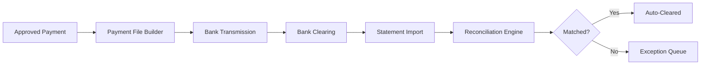
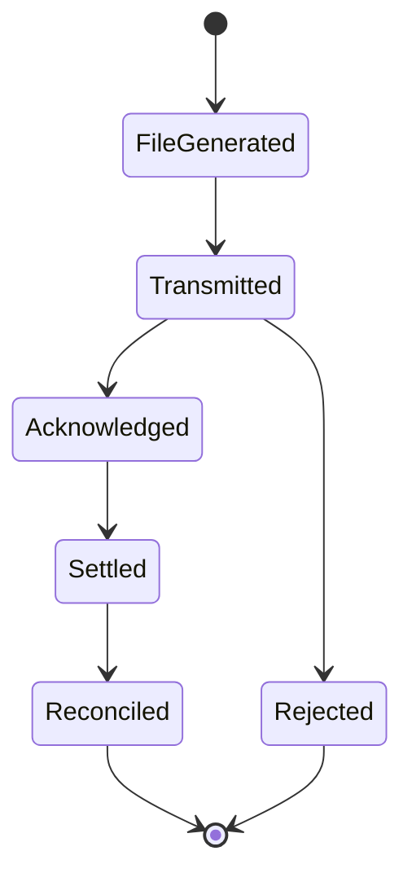

# Volume 06 - Banking

| Field | Value |
|---|---|
| Document ID | WORLD-VOL06-017 |
| Title | Banking |
| Version | 1.0 |
| Status | Approved |
| Classification | Internal |
| Founder | Mahesh Choudhary |

## Purpose

The Banking module is WORLD's interface to the external financial system. It manages bank account master data, electronic statement ingestion, payment file generation, and automated bank reconciliation. It is the bridge between the enterprise's internal ledgers and the outside world of banks, payment networks, and clearing systems. Banking supplies Finance (WORLD-VOL06-015) with the settlement rails and supplies Accounting (WORLD-VOL06-016) with the statement data required to reconcile cash to the GL. It executes the connectivity vision of the ERP Foundation (Vol 05).

## Scope

This module covers bank connectivity, account and signatory master data, statement import (MT940, CAMT, and API feeds), payment file export (ACH, SEPA, wire, RTP), reconciliation matching, and bank fee tracking. It excludes credit and collections decisions (Finance) and GL posting logic (Accounting). Physical schemas belong to Vol 09.

## Business Value

Banking eliminates manual data entry between the enterprise and its banks, accelerates reconciliation from days to minutes, and reduces settlement risk and fraud exposure. Automated matching frees skilled staff from clerical work and gives the AI Business Partner (Vol 03) a clean, timely view of real cash.

## Objectives

- Automate the import of bank statements from every account and institution.
- Generate compliant, secure payment files for straight-through processing.
- Achieve high-rate automated reconciliation between bank and book balances.
- Maintain accurate, controlled bank account and signatory master data.
- Detect and prevent fraudulent or duplicate payments.

## Responsibilities

Banking owns bank connectivity, statement ingestion, payment file formatting and transmission, and reconciliation matching. It is accountable for the accuracy and security of payment instructions and for the completeness of imported statements. It is not accountable for approving payments (Finance) or for the accounting treatment of transactions (Accounting).

## Business Process

Approved payments from Finance are formatted into bank-specific files and transmitted. Banks return statements that are ingested, normalized, and matched against outstanding book items. Unmatched items are routed for investigation.

## Master Data

| Entity | Description | Owner |
|---|---|---|
| Bank Account | Number, IBAN, currency, entity | Banking |
| Bank Institution | Routing, SWIFT/BIC, connectivity | Banking |
| Signatory | Authorized approver and limits | Banking |
| Payment Format | ACH, SEPA, wire, RTP templates | Banking |
| Reconciliation Rule | Matching logic and tolerance | Banking |

## Transactions

Statement import, payment file export, reconciliation match, manual clearing, bank fee posting, and positive-pay file generation.

## Business Rules

- Every payment file must be digitally signed and transmitted over an encrypted channel.
- No payment executes to a bank account not present in verified supplier master data.
- Statement lines must reconcile to book items within defined tolerance or route to exceptions.
- Duplicate payment references are blocked automatically.

## Workflow

A concrete example: a weekly ACH payment run of 240 supplier invoices is assembled into a NACHA-formatted file, digitally signed, and transmitted. The bank acknowledges receipt, settles the batch overnight, and returns a CAMT.053 statement the next morning; the reconciliation engine auto-matches 236 lines, routing four timing differences to the exception queue for the Reconciliation Analyst.

## Inputs

Approved payment instructions from Finance, electronic bank statements, bank acknowledgements, and verified beneficiary master data.

## Outputs

Transmitted payment files, imported and normalized statements, reconciliation results, cleared cash entries, and exception reports for Accounting and Finance.

## Dependencies

Banking depends on Finance (WORLD-VOL06-015) for payment approvals, feeds Accounting (WORLD-VOL06-016) with reconciled cash data, and relies on the ERP Foundation (Vol 05) for secure integration services.

## KPIs

| KPI | Definition | Target |
|---|---|---|
| Auto-Match Rate | Statement lines auto-reconciled | > 95% |
| Payment STP Rate | Payments cleared without touch | > 98% |
| Statement Latency | Time from bank post to import | < 1 hour |
| Rejected Payments | Failed transmissions | < 0.5% |

## Reports

Bank Reconciliation Report, Outstanding Items Report, Payment Transmission Log, Bank Fee Analysis, and Exception Aging Report.

## Dashboards

A Reconciliation dashboard shows match rates and open exceptions by account; a Payments dashboard tracks in-flight and settled payments; a Connectivity dashboard monitors bank feed health.

## Roles

Banking Administrator, Cash Manager, Reconciliation Analyst, and Auditor.

## Permissions

| Role | Manage Accounts | Transmit Payments | Reconcile | View |
|---|---|---|---|---|
| Reconciliation Analyst | No | No | Yes | Yes |
| Cash Manager | No | Yes | Yes | Yes |
| Banking Administrator | Yes | Yes | Yes | Yes |
| Auditor | No | No | No | Yes |

## AI Features

The AI Business Partner (Vol 03) learns reconciliation patterns to raise auto-match rates, predicts statement timing, scores payments for fraud risk before transmission, and recommends optimal payment routing and rails to minimize cost and settlement time.

## Future Expansion

Real-time open-banking connectivity, virtual account structures, instant-payment rails, and AI-driven cash sweeping across accounts.

## Cross-References

- [Finance](/docs/blueprint/volume-06-business-modules/section-d-finance/15-finance.md)
- [Accounting](/docs/blueprint/volume-06-business-modules/section-d-finance/16-accounting.md)
- [ERP Foundation](/docs/blueprint/volume-05-erp-foundation/README.md)

## References

- [Vision and Philosophy](/docs/blueprint/volume-01-vision-and-philosophy/README.md)
- [Document Standards](/docs/governance/document-standards.md)

## Change Log

| Version | Date | Author | Notes |
|---|---|---|---|
| 1.0 | 2026-07-12 | Lead Software Engineer | Initial approved version. |
