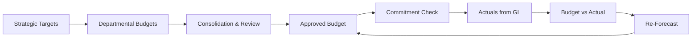
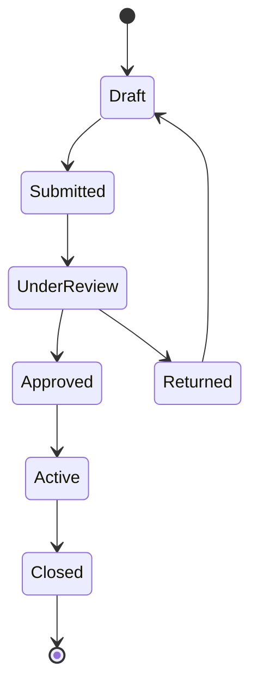

# Volume 06 - Budgeting

| Field | Value |
|---|---|
| Document ID | WORLD-VOL06-018 |
| Title | Budgeting |
| Version | 1.0 |
| Status | Approved |
| Classification | Internal |
| Founder | Mahesh Choudhary |

## Purpose

The Budgeting module is WORLD's engine for financial planning, control, and accountability. It translates strategic intent from the Business Foundation (Vol 02) into quantified financial plans, enforces spending discipline through commitment control, and continuously measures actuals against plan. It uses the same Chart of Accounts and cost-center structure maintained by Accounting (WORLD-VOL06-016), ensuring that plans and actuals share one dimensional language. Budgeting is where strategy becomes a spendable, monitored number.

## Scope

This module covers annual and rolling budget preparation, budget versions and scenarios, allocation and phasing, commitment and encumbrance control, budget-versus-actual (BvA) analysis, and re-forecasting. It excludes actual GL posting (Accounting) and cash execution (Finance). Physical schemas belong to Vol 09.

## Business Value

Budgeting prevents overspending before it happens, aligns resource allocation with strategy, and creates a feedback loop between plan and reality. By binding budget checks to procurement and expense workflows, it shifts financial control from detection to prevention, protecting margin and directing capital to its highest-value use.

## Objectives

- Produce approved budgets aligned to strategic objectives and the COA.
- Enforce budget availability checks at the point of commitment.
- Deliver timely, accurate budget-versus-actual visibility.
- Support multiple scenarios and continuous re-forecasting.
- Provide leadership with early warning of variance and overrun.

## Responsibilities

Budgeting owns the budget model, version control, allocation logic, commitment/encumbrance ledgers, and variance analysis. It is accountable for the availability and accuracy of budget data used in spend approvals. It consumes actuals from Accounting and commitments from procurement, but does not itself post to the GL.

## Business Process

Strategic targets cascade into departmental budgets, which are consolidated, reviewed, and approved. Once active, budgets are consumed by commitments and actuals; variances trigger analysis and re-forecast.

## Master Data

| Entity | Description | Owner |
|---|---|---|
| Budget Version | Baseline, scenario, forecast | Budgeting |
| Budget Line | Account x cost center x period amount | Budgeting |
| Allocation Rule | Distribution and phasing logic | Budgeting |
| Approval Hierarchy | Budget owners and limits | Budgeting |
| Fiscal Calendar | Shared planning periods | Accounting |

## Transactions

Budget entry, budget transfer, commitment (encumbrance) creation and release, budget adjustment, and re-forecast submission.

## Business Rules

- No purchase requisition proceeds if it exceeds available budget without approved override.
- Budget transfers are permitted only between accounts within the same owner's authority.
- Every active budget line must map to a valid GL account and cost center.
- Only one baseline version is active per fiscal year; scenarios are non-binding until promoted.

## Workflow

## Inputs

Strategic targets from Vol 02, historical actuals from Accounting, procurement commitments, and headcount and driver assumptions.

## Outputs

Approved budgets, commitment ledgers, budget-versus-actual statements, variance analyses, and re-forecasts feeding Business Intelligence (Vol 04).

## Dependencies

Budgeting depends on Accounting (WORLD-VOL06-016) for actuals and the COA, on Finance (WORLD-VOL06-015) for cash context, and feeds Business Intelligence (Vol 04) and the ERP Foundation (Vol 05) spend controls.

## KPIs

| KPI | Definition | Target |
|---|---|---|
| Budget Accuracy | Actual vs. budget variance | < 5% |
| Cycle Time | Days to complete budget cycle | Reduced YoY |
| Commitment Coverage | Spend checked against budget | 100% |
| Overrun Rate | Lines exceeding budget | < 2% |

## Reports

Budget-versus-Actual, Commitment and Encumbrance Report, Variance Analysis, Re-Forecast Summary, and Budget Utilization Report.

## Dashboards

A Planning dashboard tracks budget cycle progress; a Control dashboard shows real-time budget consumption by department; a Variance dashboard highlights over- and under-spend hotspots.

## Roles

Budget Analyst, Department Budget Owner, FP&A Manager, and Auditor.

## Permissions

| Role | Enter Budget | Approve | Transfer | View |
|---|---|---|---|---|
| Budget Analyst | Yes | No | No | Yes |
| Department Owner | Yes | No | Yes | Yes |
| FP&A Manager | Yes | Yes | Yes | Yes |
| Auditor | No | No | No | Yes |

## AI Features

The AI Business Partner (Vol 03) generates baseline budgets from historical patterns and drivers, predicts year-end outturn from run-rate, flags emerging overruns before they breach limits, and recommends reallocations to protect strategic priorities. For example, when a marketing cost center trends 12% above phased budget by month four, the AI narrates the driver, forecasts the annual overrun, and proposes an offsetting transfer from an under-utilized line.

## Future Expansion

Driver-based zero-based budgeting, continuous rolling forecasts, AI scenario simulation, and integrated workforce and capital planning.

## Cross-References

- [Accounting](/docs/blueprint/volume-06-business-modules/section-d-finance/16-accounting.md)
- [Finance](/docs/blueprint/volume-06-business-modules/section-d-finance/15-finance.md)
- [Business Foundation](/docs/blueprint/volume-02-business-foundation/README.md)
- [Business Intelligence](/docs/blueprint/volume-04-business-intelligence/README.md)

## References

- [Vision and Philosophy](/docs/blueprint/volume-01-vision-and-philosophy/README.md)
- [Document Standards](/docs/governance/document-standards.md)

## Change Log

| Version | Date | Author | Notes |
|---|---|---|---|
| 1.0 | 2026-07-12 | Lead Software Engineer | Initial approved version. |
