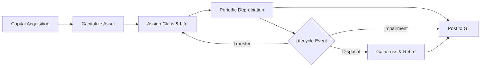
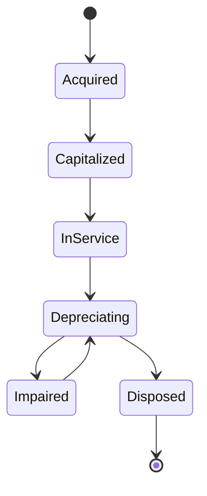

# Volume 06 - Assets

| Field | Value |
|---|---|
| Document ID | WORLD-VOL06-019 |
| Title | Assets |
| Version | 1.0 |
| Status | Approved |
| Classification | Internal |
| Founder | Mahesh Choudhary |

## Purpose

The Assets module manages the full lifecycle of the enterprise's fixed and capital assets, from acquisition through depreciation to disposal. It maintains the fixed-asset sub-ledger, calculates depreciation across multiple books, and posts the resulting entries to the General Ledger owned by Accounting (WORLD-VOL06-016). It ensures that the balance sheet faithfully reflects the value of long-lived resources and that capital is stewarded in line with the Business Foundation (Vol 02). Assets turns capital expenditure into a controlled, depreciating, auditable record.

## Scope

This module covers asset master data, capitalization, depreciation (accounting, tax, and management books), revaluation, impairment, transfers, maintenance linkage, and disposal or retirement. It excludes the funding decision and payment (Finance) and the GL close itself (Accounting). Physical schemas belong to Vol 09.

## Business Value

Assets protects and reports the largest items on the balance sheet. Accurate depreciation drives correct profit, tax, and net-book-value figures; disciplined tracking prevents ghost assets, over-insurance, and premature replacement. It gives the AI Business Partner (Vol 03) the data to optimize capital deployment and replacement timing.

## Objectives

- Maintain a complete, accurate register of every capitalized asset.
- Calculate and post depreciation correctly across all required books.
- Support impairment, revaluation, and disposal with full audit trails.
- Reconcile the asset sub-ledger to the GL at every period close.
- Inform capital planning through reliable asset lifecycle data.

## Responsibilities

Assets owns the fixed-asset register, depreciation engine, capitalization rules, and disposal processing. It is accountable for the accuracy of asset values and depreciation postings to the GL. It consumes acquisition data from procurement and Finance and provides sub-ledger detail to Accounting; it does not own the GL itself.

## Business Process

An approved capital acquisition is capitalized into the register, assigned a class and useful life, and depreciated periodically. Over its life it may be transferred, revalued, or impaired, and is ultimately disposed of with gain or loss recognition.

## Master Data

| Entity | Description | Owner |
|---|---|---|
| Asset Master | Asset record, cost, location | Assets |
| Asset Class | Category, default life, method | Assets |
| Depreciation Book | Accounting, tax, management | Assets |
| Depreciation Method | Straight-line, declining, units | Assets |
| Location / Custodian | Physical placement and owner | Assets |

## Transactions

Capitalization, depreciation run, revaluation, impairment, inter-location transfer, partial disposal, full disposal, and write-off.

## Business Rules

- Expenditure is capitalized only if it exceeds the capitalization threshold and extends useful life.
- Depreciation begins in the period the asset is placed in service, per each book's convention.
- Disposal must recognize gain or loss as the difference between proceeds and net book value.
- The asset sub-ledger must reconcile to the GL control account at every close.

## Workflow

A concrete example: the enterprise acquires a CNC machine for USD 240,000 with a ten-year straight-line life. Assets capitalizes it, begins USD 2,000 monthly depreciation posted to the GL, and after seven years an impairment review reduces its carrying value. When sold for USD 30,000 against a USD 24,000 net book value, a USD 6,000 disposal gain is recognized and the asset is retired.

## Inputs

Approved capital purchases from Finance and procurement, useful-life and method policies, revaluation and impairment assessments, and disposal proceeds.

## Outputs

Depreciation journals posted to the GL, the fixed-asset register, net-book-value schedules, disposal gain/loss entries, and capital reporting for Business Intelligence (Vol 04).

## Dependencies

Assets depends on Accounting (WORLD-VOL06-016) for GL posting, on Finance (WORLD-VOL06-015) for acquisition funding, on Budgeting (WORLD-VOL06-018) for capital plan alignment, and on the ERP Foundation (Vol 05) for the sub-ledger infrastructure.

## KPIs

| KPI | Definition | Target |
|---|---|---|
| Register Accuracy | Verified vs. recorded assets | > 99% |
| Depreciation Timeliness | Runs completed by close | 100% |
| Reconciliation Rate | Sub-ledger tied to GL | 100% |
| Asset Utilization | Active vs. idle capital assets | Maximized |

## Reports

Fixed Asset Register, Depreciation Schedule, Net Book Value Report, Disposal Gain/Loss Report, and Capital Expenditure Report.

## Dashboards

An Asset Portfolio dashboard shows value by class and location; a Depreciation dashboard tracks expense trends and run status; a Lifecycle dashboard highlights aging assets nearing replacement.

## Roles

Asset Accountant, Fixed Asset Manager, Financial Controller, and Auditor.

## Permissions

| Role | Capitalize | Run Depreciation | Dispose | View |
|---|---|---|---|---|
| Asset Accountant | Yes | Yes | No | Yes |
| Fixed Asset Manager | Yes | Yes | Yes | Yes |
| Financial Controller | Yes | Yes | Yes | Yes |
| Auditor | No | No | No | Yes |

## AI Features

The AI Business Partner (Vol 03) recommends optimal useful lives and methods from asset performance data, predicts maintenance-driven impairment, identifies ghost or idle assets for the register, and advises on replace-versus-repair timing. For example, when a fleet vehicle's maintenance cost trend and net book value cross an optimal-replacement threshold, the AI flags it, quantifies the disposal gain or loss, and proposes the replacement window aligned to the capital budget.

## Future Expansion

IoT-connected asset condition monitoring, AI-driven predictive impairment, automated lease-versus-buy analysis, and digital-twin asset lifecycle simulation.

## Cross-References

- [Accounting](/docs/blueprint/volume-06-business-modules/section-d-finance/16-accounting.md)
- [Finance](/docs/blueprint/volume-06-business-modules/section-d-finance/15-finance.md)
- [Budgeting](/docs/blueprint/volume-06-business-modules/section-d-finance/18-budgeting.md)
- [ERP Foundation](/docs/blueprint/volume-05-erp-foundation/README.md)

## References

- [Vision and Philosophy](/docs/blueprint/volume-01-vision-and-philosophy/README.md)
- [Document Standards](/docs/governance/document-standards.md)

## Change Log

| Version | Date | Author | Notes |
|---|---|---|---|
| 1.0 | 2026-07-12 | Lead Software Engineer | Initial approved version. |
