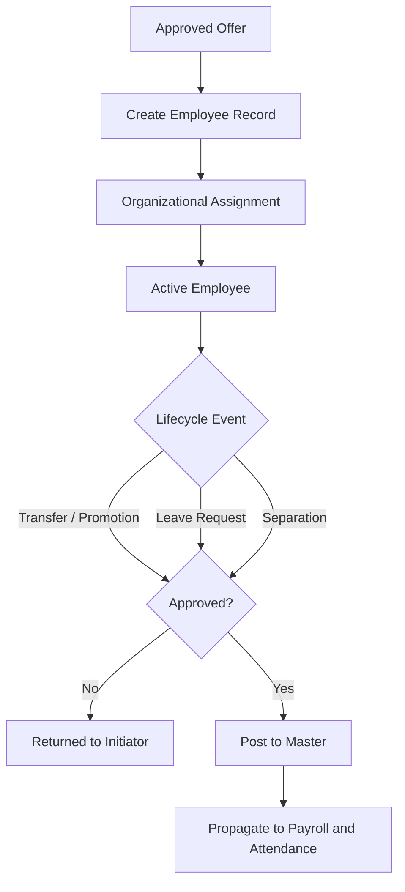

# Volume 06 - HR

| Field | Value |
|---|---|
| Document ID | WORLD-VOL06-020 |
| Title | HR |
| Version | 1.0 |
| Status | Approved |
| Classification | Internal |
| Founder | Mahesh Choudhary |

## Purpose

The HR module is the system of record for the enterprise's people. It governs the employee master, organizational assignment, and the full lifecycle from onboarding to separation, recording every people event as an auditable fact in the ERP Foundation (Volume 05). HR is the authoritative source of identity, structure, and employment terms on which Payroll, Attendance, and Recruitment depend, and it is the operational surface through which the AI Business Partner (Volume 03) reasons about workforce cost, capacity, and compliance.

## Scope

Scope covers employee master data governance, organizational assignment, position and grade management, employment lifecycle events (hire, transfer, promotion, separation), leave policy administration, and document and compliance tracking. It excludes gross-to-net pay computation (Payroll, Chapter 21), time capture (Attendance, Chapter 22), pre-hire candidate sourcing (Recruitment, Chapter 23), and physical database schemas (Volume 09).

## Business Value

People are the enterprise's largest recurring cost and its principal source of capability. A single, governed employee master eliminates the reconciliation errors, duplicate records, and compliance exposure that arise from disconnected HR spreadsheets. By making every lifecycle event a governed transaction on one data model, WORLD gives leadership a defensible, real-time view of headcount, cost, and organizational structure, and provides the trustworthy foundation without which payroll accuracy and workforce analytics are impossible.

## Objectives

- Maintain a single, accurate, and auditable employee master.
- Reflect organizational structure and reporting lines faithfully at all times.
- Govern every lifecycle event with policy, approval, and audit trail.
- Supply clean, authoritative data to Payroll, Attendance, and Recruitment.
- Expose workforce operations to the AI Business Partner for automation and insight.

## Responsibilities

HR owns employee master governance, organizational assignment integrity, position and grade catalogs, leave policy definition, and lifecycle event accuracy. It is accountable for employment compliance, document validity, and the timely, correct hand-off of employment terms and status changes to Payroll (Chapter 21).

## Business Process

The end-to-end flow is hire-to-retire. An approved offer from Recruitment creates an employee record, which is assigned to a position within the organizational structure defined in the Business Foundation (Volume 02). Lifecycle events - transfers, promotions, leave, and separations - are raised, approved, and posted, each updating the master and propagating downstream to Payroll and Attendance.

## Master Data

| Entity | Description | Owner |
|---|---|---|
| Employee | Person identity, employment terms, status | HR |
| Position | Seat within the organization linked to a grade | HR |
| Organizational Unit | Department, division, or cost center | HR |
| Grade / Band | Compensation and seniority classification | HR |
| Leave Policy | Entitlement rules by grade and location | HR |

## Transactions

Core transaction documents are the Hire Action, Transfer Action, Promotion Action, Leave Request, and Separation Action. Each is a governed document type in the ERP Foundation with defined statuses, effective dating, posting rules, and immutable audit history.

## Business Rules

- Every active employee must hold exactly one primary position within an organizational unit.
- Lifecycle events carry an effective date and cannot post retroactively without authorization.
- Employment terms and grade inherit from the position unless overridden with approval.
- A separation closes downstream entitlements and stops recurring payroll from the effective date.
- Mandatory compliance documents must be valid before an employee is marked active.

## Workflow

HR workflows run on the Volume 05 Workflow and Approval engines. Hire, transfer, promotion, leave, and separation actions are configurable, role-based, threshold-driven flows. Approval authority derives from the reporting lines and organizational structure defined in the Business Foundation (Volume 02).

## Inputs

Approved offers from Recruitment, organizational structure and policy from the Business Foundation, manager-initiated lifecycle actions, employee self-service requests, and compliance documents.

## Outputs

Authoritative employee master and org assignments to Payroll and Attendance, headcount and cost structure to Business Intelligence (Volume 04), position vacancies to Recruitment, and compliance and audit records.

## Dependencies

HR depends on the ERP Foundation (Volume 05) document, workflow, and audit engines and on the Business Foundation (Volume 02) for entity, role, and policy definitions. It is depended upon by Payroll, Attendance, and Recruitment, and it feeds Business Intelligence (Volume 04).

## KPIs

| KPI | Definition | Target |
|---|---|---|
| Master Data Accuracy | Records free of validation errors | > 99% |
| Onboarding Cycle Time | Offer acceptance to active status | < 3 days |
| Attrition Rate | Separations over average headcount | Tracked monthly |
| Compliance Document Validity | Employees with current documents | 100% |
| Org Assignment Integrity | Employees with exactly one primary position | 100% |

## Reports

Headcount by organizational unit, employee master listing, lifecycle event log, attrition and tenure analysis, and compliance document expiry report.

## Dashboards

A workforce dashboard surfacing headcount trends, open positions, pending lifecycle approvals, and compliance risks, with drill-down to individual employee records.

## Roles

| Role | Responsibility |
|---|---|
| Employee | Raises self-service and leave requests |
| Line Manager | Initiates and approves team lifecycle events |
| HR Officer | Maintains master data and processes actions |
| HR Manager | Owns policy and approves senior actions |

## Permissions

Permissions are granted on the Volume 05 role-based access model. Employees view and request against their own records; managers act on their reporting line; HR officers maintain master data; and HR managers approve above threshold. Segregation of duties prevents the same user from both initiating and approving a sensitive action such as a promotion.

## AI Features

The AI Business Partner (Volume 03) reasons over HR data to detect attrition risk, flag expiring compliance documents, recommend org rebalancing, and auto-draft lifecycle actions. **Enterprise example:** when a high-performing engineer's tenure, grade stagnation, and rising leave pattern signal flight risk, the partner alerts the line manager, drafts a retention-focused promotion action for review, and pre-checks budget impact with Payroll before routing for one-click approval.

## Future Expansion

Skills and competency graphs, succession planning, employee experience sentiment analysis, and autonomous workforce-planning agents.

## Cross-References

- [Payroll](/docs/blueprint/volume-06-business-modules/section-e-human-capital/21-payroll.md)
- [Attendance](/docs/blueprint/volume-06-business-modules/section-e-human-capital/22-attendance.md)
- [Recruitment](/docs/blueprint/volume-06-business-modules/section-e-human-capital/23-recruitment.md)
- [Volume 02 - Business Foundation](/docs/blueprint/volume-02-business-foundation/README.md)

## References

- [Volume 01 - Vision and Philosophy](/docs/blueprint/volume-01-vision-and-philosophy/README.md)
- [Document Standards](/docs/governance/document-standards.md)

## Change Log

| Version | Date | Author | Notes |
|---|---|---|---|
| 1.0 | 2026-07-12 | Lead Software Engineer | Initial approved version. |
