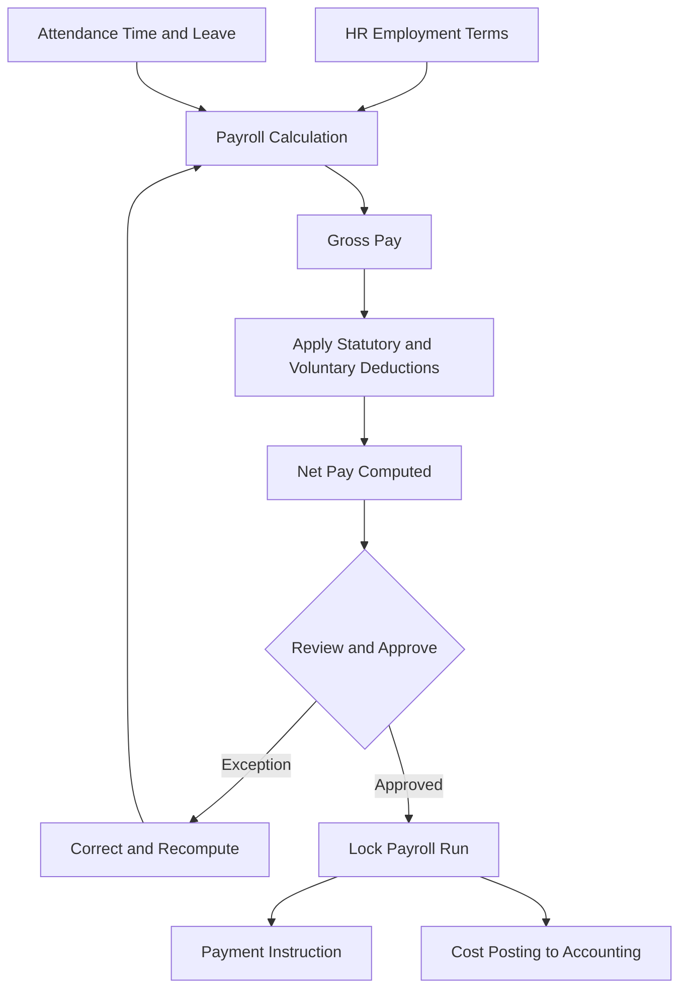

# Volume 06 - Payroll

| Field | Value |
|---|---|
| Document ID | WORLD-VOL06-021 |
| Title | Payroll |
| Version | 1.0 |
| Status | Approved |
| Classification | Internal |
| Founder | Mahesh Choudhary |

## Purpose

The Payroll module computes and disburses employee compensation. It converts employment terms from the HR employee master and time data from Attendance into governed gross-to-net calculations, statutory deductions, and payment instructions, recording every run as an auditable fact in the ERP Foundation (Volume 05). Payroll is the enterprise's largest recurring, compliance-sensitive financial obligation, and the operational surface through which the AI Business Partner (Volume 03) validates, explains, and safeguards pay accuracy.

## Scope

Scope covers pay component definition, gross-to-net computation, statutory and voluntary deductions, payroll run execution and locking, payslip generation, and hand-off of the net-pay liability and cost postings to Accounting. It excludes employee master and org assignment (HR, Chapter 20), time and leave capture (Attendance, Chapter 22), and physical database schemas (Volume 09).

## Business Value

Payroll accuracy is a matter of trust and legal exposure in equal measure. Errors erode employee confidence, trigger penalties, and consume finance time in corrections. By computing pay on the same governed data model that holds employment terms and attendance, WORLD eliminates the fragile spreadsheet hand-offs that cause most payroll defects, guarantees statutory compliance, and produces a fully auditable, reproducible pay run that reconciles cleanly to the general ledger.

## Objectives

- Compute accurate gross-to-net pay for every employee, every period.
- Enforce statutory and contractual deduction rules without exception.
- Produce an auditable, reproducible, and locked payroll run.
- Reconcile net pay and labor cost cleanly to Accounting.
- Expose payroll to the AI Business Partner for validation and explanation.

## Responsibilities

Payroll owns pay component governance, calculation integrity, statutory compliance, run execution and locking, and payslip issuance. It is accountable for the correctness of every pay run and for the timely, correct hand-off of the net-pay liability and labor cost to Accounting (Chapter 16).

## Business Process

The end-to-end flow is data-to-disbursement. Employment terms flow from HR and time and leave data flow from Attendance into the payroll engine, which computes gross, applies deductions, derives net, and posts the run. After review the run is locked, payslips are issued, and payment and ledger instructions are handed off.

## Master Data

| Entity | Description | Owner |
|---|---|---|
| Pay Component | Earning or deduction with calculation rule | Payroll |
| Salary Structure | Grade-linked set of pay components | Payroll |
| Statutory Rule | Tax, insurance, and contribution formulas | Payroll |
| Pay Group | Set of employees sharing a pay cycle | Payroll |
| Bank / Payment Detail | Employee disbursement instruction | HR |

## Transactions

Core transaction documents are the Payroll Run, Payslip, Deduction Instruction, Off-Cycle Payment, and Payroll Cost Posting. Each is a governed document type in the ERP Foundation with defined statuses, locking rules, and immutable audit history.

## Business Rules

- A locked payroll run is immutable; corrections require a governed off-cycle or reversal.
- Net pay equals gross earnings less all applicable statutory and voluntary deductions.
- Employment terms and salary structure are sourced from the HR master as of the pay period.
- Attendance and approved leave from Chapter 22 drive variable and unpaid components.
- Statutory deductions apply according to the employee's jurisdiction and cannot be waived.

## Workflow

Payroll workflows run on the Volume 05 Workflow and Approval engines. Run review, exception correction, approval, and off-cycle authorization are configurable, role-based flows. Approval authority derives from the finance and HR structure defined in the Business Foundation (Volume 02), with mandatory segregation between preparer and approver.

## Inputs

Employment terms and salary structures from HR, time and approved leave from Attendance, statutory rate tables, one-time earnings and deductions, and bank payment details.

## Outputs

Payslips to employees, net-pay payment instructions to the bank, labor cost and liability postings to Accounting, statutory filings, and payroll cost analytics to Business Intelligence (Volume 04).

## Dependencies

Payroll depends on HR (Chapter 20) for employment terms, on Attendance (Chapter 22) for time and leave, on the ERP Foundation (Volume 05) for calculation, posting, and audit engines, and on the Business Foundation (Volume 02) for policy and approval structure. It feeds Accounting and Business Intelligence.

## KPIs

| KPI | Definition | Target |
|---|---|---|
| Payroll Accuracy | Payslips issued without correction | > 99.5% |
| On-Time Pay Rate | Runs disbursed on the scheduled date | 100% |
| Statutory Compliance | Filings submitted correctly and on time | 100% |
| Off-Cycle Rate | Corrections outside the main run | < 2% |
| Reconciliation Variance | Payroll to ledger difference | Zero |

## Reports

Payroll register by pay group, statutory deduction summary, cost distribution by cost center, off-cycle and reversal report, and year-to-date earnings statement.

## Dashboards

A payroll operations dashboard surfacing run status, exceptions awaiting correction, cost trends by unit, and statutory obligations due, with drill-down to individual payslips.

## Roles

| Role | Responsibility |
|---|---|
| Payroll Officer | Prepares and computes the payroll run |
| Payroll Manager | Reviews, approves, and locks runs |
| Finance Controller | Confirms cost postings and funding |
| Employee | Views own payslips and statements |

## Permissions

Permissions are granted on the Volume 05 role-based access model. Payroll officers prepare runs; payroll managers approve and lock; the finance controller confirms postings; and employees view only their own payslips. Segregation of duties prevents the same user from both preparing and approving a payroll run.

## AI Features

The AI Business Partner (Volume 03) reasons over payroll data to detect anomalies before disbursement, explain pay changes in plain language, and forecast labor cost. **Enterprise example:** before a monthly run is locked, the partner compares each employee's net pay to trailing periods, flags a warehouse worker whose pay spiked due to an un-approved overtime feed from Attendance, and holds only that record for review while releasing the rest, preventing an erroneous payment without delaying the run.

## Future Expansion

Multi-country payroll harmonization, on-demand earned-wage access, predictive labor-cost planning, and autonomous statutory-filing agents.

## Cross-References

- [HR](/docs/blueprint/volume-06-business-modules/section-e-human-capital/20-hr.md)
- [Attendance](/docs/blueprint/volume-06-business-modules/section-e-human-capital/22-attendance.md)
- [Volume 05 - ERP Foundation](/docs/blueprint/volume-05-erp-foundation/README.md)
- [Volume 04 - Business Intelligence](/docs/blueprint/volume-04-business-intelligence/README.md)

## References

- [Volume 01 - Vision and Philosophy](/docs/blueprint/volume-01-vision-and-philosophy/README.md)
- [Document Standards](/docs/governance/document-standards.md)

## Change Log

| Version | Date | Author | Notes |
|---|---|---|---|
| 1.0 | 2026-07-12 | Lead Software Engineer | Initial approved version. |
