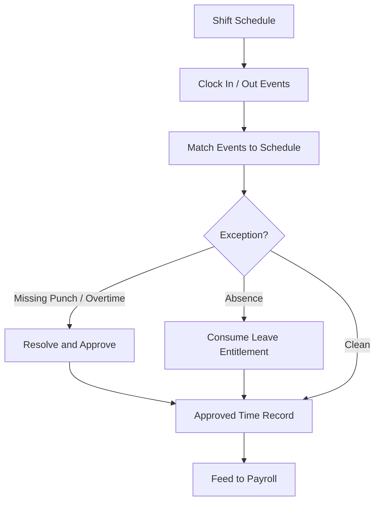

# Volume 06 - Attendance

| Field | Value |
|---|---|
| Document ID | WORLD-VOL06-022 |
| Title | Attendance |
| Version | 1.0 |
| Status | Approved |
| Classification | Internal |
| Founder | Mahesh Choudhary |

## Purpose

The Attendance module captures, validates, and governs employee time. It converts raw clock events, shift schedules, and leave into approved, auditable time records that feed Payroll, recording every entry as a fact in the ERP Foundation (Volume 05). Attendance is the bridge between an employee's presence and their pay, and the operational surface through which the AI Business Partner (Volume 03) monitors workforce utilization, exceptions, and compliance with working-time policy.

## Scope

Scope covers time capture, shift and roster management, leave consumption against HR entitlements, overtime calculation, exception handling, and the approved-time feed to Payroll. It excludes leave policy definition and employee master (HR, Chapter 20), gross-to-net pay computation (Payroll, Chapter 21), and physical database schemas (Volume 09).

## Business Value

Time is the raw input to labor cost, and unmanaged time is unmanaged spend and compliance risk. Manual timesheets produce disputes, buddy-punching, unpaid-overtime liability, and payroll rework. By capturing time on a governed data model linked directly to the employee master and payroll engine, WORLD guarantees that every paid hour is an approved hour, enforces working-time rules automatically, and gives operations a real-time view of presence, absence, and overtime exposure.

## Objectives

- Capture accurate, tamper-evident time for every employee.
- Enforce shift, overtime, and working-time policy automatically.
- Consume leave correctly against HR-defined entitlements.
- Deliver a clean, approved time feed to Payroll every cycle.
- Expose time and utilization data to the AI Business Partner for insight.

## Responsibilities

Attendance owns time record integrity, shift and roster accuracy, overtime computation, exception resolution, and the approved-time hand-off to Payroll (Chapter 21). It is accountable for enforcing working-time compliance and for the correct consumption of leave against entitlements governed by HR (Chapter 20).

## Business Process

The end-to-end flow is capture-to-feed. Employees are scheduled to shifts, clock in and out, and their raw events are matched to schedules. Exceptions - missing punches, overtime, and absences - are resolved and approved, leave is consumed against entitlement, and the approved time record is fed to Payroll for computation.

## Master Data

| Entity | Description | Owner |
|---|---|---|
| Shift | Defined working period with start and end | Attendance |
| Roster | Assignment of employees to shifts | Attendance |
| Time Policy | Overtime, grace, and rounding rules | Attendance |
| Leave Balance | Employee entitlement drawn from HR policy | HR |
| Clock Source | Device or channel capturing time events | Attendance |

## Transactions

Core transaction documents are the Time Entry, Attendance Correction, Overtime Record, Leave Consumption, and Approved Timesheet. Each is a governed document type in the ERP Foundation with defined statuses, approval rules, and immutable audit history.

## Business Rules

- Only approved time records feed Payroll; unresolved exceptions are excluded from the run.
- Overtime accrues only when authorized and beyond the policy-defined threshold.
- Leave consumption cannot exceed the entitlement balance governed by HR.
- A submitted timesheet is locked to edits once approved for a pay period.
- Clock events are tamper-evident and retain their source for audit.

## Workflow

Attendance workflows run on the Volume 05 Workflow and Approval engines. Exception resolution, overtime authorization, leave approval, and timesheet sign-off are configurable, role-based flows. Approval authority derives from the reporting lines defined in the Business Foundation (Volume 02) and the leave policy governed by HR.

## Inputs

Clock events from devices and self-service, shift schedules and rosters, leave requests and entitlements from HR, and time and overtime policies.

## Outputs

Approved time and overtime records to Payroll, leave consumption updates to HR, utilization and absence analytics to Business Intelligence (Volume 04), and compliance and exception records.

## Dependencies

Attendance depends on HR (Chapter 20) for employee master and leave entitlements, on the ERP Foundation (Volume 05) for workflow, posting, and audit engines, and on the Business Foundation (Volume 02) for reporting lines and policy. It feeds Payroll (Chapter 21) and Business Intelligence (Volume 04).

## KPIs

| KPI | Definition | Target |
|---|---|---|
| Time Capture Completeness | Employees with complete daily records | > 99% |
| Exception Resolution Time | Exception raised to approval | < 24 hours |
| Overtime Ratio | Overtime hours over scheduled hours | Tracked weekly |
| Absenteeism Rate | Unplanned absences over scheduled days | Tracked monthly |
| Payroll Feed Accuracy | Approved records passing payroll validation | > 99.5% |

## Reports

Daily attendance register, exception and correction log, overtime summary by unit, leave consumption report, and absenteeism trend analysis.

## Dashboards

An attendance operations dashboard surfacing present-and-absent counts, unresolved exceptions, overtime exposure, and roster coverage, with drill-down to individual time records.

## Roles

| Role | Responsibility |
|---|---|
| Employee | Clocks time and requests leave |
| Line Manager | Approves exceptions, overtime, and leave |
| Attendance Officer | Maintains rosters and resolves records |
| HR Manager | Owns leave policy and audits balances |

## Permissions

Permissions are granted on the Volume 05 role-based access model. Employees record their own time and requests; managers approve for their reporting line; attendance officers maintain rosters and corrections; and HR audits balances. Segregation of duties prevents the same user from both recording and approving their own time.

## AI Features

The AI Business Partner (Volume 03) reasons over time data to detect anomalies, forecast staffing gaps, and auto-resolve routine exceptions. **Enterprise example:** the partner notices a production line will be understaffed next shift because of an approved-leave cluster, proposes a compliant roster adjustment within overtime limits, and flags a repeated missing-punch pattern at one clock device for the attendance officer before it corrupts the payroll feed.

## Future Expansion

Geofenced and biometric capture, predictive shift optimization, fatigue and working-time risk modeling, and autonomous rostering agents.

## Cross-References

- [HR](/docs/blueprint/volume-06-business-modules/section-e-human-capital/20-hr.md)
- [Payroll](/docs/blueprint/volume-06-business-modules/section-e-human-capital/21-payroll.md)
- [Volume 05 - ERP Foundation](/docs/blueprint/volume-05-erp-foundation/README.md)
- [Volume 03 - AI Business Partner](/docs/blueprint/volume-03-ai-business-partner/README.md)

## References

- [Volume 01 - Vision and Philosophy](/docs/blueprint/volume-01-vision-and-philosophy/README.md)
- [Document Standards](/docs/governance/document-standards.md)

## Change Log

| Version | Date | Author | Notes |
|---|---|---|---|
| 1.0 | 2026-07-12 | Lead Software Engineer | Initial approved version. |
