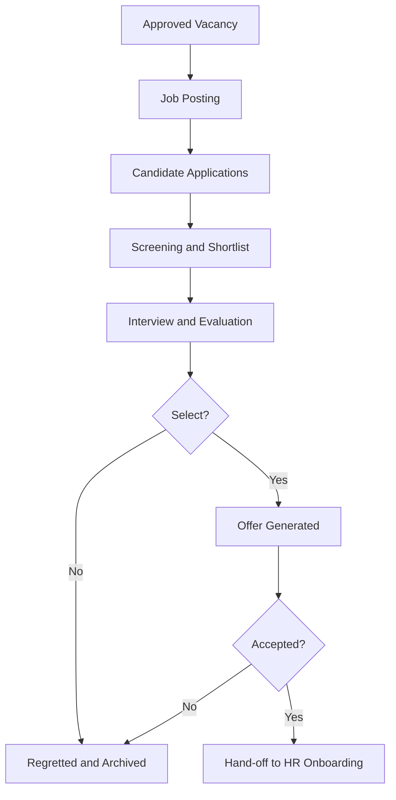

# Volume 06 - Recruitment

| Field | Value |
|---|---|
| Document ID | WORLD-VOL06-023 |
| Title | Recruitment |
| Version | 1.0 |
| Status | Approved |
| Classification | Internal |
| Founder | Mahesh Choudhary |

## Purpose

The Recruitment module governs how the enterprise sources, evaluates, and hires talent. It converts an approved position vacancy into a governed hiring process that culminates in an accepted offer, which seeds the HR employee master, recording every step as an auditable fact in the ERP Foundation (Volume 05). Recruitment is the enterprise's gateway to workforce capability, and the operational surface through which the AI Business Partner (Volume 03) screens, ranks, and accelerates hiring decisions.

## Scope

Scope covers requisition and vacancy approval, job posting, candidate and application management, screening and interview workflow, offer generation and acceptance, and hand-off of the approved hire to HR. It excludes employee master creation and lifecycle (HR, Chapter 20), pay computation (Payroll, Chapter 21), and physical database schemas (Volume 09).

## Business Value

The cost of a bad or slow hire compounds across the employee lifecycle. Fragmented recruiting across inboxes and spreadsheets loses candidates, obscures pipeline status, and exposes the enterprise to bias and compliance risk. By running hiring as a governed process on the same data model that holds positions and org structure, WORLD shortens time-to-hire, preserves a defensible and auditable selection trail, and ensures that every offer maps cleanly to a funded, approved position before an employee record is ever created.

## Objectives

- Convert approved vacancies into filled positions quickly and fairly.
- Maintain a single, auditable candidate pipeline for every requisition.
- Enforce structured, bias-aware evaluation and approval.
- Seed the HR master cleanly from every accepted offer.
- Expose hiring operations to the AI Business Partner for screening and insight.

## Responsibilities

Recruitment owns requisition governance, candidate pipeline integrity, interview and evaluation workflow, offer accuracy, and the hand-off of accepted hires to HR (Chapter 20). It is accountable for hiring compliance, selection auditability, and ensuring every offer maps to a funded, approved position.

## Business Process

The end-to-end flow is requisition-to-hire. An approved vacancy - originating from an HR position gap defined against the Business Foundation (Volume 02) organizational structure - is posted, candidates apply and are screened, shortlisted applicants are interviewed and evaluated, and the selected candidate receives an offer whose acceptance hands off to HR to create the employee record.

## Master Data

| Entity | Description | Owner |
|---|---|---|
| Requisition | Approved vacancy linked to a position | Recruitment |
| Candidate | Person profile, history, and status | Recruitment |
| Job Posting | Published advertisement for a requisition | Recruitment |
| Interview Stage | Defined evaluation step and scorecard | Recruitment |
| Offer Template | Grade-linked terms for offer generation | HR |

## Transactions

Core transaction documents are the Requisition, Application, Interview Evaluation, Offer, and Acceptance. Each is a governed document type in the ERP Foundation with defined statuses, approval rules, and immutable audit history.

## Business Rules

- An offer cannot be issued without an approved requisition mapped to a funded position.
- Offer terms and grade inherit from the position and HR offer template.
- Every advancement between interview stages requires a recorded evaluation.
- A candidate cannot hold two active applications for the same requisition.
- An accepted offer must hand off to HR before any employment record exists.

## Workflow

Recruitment workflows run on the Volume 05 Workflow and Approval engines. Requisition approval, stage advancement, offer approval, and acceptance are configurable, role-based, threshold-driven flows. Requisition and offer approval authority derives from the organizational structure and hiring policy defined in the Business Foundation (Volume 02).

## Inputs

Approved vacancies and position gaps from HR, candidate applications from postings and referrals, interview evaluations, offer templates, and hiring budget and headcount plans.

## Outputs

Accepted offers and hire data to HR, filled and open pipeline status to management, time-to-hire and funnel analytics to Business Intelligence (Volume 04), and compliance and selection audit records.

## Dependencies

Recruitment depends on HR (Chapter 20) for positions and offer templates, on the ERP Foundation (Volume 05) for document, workflow, and audit engines, and on the Business Foundation (Volume 02) for organizational structure and hiring policy. It feeds HR onboarding and Business Intelligence (Volume 04).

## KPIs

| KPI | Definition | Target |
|---|---|---|
| Time to Hire | Requisition approval to offer acceptance | < 30 days |
| Offer Acceptance Rate | Offers accepted over offers issued | > 85% |
| Pipeline Conversion | Applications advancing to interview | Tracked per role |
| Cost per Hire | Total recruiting spend per hire | Tracked monthly |
| Quality of Hire | New hires passing probation | > 90% |

## Reports

Requisition status report, candidate pipeline funnel, interview outcome summary, offer and acceptance log, and source-of-hire effectiveness analysis.

## Dashboards

A recruitment operations dashboard surfacing open requisitions, pipeline by stage, offers pending acceptance, and time-to-hire trends, with drill-down to individual candidates.

## Roles

| Role | Responsibility |
|---|---|
| Hiring Manager | Raises requisitions and evaluates candidates |
| Recruiter | Sources, screens, and manages the pipeline |
| Interviewer | Assesses candidates and records scorecards |
| HR Manager | Approves offers and hiring policy |

## Permissions

Permissions are granted on the Volume 05 role-based access model. Hiring managers raise requisitions and evaluate; recruiters manage the pipeline; interviewers record only their own evaluations; and HR managers approve offers. Segregation of duties prevents the same user from both raising a requisition and approving its final offer.

## AI Features

The AI Business Partner (Volume 03) reasons over recruiting data to screen and rank candidates against role criteria, surface pipeline bottlenecks, and draft offers. **Enterprise example:** for a hard-to-fill engineering requisition, the partner ranks incoming applications against the scorecard, highlights three high-fit candidates who would otherwise stall in the queue, flags an interview stage running slower than target, and pre-drafts a compliant offer at the position's grade for the hiring manager to approve.

## Future Expansion

Skills-based matching graphs, candidate experience automation, structured bias-audit tooling, and autonomous sourcing agents.

## Cross-References

- [HR](/docs/blueprint/volume-06-business-modules/section-e-human-capital/20-hr.md)
- [Payroll](/docs/blueprint/volume-06-business-modules/section-e-human-capital/21-payroll.md)
- [Volume 02 - Business Foundation](/docs/blueprint/volume-02-business-foundation/README.md)
- [Volume 04 - Business Intelligence](/docs/blueprint/volume-04-business-intelligence/README.md)

## References

- [Volume 01 - Vision and Philosophy](/docs/blueprint/volume-01-vision-and-philosophy/README.md)
- [Document Standards](/docs/governance/document-standards.md)

## Change Log

| Version | Date | Author | Notes |
|---|---|---|---|
| 1.0 | 2026-07-12 | Lead Software Engineer | Initial approved version. |
