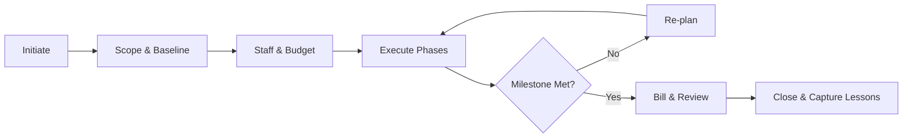

# Volume 06 - Projects

| Field | Value |
|---|---|
| Document ID | WORLD-VOL06-024 |
| Title | Projects |
| Version | 1.0 |
| Status | Approved |
| Classification | Internal |
| Founder | Mahesh Choudhary |

## Purpose

The Projects module is the system of delivery for every bounded, outcome-driven initiative the enterprise undertakes, whether an internal transformation, a client engagement, or a capital build. It structures scope, schedule, budget, and resources into a governed record so that the AI Business Partner (Volume 03) can reason over delivery health and act on the operator's behalf. Projects operationalizes the value-delivery principles of the Business Foundation (Volume 02) and persists its records on the ERP Foundation (Volume 05).

## Scope

This document covers project definition, planning, budgeting, resource assignment, milestone tracking, billing linkage, and closure. It excludes granular task execution (see WORLD-VOL06-025 Task Management), deliverable storage (WORLD-VOL06-026 Documents), and physical data schemas, which belong to Volume 09.

## Business Value

Projects converts ambiguous intent into predictable, measurable delivery. It prevents scope drift, protects margin, exposes schedule risk early, and gives the AI Business Partner the substrate to forecast completion and flag overruns. The measurable outcome is higher on-time, on-budget delivery and improved project profitability.

## Objectives

- Define every initiative with a clear scope, budget, and accountable owner.
- Plan work into phases and milestones with realistic baselines.
- Allocate people and cost against capacity, not aspiration.
- Track actuals against budget continuously to protect margin.
- Feed reliable delivery data to Finance, Billing, and Business Intelligence (Volume 04).

## Responsibilities

The module owns the lifecycle of project master data and delivery transactions. It is responsible for baseline integrity, budget-versus-actual tracking, milestone status, and the handoff of billable events to invoicing. It is not responsible for executing individual tasks or authoring deliverables, which it coordinates through dependent modules.

## Business Process

A project is initiated from an approved opportunity, internal mandate, or contract. It is scoped, baselined, and staffed, then executed through phases and milestones while actuals accrue. Governance gates review health at each phase before the project is delivered, billed, and formally closed with lessons captured.

## Master Data

| Entity | Description | Key Attributes |
|---|---|---|
| Project | Bounded delivery initiative | Code, name, client, owner, status |
| Phase | Stage of a project | Name, sequence, start, finish |
| Milestone | Contractual or internal checkpoint | Due date, billable flag, status |
| Resource Assignment | Person allocated to a project | Role, rate, allocation percent |
| Budget Line | Cost or revenue estimate | Category, planned, committed, actual |

## Transactions

Baseline approvals, milestone completions, timesheet postings, cost commitments, budget revisions, and billing events are the transactional records. Each is timestamped and attributed, providing the audit trail the ERP Foundation (Volume 05) requires.

## Business Rules

- A project cannot move to execution without an approved baseline budget.
- Actuals are posted against budget lines, never against the project header directly.
- A billable milestone cannot be invoiced until marked complete and approved.
- Baseline changes require a governance gate and create an auditable revision.

## Workflow

Projects follow a phase-gate workflow with approval checkpoints between phases. Budget overruns beyond a defined tolerance escalate to the sponsor. Milestone slippage past its SLA triggers an alert to the project owner and the AI Business Partner.

## Inputs

Approved opportunities from CRM and Sales, contract terms, resource capacity data, cost estimates, and timesheet submissions from Task Management (WORLD-VOL06-025).

## Outputs

Billable milestone events to Billing and Finance, delivery health to Business Intelligence (Volume 04), and project context to the AI Business Partner (Volume 03).

## Dependencies

Depends on the ERP Foundation (Volume 05) for identity, audit, and multi-entity partitioning; on the Business Foundation (Volume 02) for the value-delivery model; and coordinates with Task Management (WORLD-VOL06-025) and Documents (WORLD-VOL06-026).

## KPIs

Schedule variance, cost variance, budget-at-completion accuracy, milestone on-time rate, resource utilization, and project gross margin.

## Reports

Budget-versus-actual by project, milestone status report, resource allocation report, and project profitability report.

## Dashboards

An operator dashboard shows portfolio health, at-risk projects, weighted margin forecast, upcoming milestones, and the AI Business Partner's recommended interventions.

## Roles

Project Sponsor, Project Manager, Team Member, and Project Management Office (PMO) Administrator.

## Permissions

| Role | Read | Create | Edit | Delete |
|---|---|---|---|---|
| Project Sponsor | Portfolio | No | Approve gates | No |
| Project Manager | Own & team | Yes | Own | Archive only |
| Team Member | Assigned | No | Own actuals | No |
| PMO Administrator | All | Yes | All | Yes |

## AI Features

The AI Business Partner (Volume 03) forecasts completion dates, predicts budget overruns, recommends resource rebalancing, and drafts status narratives. Example: for a 250,000 USD systems-integration project trending 12 percent over budget at phase two, it isolates the driver as unplanned rework, proposes reassigning a senior engineer, and drafts a sponsor briefing with a revised baseline within tolerance.

## Future Expansion

Monte Carlo schedule simulation, earned-value automation, portfolio optimization across capital constraints, and predictive staffing from historical delivery patterns.

## Cross-References

- [Task Management](../section-f-projects-and-productivity/25-task-management.md)
- [Documents](../section-f-projects-and-productivity/26-documents.md)
- [Volume 02 - Business Foundation](../../volume-02-business-foundation/README.md)
- [Volume 05 - ERP Foundation](../../volume-05-erp-foundation/README.md)

## References

- [Volume 01 - Vision and Philosophy](/docs/blueprint/volume-01-vision-and-philosophy/README.md)
- [Document Standards](/docs/governance/document-standards.md)

## Change Log

| Version | Date | Author | Notes |
|---|---|---|---|
| 1.0 | 2026-07-12 | Lead Software Engineer | Initial approved version. |
