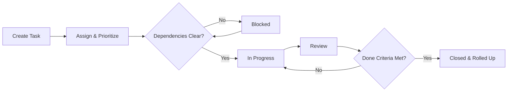

# Volume 06 - Task Management

| Field | Value |
|---|---|
| Document ID | WORLD-VOL06-025 |
| Title | Task Management |
| Version | 1.0 |
| Status | Approved |
| Classification | Internal |
| Founder | Mahesh Choudhary |

## Purpose

The Task Management module is the system of execution for the discrete units of work that move projects and operations forward. It captures, assigns, sequences, and tracks tasks so that the AI Business Partner (Volume 03) can reason over workload, bottlenecks, and priority and act on the operator's behalf. Task Management operationalizes the accountability principles of the Business Foundation (Volume 02) and persists its records on the ERP Foundation (Volume 05).

## Scope

This document covers task creation, assignment, dependencies, time logging, status tracking, and Kanban and list execution views. It excludes project-level budgeting and milestones (see WORLD-VOL06-024 Projects), deliverable storage (WORLD-VOL06-026 Documents), and physical data schemas, which belong to Volume 09.

## Business Value

Task Management converts intent into coordinated action. It removes ambiguity over ownership, surfaces blockers before they cascade, balances workload across teams, and gives the AI Business Partner the substrate to prioritize and automate routine follow-up. The measurable outcome is higher throughput and shorter cycle times.

## Objectives

- Give every unit of work a single owner, due date, and clear definition of done.
- Model dependencies so sequencing reflects reality.
- Capture effort through time logging linked to projects and clients.
- Balance assignment against individual capacity.
- Feed accurate execution data to Projects, Billing, and Business Intelligence (Volume 04).

## Responsibilities

The module owns the lifecycle of task records and execution transactions. It is responsible for status integrity, dependency enforcement, time capture, and workload visibility. It is not responsible for project budgeting or contractual milestones, which it feeds through its linkage to Projects.

## Business Process

A task is created from a project plan, a recurring template, or an ad hoc request. It is assigned, sequenced against dependencies, and worked through a status flow while time is logged. Completion is validated against the definition of done before the task closes and rolls its effort up to its parent project.

## Master Data

| Entity | Description | Key Attributes |
|---|---|---|
| Task | Discrete unit of work | Title, owner, due date, priority, status |
| Task List | Grouping of related tasks | Name, project link, owner |
| Dependency | Relationship between tasks | Predecessor, successor, type |
| Time Log | Recorded effort against a task | Duration, date, billable flag |
| Checklist Item | Sub-step within a task | Description, done flag |

## Transactions

Status changes, assignments, time-log entries, dependency updates, and comment threads are the transactional records. Each is timestamped and attributed, providing the audit trail the ERP Foundation (Volume 05) requires.

## Business Rules

- A task cannot start while an incomplete blocking dependency exists.
- A task cannot close until its checklist and definition of done are satisfied.
- Billable time must reference a valid project and client.
- Reassignment preserves history; ownership is never silently overwritten.

## Workflow

Tasks follow a status workflow from backlog to closed, with a review gate before closure. Overdue tasks escalate to the assignee's manager. Capacity breaches, where assigned effort exceeds available hours, trigger a rebalancing alert to the project owner and the AI Business Partner.

## Inputs

Project plans and milestones from Projects (WORLD-VOL06-024), recurring task templates, ad hoc requests, and calendar availability data.

## Outputs

Rolled-up effort and progress to Projects, billable time to Billing and Finance, throughput signals to Business Intelligence (Volume 04), and workload context to the AI Business Partner (Volume 03).

## Dependencies

Depends on the ERP Foundation (Volume 05) for identity, audit, and multi-entity partitioning; on the Business Foundation (Volume 02) for the accountability model; and is a child of Projects (WORLD-VOL06-024).

## KPIs

Cycle time, on-time completion rate, average time-to-first-action, blocked-task ratio, throughput per team, and time-logging compliance.

## Reports

Workload by assignee, overdue task report, cycle-time analysis, and billable-hours summary.

## Dashboards

An operator dashboard shows a Kanban board, team capacity heatmap, overdue and blocked tasks, and the AI Business Partner's recommended reprioritizations for the day.

## Roles

Team Lead, Assignee, Requester, and Workspace Administrator.

## Permissions

| Role | Read | Create | Edit | Delete |
|---|---|---|---|---|
| Team Lead | Team | Yes | Team | Archive only |
| Assignee | Assigned & team | Yes | Own | No |
| Requester | Own requests | Yes | Own requests | No |
| Workspace Administrator | All | Yes | All | Yes |

## AI Features

The AI Business Partner (Volume 03) prioritizes each person's queue, predicts due-date slippage, auto-drafts task breakdowns from a goal, and nudges owners of stalled work. Example: given the instruction to prepare a client onboarding, it generates a sequenced eight-task checklist with dependencies and owners, flags a capacity conflict for the lead consultant, and proposes moving two tasks to the following week.

## Future Expansion

Natural-language task creation from meetings, automatic dependency inference, workload-aware auto-assignment, and predictive burndown for delivery teams.

## Cross-References

- [Projects](../section-f-projects-and-productivity/24-projects.md)
- [Documents](../section-f-projects-and-productivity/26-documents.md)
- [Volume 02 - Business Foundation](../../volume-02-business-foundation/README.md)
- [Volume 05 - ERP Foundation](../../volume-05-erp-foundation/README.md)

## References

- [Volume 01 - Vision and Philosophy](/docs/blueprint/volume-01-vision-and-philosophy/README.md)
- [Document Standards](/docs/governance/document-standards.md)

## Change Log

| Version | Date | Author | Notes |
|---|---|---|---|
| 1.0 | 2026-07-12 | Lead Software Engineer | Initial approved version. |
