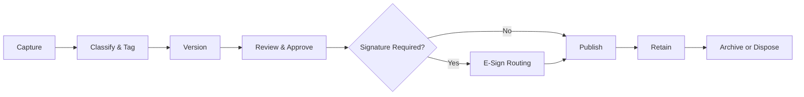

# Volume 06 - Documents

| Field | Value |
|---|---|
| Document ID | WORLD-VOL06-026 |
| Title | Documents |
| Version | 1.0 |
| Status | Approved |
| Classification | Internal |
| Founder | Mahesh Choudhary |

## Purpose

The Documents module is the system of record for the enterprise's unstructured knowledge: contracts, proposals, deliverables, policies, and correspondence. It captures, classifies, versions, and governs documents so that the AI Business Partner (Volume 03) can retrieve, summarize, and reason over them and act on the operator's behalf. Documents operationalizes the knowledge-as-asset principle of the Business Foundation (Volume 02) and extends the platform Document Management service of the ERP Foundation (Volume 05, Chapter 33) into a business-facing module.

## Scope

This document covers document capture, classification, versioning, access control, e-signature routing, retention, and retrieval. It excludes the platform storage and audit primitives (see Volume 05 Chapter 33) and physical data schemas, which belong to Volume 09.

## Business Value

Documents turns scattered files into a governed, searchable, and auditable corporate memory. It eliminates version confusion, enforces retention and confidentiality, accelerates retrieval, and gives the AI Business Partner the grounded context to answer questions and draft new documents accurately. The measurable outcome is reduced risk and faster knowledge work.

## Objectives

- Provide a single authoritative version of every business document.
- Classify documents consistently for retrieval and governance.
- Enforce access, retention, and confidentiality by policy.
- Route documents for review, approval, and e-signature reliably.
- Feed grounded content and metadata to the AI Business Partner and Business Intelligence (Volume 04).

## Responsibilities

The module owns the lifecycle of document master data and governance transactions. It is responsible for version integrity, classification, access enforcement, and retention. It is not responsible for the underlying binary storage and audit ledger, which the ERP Foundation (Volume 05, Chapter 33) provides.

## Business Process

A document is captured by upload, generation, or inbound integration. It is classified, versioned, and routed for review and approval, then published to authorized users, retained per policy, and eventually archived or disposed under a defined retention schedule.

## Master Data

| Entity | Description | Key Attributes |
|---|---|---|
| Document | Governed file record | Title, type, owner, classification, status |
| Version | Immutable revision | Version number, author, timestamp |
| Category | Classification taxonomy node | Name, retention policy, sensitivity |
| Access Grant | Permission binding | Principal, scope, level |
| Retention Policy | Lifecycle rule | Duration, disposition action |

## Transactions

Uploads, version commits, approvals, e-signature events, access grants, and disposition actions are the transactional records. Each is timestamped and attributed, drawing on the audit ledger the ERP Foundation (Volume 05, Chapter 33) provides.

## Business Rules

- A published version is immutable; changes create a new version, never an overwrite.
- Every document must carry a classification before it can be published.
- Access is denied by default and granted only by explicit policy.
- Documents past their retention period follow their defined disposition action.

## Workflow

Documents follow a review-and-approval workflow, optionally extended by an e-signature workflow. Approval routing respects the delegation of authority defined in the Business Foundation (Volume 02). Retention breaches escalate to the records owner for disposition.

## Inputs

Uploaded files, documents generated by Projects (WORLD-VOL06-024) and Sales, inbound email attachments, and templates for contracts and proposals.

## Outputs

Approved and signed documents to counterparties and internal consumers, deliverables linked back to Projects, and grounded content and metadata to the AI Business Partner (Volume 03) and Business Intelligence (Volume 04).

## Dependencies

Depends on the ERP Foundation (Volume 05, Chapter 33) for storage, audit, and multi-entity partitioning; on the Business Foundation (Volume 02) for classification and delegation policy; and links deliverables to Projects (WORLD-VOL06-024).

## KPIs

Retrieval time, version-conflict rate, approval cycle time, e-signature turnaround, retention-compliance rate, and share of documents correctly classified.

## Reports

Document inventory by category, pending-approval report, retention-due report, and access-audit report.

## Dashboards

An operator dashboard shows documents awaiting approval, expiring contracts, retention actions due, and the AI Business Partner's summaries of recently changed high-value documents.

## Roles

Document Owner, Reviewer, Approver, and Records Administrator.

## Permissions

| Role | Read | Create | Edit | Delete |
|---|---|---|---|---|
| Document Owner | Own & shared | Yes | Own drafts | Archive only |
| Reviewer | Assigned | No | Comment only | No |
| Approver | Assigned | No | Approve or reject | No |
| Records Administrator | All | Yes | Policy & metadata | Dispose per policy |

## AI Features

The AI Business Partner (Volume 03) classifies documents automatically, extracts key terms, summarizes long files, answers questions grounded in the corpus, and drafts new documents from templates and context. Example: on ingesting a 40-page master services agreement, it classifies it as a contract, extracts the renewal date, liability cap, and payment terms, flags a non-standard indemnity clause for legal review, and drafts a plain-language summary for the account owner.

## Future Expansion

Retrieval-augmented drafting across the full corpus, automated clause-risk scoring, semantic search over multilingual documents, and proactive contract-obligation monitoring.

## Cross-References

- [Projects](../section-f-projects-and-productivity/24-projects.md)
- [Task Management](../section-f-projects-and-productivity/25-task-management.md)
- [Volume 03 - AI Business Partner](../../volume-03-ai-business-partner/README.md)
- [Volume 05 - ERP Foundation](../../volume-05-erp-foundation/README.md)

## References

- [Volume 01 - Vision and Philosophy](/docs/blueprint/volume-01-vision-and-philosophy/README.md)
- [Document Standards](/docs/governance/document-standards.md)

## Change Log

| Version | Date | Author | Notes |
|---|---|---|---|
| 1.0 | 2026-07-12 | Lead Software Engineer | Initial approved version. |
