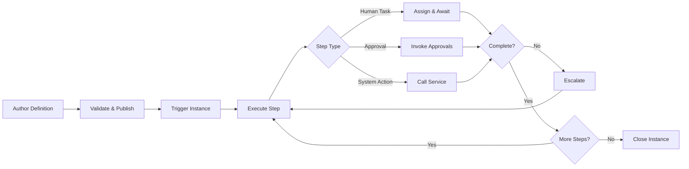

# Volume 06 - Workflow

| Field | Value |
|---|---|
| Document ID | WORLD-VOL06-027 |
| Title | Workflow |
| Version | 1.0 |
| Status | Approved |
| Classification | Internal |
| Founder | Mahesh Choudhary |

## Purpose

The Workflow module is the platform service that orchestrates multi-step business processes across every module in the operating system. It exposes the process-orchestration engine of the ERP Foundation (Volume 05, Chapter 31) to operators and builders, turning implicit sequences of human and system actions into governed, observable, and repeatable flows. It operationalizes the process discipline of the Business Foundation (Volume 02) and gives the AI Business Partner (Volume 03) an executable substrate on which to reason, intervene, and act on the operator's behalf.

## Scope

This document covers workflow definition, versioning, triggering, execution, state management, escalation, and observability. It excludes the approval decision semantics owned by Approvals (WORLD-VOL06-028), the delivery of messages owned by Notifications (WORLD-VOL06-029), and the underlying engine internals and physical schemas, which belong to Volume 05 and Volume 09 respectively.

## Business Value

Workflow converts tribal, undocumented process knowledge into durable, auditable automation. It removes manual handoffs, eliminates dropped steps, and guarantees that work advances under consistent rules regardless of who is present. The measurable outcome is shorter cycle times, lower process error rates, and complete traceability of how every business outcome was produced.

## Objectives

- Model any business process as a versioned, executable workflow definition.
- Trigger flows from events, schedules, or user actions across all modules.
- Route each step to the correct role, service, or agent with deterministic rules.
- Escalate stalled work automatically against defined service levels.
- Provide end-to-end observability of every instance for audit and improvement.

## Responsibilities

The module owns the lifecycle of workflow definitions and the execution state of every running instance. It is responsible for step routing, transition integrity, timer and escalation management, and the emission of process events. It is not responsible for adjudicating approvals or delivering notifications; it invokes Approvals (WORLD-VOL06-028) and Notifications (WORLD-VOL06-029) as coordinated services.

## Business Process

A workflow is authored, validated, and published as an immutable version. A trigger creates an instance that advances step by step, invoking human tasks, system actions, approvals, and notifications until it reaches a terminal state. Stalled steps escalate, and every transition is recorded.

## Master Data

| Entity | Description | Key Attributes |
|---|---|---|
| Workflow Definition | Published process template | Code, name, version, status |
| Step | Node within a definition | Type, assignee rule, SLA |
| Transition | Directed edge between steps | Condition, source, target |
| Trigger | Event that starts an instance | Event type, filter, entity |
| Escalation Policy | Rule for breached SLAs | Threshold, action, target role |

## Transactions

Instance creation, step assignments, step completions, transition firings, timer expirations, escalations, and instance closures are the transactional records. Each is timestamped and attributed, providing the immutable audit trail the ERP Foundation (Volume 05) requires.

## Business Rules

- A workflow cannot be triggered unless it has a published, validated version.
- A running instance is bound to the definition version active at its creation.
- Every step must have a defined assignee rule and terminal condition.
- A step breaching its SLA must invoke its escalation policy without manual action.
- Definitions are immutable once published; changes create a new version.

## Workflow

The module is itself the workflow engine, but its own governance follows a publish-gate flow: a draft definition is validated for reachability and orphan-free transitions, reviewed, and promoted to Published. Deprecating a version blocks new instances while allowing in-flight instances to complete.

## Inputs

Business events emitted by any module, scheduled triggers, user-initiated start requests, approval outcomes from Approvals (WORLD-VOL06-028), and definition metadata authored by process designers.

## Outputs

Process events and completed instance records to Business Intelligence (Volume 04), notification requests to Notifications (WORLD-VOL06-029), approval requests to Approvals (WORLD-VOL06-028), and live process context to the AI Business Partner (Volume 03).

## Dependencies

Depends on the ERP Foundation (Volume 05, Chapter 31) for the orchestration engine, identity, and audit; on the Business Foundation (Volume 02) for the process model; and coordinates with Approvals (WORLD-VOL06-028) and Notifications (WORLD-VOL06-029).

## KPIs

Average cycle time per definition, step SLA adherence, escalation rate, instance completion rate, rework loops per instance, and automation coverage of manual steps.

## Reports

Instance status report by definition, SLA breach report, escalation frequency report, and cycle-time trend report by process.

## Dashboards

An operator dashboard shows active instances by state, bottleneck steps, breached SLAs, throughput trend, and the AI Business Partner's recommended process interventions.

## Roles

Process Designer, Process Owner, Task Assignee, and Workflow Administrator.

## Permissions

| Role | Read | Create | Edit | Delete |
|---|---|---|---|---|
| Process Designer | Definitions | Yes | Draft only | Draft only |
| Process Owner | Owned flows | No | Publish gate | No |
| Task Assignee | Assigned steps | No | Own steps | No |
| Workflow Administrator | All | Yes | All | Yes |

## AI Features

The AI Business Partner (Volume 03) monitors live instances, predicts SLA breaches before they occur, recommends re-routing around bottlenecks, and can author new draft definitions from a described intent. Example: for a procurement onboarding flow where the vendor-verification step averages a two-day breach, the AI Business Partner isolates the cause as a single overloaded assignee, proposes a parallel-review transition, and drafts the revised definition version for the Process Owner to publish.

## Future Expansion

Process mining from historical event logs, simulation of proposed definitions before publication, natural-language workflow authoring, and autonomous optimization of routing rules under governance constraints.

## Cross-References

- [Approvals](./28-approvals.md)
- [Notifications](./29-notifications.md)
- [Volume 03 - AI Business Partner](../../volume-03-ai-business-partner/README.md)
- [Volume 05 - ERP Foundation](../../volume-05-erp-foundation/README.md)

## References

- [Volume 01 - Vision and Philosophy](/docs/blueprint/volume-01-vision-and-philosophy/README.md)
- [Document Standards](/docs/governance/document-standards.md)

## Change Log

| Version | Date | Author | Notes |
|---|---|---|---|
| 1.0 | 2026-07-12 | Lead Software Engineer | Initial approved version. |
