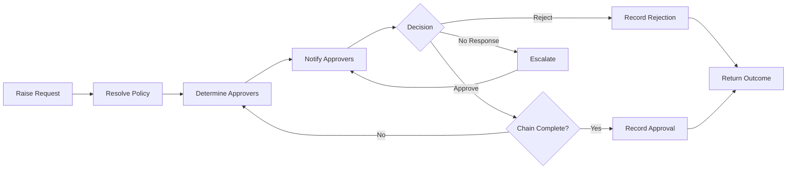

# Volume 06 - Approvals

| Field | Value |
|---|---|
| Document ID | WORLD-VOL06-028 |
| Title | Approvals |
| Version | 1.0 |
| Status | Approved |
| Classification | Internal |
| Founder | Mahesh Choudhary |

## Purpose

The Approvals module is the platform service that governs every decision requiring authorization across the operating system. It exposes the approval engine of the ERP Foundation (Volume 05, Chapter 30) to all modules, providing a single, consistent way to request, route, adjudicate, and record authorizations. It operationalizes the accountability and delegation-of-authority principles of the Business Foundation (Volume 02) and gives the AI Business Partner (Volume 03) a governed control point through which it can recommend, pre-screen, or execute decisions within delegated limits.

## Scope

This document covers approval policy definition, request creation, routing, delegation, adjudication, escalation, and the recording of decisions. It excludes the orchestration of surrounding process steps owned by Workflow (WORLD-VOL06-027), the delivery of approval messages owned by Notifications (WORLD-VOL06-029), and the engine internals and physical schemas belonging to Volume 05 and Volume 09.

## Business Value

Approvals enforces financial and operational control without becoming a bottleneck. It guarantees that no material commitment occurs outside authority, compresses decision latency through parallel and conditional routing, and produces an unbroken audit trail for every authorization. The measurable outcome is stronger compliance, faster decisions, and demonstrable segregation of duties.

## Objectives

- Centralize every authorization decision behind a consistent policy model.
- Route requests to the correct authority based on amount, entity, and risk.
- Support delegation, out-of-office reassignment, and multi-level chains.
- Escalate overdue decisions automatically against service levels.
- Record every decision immutably for audit and segregation of duties.

## Responsibilities

The module owns approval policies and the lifecycle of every approval request. It is responsible for authority resolution, delegation handling, quorum and threshold enforcement, and the emission of decision outcomes. It is not responsible for orchestrating the broader process or delivering messages; it is invoked by Workflow (WORLD-VOL06-027) and calls Notifications (WORLD-VOL06-029).

## Business Process

A request is raised against a policy, which resolves the required approvers. Approvers are notified and adjudicate in sequence or in parallel; thresholds and quorums are enforced. Overdue steps escalate, and the final decision is recorded and returned to the caller.

## Master Data

| Entity | Description | Key Attributes |
|---|---|---|
| Approval Policy | Rule set for a decision type | Code, entity, thresholds, levels |
| Approval Request | Instance awaiting decision | Subject, amount, status, requester |
| Approver Assignment | Authority resolved for a step | Role, level, quorum, order |
| Delegation | Temporary transfer of authority | From, to, start, end |
| Decision Record | Immutable outcome of a step | Decision, approver, timestamp, note |

## Transactions

Request creation, approver resolutions, individual decisions, delegations, escalations, and final outcome records are the transactional entries. Each is timestamped and attributed, providing the audit trail and segregation-of-duties evidence the ERP Foundation (Volume 05) requires.

## Business Rules

- A request cannot proceed without a matching, active approval policy.
- An approver may not adjudicate a request they raised, enforcing segregation of duties.
- Threshold and quorum conditions must be satisfied before an approval is final.
- A delegated authority carries the original limits, never expanded ones.
- Every decision is immutable; a reversal creates a new, linked request.

## Workflow

Approvals is typically invoked as a step within a larger Workflow (WORLD-VOL06-027) instance. It runs its own internal routing flow: resolve authority, dispatch, collect decisions against quorum, escalate on SLA breach, and return a single consolidated outcome to the calling workflow.

## Inputs

Approval requests from any module or from Workflow (WORLD-VOL06-027), policy definitions authored by governance owners, delegation records, and authority data from the ERP Foundation (Volume 05).

## Outputs

Decision outcomes to the calling module or workflow, notification requests to Notifications (WORLD-VOL06-029), decision records to Business Intelligence (Volume 04), and authorization context to the AI Business Partner (Volume 03).

## Dependencies

Depends on the ERP Foundation (Volume 05, Chapter 30) for the approval engine, identity, and audit; on the Business Foundation (Volume 02) for the delegation-of-authority model; and coordinates with Workflow (WORLD-VOL06-027) and Notifications (WORLD-VOL06-029).

## KPIs

Average time to decision, approval SLA adherence, escalation rate, rejection rate by policy, delegation usage, and segregation-of-duties exception count.

## Reports

Pending approvals by approver, decision turnaround report, policy exception report, and delegation activity report.

## Dashboards

An operator dashboard shows outstanding requests by age, approvers at risk of SLA breach, rejection trends, and the AI Business Partner's pre-screening recommendations for pending items.

## Roles

Requester, Approver, Governance Owner, and Approvals Administrator.

## Permissions

| Role | Read | Create | Edit | Delete |
|---|---|---|---|---|
| Requester | Own requests | Yes | Withdraw own | No |
| Approver | Assigned requests | No | Decide only | No |
| Governance Owner | Policies & requests | Policies | Policies | No |
| Approvals Administrator | All | Yes | All | Archive only |

## AI Features

The AI Business Partner (Volume 03) pre-screens requests against policy and history, flags anomalies, recommends approve or reject with rationale, and can auto-approve within an explicitly delegated limit. Example: for a 4,200 USD travel request that matches the requester's role, budget, and prior patterns, the AI Business Partner marks it low risk and, under a delegated 5,000 USD auto-approval threshold, clears it instantly while routing a 60,000 USD capital request to the CFO with a risk-annotated summary.

## Future Expansion

Risk-based dynamic thresholds, learned approver recommendations from historical decisions, continuous controls monitoring, and policy conflict detection across entities.

## Cross-References

- [Workflow](./27-workflow.md)
- [Notifications](./29-notifications.md)
- [Volume 02 - Business Foundation](../../volume-02-business-foundation/README.md)
- [Volume 05 - ERP Foundation](../../volume-05-erp-foundation/README.md)

## References

- [Volume 01 - Vision and Philosophy](/docs/blueprint/volume-01-vision-and-philosophy/README.md)
- [Document Standards](/docs/governance/document-standards.md)

## Change Log

| Version | Date | Author | Notes |
|---|---|---|---|
| 1.0 | 2026-07-12 | Lead Software Engineer | Initial approved version. |
