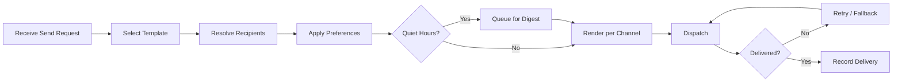

# Volume 06 - Notifications

| Field | Value |
|---|---|
| Document ID | WORLD-VOL06-029 |
| Title | Notifications |
| Version | 1.0 |
| Status | Approved |
| Classification | Internal |
| Founder | Mahesh Choudhary |

## Purpose

The Notifications module is the platform service that delivers the right message to the right recipient through the right channel at the right time. It exposes the notification engine of the ERP Foundation (Volume 05, Chapter 32) to every module, unifying alerts, reminders, and digests behind a single templated, preference-aware delivery service. It operationalizes the communication and situational-awareness principles of the Business Foundation (Volume 02) and gives the AI Business Partner (Volume 03) a controlled channel through which to reach operators with insight and calls to action.

## Scope

This document covers notification templates, channel management, recipient resolution, preference handling, delivery, retry, and delivery tracking. It excludes the decision to send that originates in other modules such as Workflow (WORLD-VOL06-027) and Approvals (WORLD-VOL06-028), and the engine internals and physical schemas belonging to Volume 05 and Volume 09.

## Business Value

Notifications ensures that time-sensitive information reaches people without flooding them into fatigue. It centralizes messaging so every module speaks with one voice, honors recipient preferences and quiet hours, and guarantees delivery with retry and fallback. The measurable outcome is faster response to critical events, reduced noise, and reliable, auditable communication.

## Objectives

- Provide one templated service for all system-generated messages.
- Deliver across channels including in-app, email, mobile push, and chat.
- Resolve recipients dynamically from roles, ownership, and subscriptions.
- Honor per-user preferences, quiet hours, and digest batching.
- Guarantee delivery through retry, fallback channels, and tracking.

## Responsibilities

The module owns notification templates, channel adapters, delivery preferences, and the lifecycle of every dispatched message. It is responsible for recipient resolution, rendering, channel selection, retry, and delivery status. It is not responsible for deciding when a business event warrants a message; it is invoked by other modules such as Workflow (WORLD-VOL06-027) and Approvals (WORLD-VOL06-028).

## Business Process

A send request arrives with an event and context. The module selects a template, resolves recipients, applies their preferences, renders per channel, dispatches, and tracks delivery. Failed sends retry and fall back to alternate channels.

## Master Data

| Entity | Description | Key Attributes |
|---|---|---|
| Notification Template | Reusable message definition | Code, subject, body, variables |
| Channel | Delivery medium | Type, adapter, priority |
| Recipient Preference | Per-user delivery settings | Channel opt-in, quiet hours, digest |
| Subscription | Interest in an event class | Event type, entity, recipient |
| Delivery Record | Outcome of a dispatch | Status, channel, timestamp, attempts |

## Transactions

Send requests, recipient resolutions, dispatch attempts, delivery confirmations, retries, and digest generations are the transactional records. Each is timestamped and attributed, providing the delivery audit trail the ERP Foundation (Volume 05) requires.

## Business Rules

- Every message must render from an approved, versioned template.
- Recipient preferences and quiet hours are honored except for messages flagged critical.
- A failed dispatch retries to a defined limit before invoking a fallback channel.
- Non-critical messages within quiet hours are batched into the next digest.
- Delivery status is recorded for every attempt for auditability.

## Workflow

Notifications is invoked as a service by other modules and by Workflow (WORLD-VOL06-027) steps. Its internal flow selects a template, resolves and filters recipients by preference, dispatches across channels, and manages retry and fallback until a terminal delivery status is recorded.

## Inputs

Send requests with event context from any module, notification requests from Workflow (WORLD-VOL06-027) and Approvals (WORLD-VOL06-028), template definitions, and recipient preference and subscription data.

## Outputs

Delivered messages across channels, delivery status records to the calling module, engagement and delivery metrics to Business Intelligence (Volume 04), and delivery context to the AI Business Partner (Volume 03).

## Dependencies

Depends on the ERP Foundation (Volume 05, Chapter 32) for the notification engine, identity, and audit; on the Business Foundation (Volume 02) for the communication model; and is invoked by Workflow (WORLD-VOL06-027) and Approvals (WORLD-VOL06-028).

## KPIs

Delivery success rate, average delivery latency, retry rate, opt-out rate, digest adoption, and engagement rate per channel.

## Reports

Delivery status report by channel, failed-delivery report, engagement report by template, and opt-out trend report.

## Dashboards

An operator dashboard shows delivery health by channel, failed and retrying messages, engagement trends, and the AI Business Partner's recommendations to tune noisy templates.

## Roles

Template Author, Channel Administrator, Recipient, and Notifications Administrator.

## Permissions

| Role | Read | Create | Edit | Delete |
|---|---|---|---|---|
| Template Author | Templates | Yes | Draft only | Draft only |
| Channel Administrator | Channels | Channels | Channels | No |
| Recipient | Own preferences | No | Own preferences | No |
| Notifications Administrator | All | Yes | All | Yes |

## AI Features

The AI Business Partner (Volume 03) tunes delivery to maximize signal and minimize fatigue: it consolidates related alerts, recommends the best channel and timing per recipient, and drafts the message body from event context. Example: when a shipment delay, a payment hold, and a stock warning all concern the same customer within an hour, the AI Business Partner merges them into a single prioritized briefing to the account owner rather than three separate alerts, and schedules it just before that owner's known review time.

## Future Expansion

Send-time optimization from engagement history, adaptive digest frequency, sentiment-aware message tone, and cross-channel orchestration with guaranteed read-receipt fallbacks.

## Cross-References

- [Workflow](./27-workflow.md)
- [Approvals](./28-approvals.md)
- [Volume 03 - AI Business Partner](../../volume-03-ai-business-partner/README.md)
- [Volume 05 - ERP Foundation](../../volume-05-erp-foundation/README.md)

## References

- [Volume 01 - Vision and Philosophy](/docs/blueprint/volume-01-vision-and-philosophy/README.md)
- [Document Standards](/docs/governance/document-standards.md)

## Change Log

| Version | Date | Author | Notes |
|---|---|---|---|
| 1.0 | 2026-07-12 | Lead Software Engineer | Initial approved version. |
