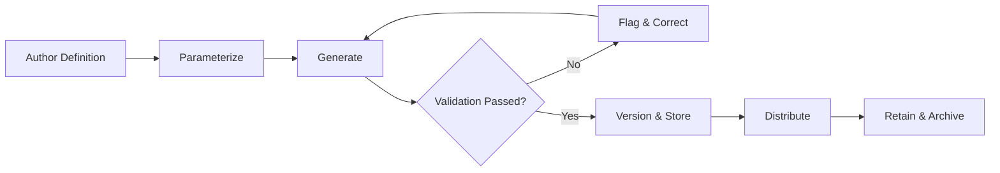

# Volume 06 - Reporting

| Field | Value |
|---|---|
| Document ID | WORLD-VOL06-030 |
| Title | Reporting |
| Version | 1.0 |
| Status | Approved |
| Classification | Internal |
| Founder | Mahesh Choudhary |

## Purpose

The Reporting module is the system of record for structured, governed, and reproducible business output across every operational domain of the enterprise. It transforms the transactional truth persisted on the ERP Foundation (Volume 05) into curated, versioned reports that operators, auditors, and regulators can trust. Reporting operationalizes the accountability principles of the Business Foundation (Volume 02) and provides the AI Business Partner (Volume 03) with a consistent, explainable surface from which to reason, summarize, and narrate. It complements the analytical depth of Business Intelligence (Volume 04) by delivering the formal, presentation-ready artifacts that BI insight is distilled into.

## Scope

This document covers report definition, parameterization, generation, scheduling, distribution, versioning, and retention. It includes standard operational reports, statutory and compliance reports, and ad hoc query outputs. It excludes interactive visual surfaces (see WORLD-VOL06-031 Dashboards), the exploratory analytics engine of Business Intelligence (Volume 04), and physical data schemas, which belong to Volume 09.

## Business Value

Reporting converts raw enterprise data into decisions and defensible records. It eliminates the reconciliation tax of spreadsheets, guarantees a single version of the truth, and provides the audit-grade evidence required by finance, tax, and governance functions. The measurable outcome is faster close cycles, reduced manual effort, and higher confidence in the numbers that leaders act upon.

## Objectives

- Provide a governed catalog of reusable, parameterized report definitions.
- Guarantee reproducibility so any report can be regenerated identically from the same period and parameters.
- Automate scheduling and secure distribution to the right audiences.
- Preserve versioned, immutable outputs for audit and regulatory retention.
- Feed reliable, structured summaries to the AI Business Partner (Volume 03) and Business Intelligence (Volume 04).

## Responsibilities

The module owns the report definition catalog, the generation pipeline, output versioning, and distribution governance. It is responsible for ensuring that every report is traceable to its source transactions and parameters. It is not responsible for defining the underlying analytical models, which belong to Business Intelligence (Volume 04), nor for interactive exploration, which belongs to Dashboards.

## Business Process

A report begins as a definition authored against governed data sources, is parameterized for a period or entity, generated on demand or on schedule, versioned as an immutable output, and distributed to its audience through controlled channels before entering retention.

## Master Data

| Entity | Description | Key Attributes |
|---|---|---|
| Report Definition | Reusable report template | Code, name, source, owner, category |
| Parameter Set | Named inputs for a run | Period, entity, filters |
| Report Instance | Generated immutable output | Version, generated-at, hash |
| Distribution List | Recipients and channels | Audience, channel, schedule |
| Retention Policy | Lifecycle rule for outputs | Duration, classification, disposal |

## Transactions

Report generation runs, scheduled executions, distribution events, parameter changes, and retention or disposal actions are the transactional records. Each is timestamped, attributed, and content-hashed, providing the immutable audit trail the ERP Foundation (Volume 05) requires.

## Business Rules

- A report instance is immutable once generated; corrections produce a new version.
- Every instance must be reproducible from its recorded parameters and source period.
- Statutory reports cannot be disposed of before their retention period expires.
- Distribution respects the classification of the underlying data and recipient permissions.

## Workflow

Reports follow an author-to-distribute workflow with a validation gate. Failed validation blocks distribution and alerts the report owner. Scheduled runs that miss their SLA escalate to the operations owner and the AI Business Partner (Volume 03), which can diagnose and re-trigger the run.

## Inputs

Governed transactional data from all Volume 06 modules, period and entity parameters, distribution schedules, and analytical models published by Business Intelligence (Volume 04).

## Outputs

Versioned report instances, structured summaries to the AI Business Partner (Volume 03), source content for Dashboards (WORLD-VOL06-031), and retained archives for audit and compliance.

## Dependencies

Depends on the ERP Foundation (Volume 05) for identity, audit, and multi-entity partitioning; on Business Intelligence (Volume 04) for analytical models; on the Business Foundation (Volume 02) for accountability principles; and coordinates with Dashboards (WORLD-VOL06-031).

## KPIs

Report generation success rate, average generation time, schedule adherence, reproducibility conformance, and reduction in manual reporting hours.

## Reports

A report catalog inventory, a generation audit log, a distribution compliance report, and a retention and disposal register.

## Dashboards

An operator dashboard shows reporting health, failed and overdue runs, distribution coverage, retention obligations approaching expiry, and the AI Business Partner's recommended remediation.

## Roles

Report Author, Report Consumer, Reporting Administrator, and Compliance Officer.

## Permissions

| Role | Read | Create | Edit | Delete |
|---|---|---|---|---|
| Report Author | Own & shared | Yes | Own definitions | Archive only |
| Report Consumer | Subscribed | No | No | No |
| Reporting Administrator | All | Yes | All | Yes |
| Compliance Officer | All | No | Retention only | No |

## AI Features

The AI Business Partner (Volume 03) drafts natural-language executive narratives over report instances, detects anomalies between periods, recommends new report definitions from recurring queries, and answers questions grounded in the governed output. Example: at month-end close, an operator asks for the consolidated management pack for three legal entities; the AI Business Partner generates each statutory report, validates inter-company eliminations, drafts a two-page variance narrative highlighting a 9 percent overspend in logistics, and distributes the versioned pack to the board list, all within the retention and classification rules.

## Future Expansion

Narrative report authoring from plain-language intent, self-service regulatory report packs by jurisdiction, real-time streaming report refresh, and automated disclosure tagging for statutory filings.

## Cross-References

- [Dashboards](../section-h-intelligence-and-insights/31-dashboards.md)
- [AI Integration](../section-h-intelligence-and-insights/32-ai-integration.md)
- [Volume 04 - Business Intelligence](../../volume-04-business-intelligence/README.md)
- [Volume 05 - ERP Foundation](../../volume-05-erp-foundation/README.md)

## References

- [Volume 01 - Vision and Philosophy](/docs/blueprint/volume-01-vision-and-philosophy/README.md)
- [Document Standards](/docs/governance/document-standards.md)

## Change Log

| Version | Date | Author | Notes |
|---|---|---|---|
| 1.0 | 2026-07-12 | Lead Software Engineer | Initial approved version. |
