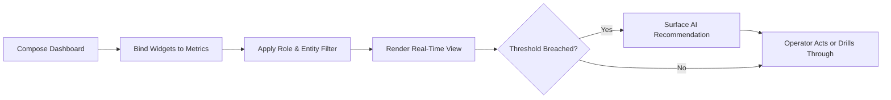

# Volume 06 - Dashboards

| Field | Value |
|---|---|
| Document ID | WORLD-VOL06-031 |
| Title | Dashboards |
| Version | 1.0 |
| Status | Approved |
| Classification | Internal |
| Founder | Mahesh Choudhary |

## Purpose

The Dashboards module is the real-time visual command surface of the enterprise, presenting the operator with the state of the business at a glance and the levers to act on it. It renders the governed metrics of Business Intelligence (Volume 04) and the transactional truth of the ERP Foundation (Volume 05) into interactive, role-aware views. Dashboards operationalizes the situational-awareness principles of the Business Foundation (Volume 02) and serves as the primary human interface through which the AI Business Partner (Volume 03) surfaces insight, recommendations, and one-click actions.

## Scope

This document covers dashboard composition, widget configuration, real-time data binding, drill-through, personalization, and embedded AI recommendations. It excludes formal report generation and retention (see WORLD-VOL06-030 Reporting), the analytical modeling engine of Business Intelligence (Volume 04), and physical data schemas, which belong to Volume 09.

## Business Value

Dashboards collapse the time between observation and decision. They replace stale, siloed status meetings with a live, shared picture of health, expose emerging risk while it is still cheap to correct, and place the AI Business Partner's recommendations directly beside the metrics that motivate them. The measurable outcome is faster reaction time, fewer surprises, and higher decision quality.

## Objectives

- Present each role with a curated, real-time view of the metrics that matter to it.
- Enable drill-through from any metric to its underlying transactions.
- Embed AI Business Partner (Volume 03) recommendations and actions in context.
- Guarantee that every displayed figure is traceable to a governed source.
- Personalize layout and thresholds without compromising data governance.

## Responsibilities

The module owns dashboard definitions, widget catalog, data-binding configuration, and personalization state. It is responsible for rendering only governed, permission-filtered data and for the integrity of drill-through lineage. It is not responsible for defining the metrics themselves, which belong to Business Intelligence (Volume 04), nor for immutable formal outputs, which belong to Reporting.

## Business Process

A dashboard is composed from governed widgets, bound to live metric sources, filtered by the viewer's role and entity, rendered in real time, and used to drill through to detail or to trigger an AI-recommended action.

## Master Data

| Entity | Description | Key Attributes |
|---|---|---|
| Dashboard | Named collection of widgets | Code, name, owner, audience |
| Widget | Visual bound to a metric | Type, metric, threshold, size |
| Data Binding | Link to a governed source | Metric ID, refresh interval |
| Personalization | Per-user view state | Layout, filters, saved views |
| Alert Threshold | Trigger for attention | Metric, operator, boundary |

## Transactions

Dashboard views, widget interactions, drill-through events, threshold breaches, and action triggers are the transactional records. Each is timestamped and attributed, providing usage lineage and the audit trail the ERP Foundation (Volume 05) requires.

## Business Rules

- A widget may bind only to a governed metric with defined lineage.
- Displayed data is always filtered by the viewer's role and entity permissions.
- Drill-through must resolve to the exact transactions behind a figure.
- Personalization changes layout and thresholds only, never the underlying data.

## Workflow

Dashboards follow a compose-to-consume workflow. Metric refreshes stream on defined intervals. A breached threshold raises a visual alert and invokes the AI Business Partner (Volume 03), which attaches a diagnosis and a recommended action the operator can accept, defer, or dismiss.

## Inputs

Governed metrics and models from Business Intelligence (Volume 04), transactional data from all Volume 06 modules, role and entity context from the ERP Foundation (Volume 05), and recommendations from the AI Business Partner (Volume 03).

## Outputs

Rendered real-time views, drill-through navigation into source modules, action triggers to operational modules, and interaction telemetry to Business Intelligence (Volume 04).

## Dependencies

Depends on Business Intelligence (Volume 04) for governed metrics; on the ERP Foundation (Volume 05) for identity, permissions, and audit; on the Business Foundation (Volume 02) for situational-awareness principles; and coordinates with Reporting (WORLD-VOL06-030) and AI Integration (WORLD-VOL06-032).

## KPIs

Dashboard adoption rate, average time-to-insight, refresh latency, alert acknowledgement time, and recommendation acceptance rate.

## Reports

A dashboard usage report, a widget performance and latency report, an alert response report, and a recommendation acceptance report.

## Dashboards

A meta dashboard shows platform-wide dashboard adoption, refresh health, unacknowledged alerts, most-used widgets, and the AI Business Partner's suggestions for new views based on operator behavior.

## Roles

Dashboard Viewer, Dashboard Author, Dashboard Administrator, and Executive Sponsor.

## Permissions

| Role | Read | Create | Edit | Delete |
|---|---|---|---|---|
| Dashboard Viewer | Assigned | No | Personalization only | No |
| Dashboard Author | Own & shared | Yes | Own | Archive only |
| Dashboard Administrator | All | Yes | All | Yes |
| Executive Sponsor | Portfolio | No | No | No |

## AI Features

The AI Business Partner (Volume 03) monitors every widget, explains movements in plain language, recommends the next best action beside the metric, and can execute approved actions under the governance of Volume 03 Section G. Example: a revenue-operations leader opens the pipeline dashboard where the weighted forecast widget breaches its floor threshold; the AI Business Partner annotates the drop as three slipped enterprise deals, recommends reprioritizing two at-risk opportunities, drafts the outreach, and offers a one-click action that, once the operator approves, updates the CRM and re-forecasts the quarter in real time.

## Future Expansion

Conversational dashboard assembly from spoken intent, predictive threshold tuning, cross-entity executive war rooms, and adaptive layouts that reorganize by detected operator focus.

## Cross-References

- [Reporting](../section-h-intelligence-and-insights/30-reporting.md)
- [AI Integration](../section-h-intelligence-and-insights/32-ai-integration.md)
- [Volume 03 - AI Business Partner](../../volume-03-ai-business-partner/README.md)
- [Volume 04 - Business Intelligence](../../volume-04-business-intelligence/README.md)

## References

- [Volume 01 - Vision and Philosophy](/docs/blueprint/volume-01-vision-and-philosophy/README.md)
- [Document Standards](/docs/governance/document-standards.md)

## Change Log

| Version | Date | Author | Notes |
|---|---|---|---|
| 1.0 | 2026-07-12 | Lead Software Engineer | Initial approved version. |
