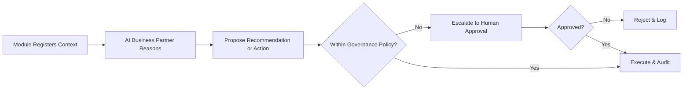

# Volume 06 - AI Integration

| Field | Value |
|---|---|
| Document ID | WORLD-VOL06-032 |
| Title | AI Integration |
| Version | 1.0 |
| Status | Approved |
| Classification | Internal |
| Founder | Mahesh Choudhary |

## Purpose

The AI Integration module is the connective tissue that binds the AI Business Partner (Volume 03) into every business module of Volume 06. It defines how each module exposes context, receives recommendations, and delegates governed actions to the AI Business Partner so that intelligence is not a bolt-on feature but the operating fabric of the enterprise. AI Integration operationalizes the AI-native principles of the Business Foundation (Volume 02), draws its reasoning surface from Business Intelligence (Volume 04), and persists every interaction on the ERP Foundation (Volume 05), whose native AI hooks are defined in Volume 05 Section E.

## Scope

This document covers the context-provider contract, the recommendation channel, the action-delegation protocol, and the governance guardrails that constrain autonomous behavior. It includes how modules register capabilities and how actions are approved, executed, and audited. It excludes the internal reasoning architecture of the AI Business Partner (Volume 03) and the analytical models it consumes (Volume 04), which are documented in their own volumes.

## Business Value

AI Integration turns a collection of modules into a single, reasoning enterprise. It removes the integration burden of wiring intelligence into each module individually, guarantees consistent governance over autonomous action, and ensures every recommendation is explainable and every action reversible. The measurable outcome is compounding operating leverage: the same headcount governs more decisions with higher confidence and full auditability.

## Objectives

- Provide a uniform contract by which any module exposes context to the AI Business Partner (Volume 03).
- Deliver recommendations back into module surfaces, including Dashboards (WORLD-VOL06-031).
- Govern every autonomous action under the guardrails of Volume 03 Section G.
- Guarantee explainability, approval, and reversibility for all AI-initiated changes.
- Record every interaction as an auditable event on the ERP Foundation (Volume 05).

## Responsibilities

The module owns the integration contracts, the capability registry, the action-delegation protocol, and the governance policy enforcement point. It is responsible for ensuring no action executes outside its permission scope and for the completeness of the interaction audit trail. It is not responsible for the AI Business Partner's reasoning itself (Volume 03) nor for the business logic of the modules it connects.

## Business Process

A module registers its context and capabilities; the AI Business Partner reasons over that context; it proposes a recommendation or a delegated action; the governance layer of Volume 03 Section G evaluates policy, scope, and approval; and the action executes and is recorded, or is escalated to a human.

## Master Data

| Entity | Description | Key Attributes |
|---|---|---|
| Capability Registration | Module capability exposed to AI | Module, action, scope |
| Context Provider | Data contract for reasoning | Source, schema, refresh |
| Recommendation | AI-proposed insight or action | Type, rationale, confidence |
| Action Delegation | Governed autonomous action | Scope, approval mode, reversibility |
| Governance Policy | Guardrail from Vol 03 Section G | Limit, approver, condition |

## Transactions

Context requests, recommendations issued, action proposals, approvals, executions, and reversals are the transactional records. Each is timestamped, attributed to the human or AI actor, and content-hashed, providing the tamper-evident audit trail the ERP Foundation (Volume 05) requires.

## Business Rules

- No action executes outside the permission scope of the invoking human operator.
- Every action above a governance threshold requires explicit human approval per Volume 03 Section G.
- Every AI-initiated change must be explainable and reversible.
- All interactions are logged immutably; the AI can never suppress its own audit trail.

## Workflow

AI Integration follows a register-reason-govern-act workflow. Low-risk actions within policy execute autonomously and notify. Higher-risk actions route to human approval with a full rationale. Any breach of a governance guardrail halts execution and escalates to the accountable operator.

## Inputs

Module context and capability registrations from every Volume 06 module, governed metrics from Business Intelligence (Volume 04), governance policies from Volume 03 Section G, and human approvals.

## Outputs

Recommendations to module surfaces and Dashboards (WORLD-VOL06-031), governed action executions into operational modules, and immutable interaction records to the ERP Foundation (Volume 05).

## Dependencies

Depends on the AI Business Partner (Volume 03) for reasoning and its Section G governance; on the ERP Foundation (Volume 05) for identity, audit, and its Section E AI hooks; on Business Intelligence (Volume 04) for models; and on the Business Foundation (Volume 02) for AI-native principles.

## KPIs

Recommendation acceptance rate, autonomous action success rate, mean time to human approval, policy-breach interception rate, and action reversal rate.

## Reports

An AI action audit report, a recommendation outcome report, a governance-policy exception report, and a module capability coverage report.

## Dashboards

A governance dashboard shows AI action volume, autonomous-versus-approved ratio, pending approvals, intercepted policy breaches, and the AI Business Partner's own confidence and reversal trends across modules.

## Roles

AI Governance Officer, Module Owner, Operator, and Platform Administrator.

## Permissions

| Role | Read | Create | Edit | Delete |
|---|---|---|---|---|
| AI Governance Officer | All | Policies | Guardrails | No |
| Module Owner | Own module | Registrations | Own scope | Archive only |
| Operator | Assigned | Approvals | No | No |
| Platform Administrator | All | Yes | All | Yes |

## AI Features

The AI Business Partner (Volume 03) plugs into every module through this contract: it reads context, proposes actions, and executes them only within the guardrails of Volume 03 Section G, with full explainability and reversibility. Example: the Procurement module registers a purchase-order approval capability; the AI Business Partner detects a supplier price rise, cross-checks contract terms from the ERP Foundation (Volume 05), and proposes switching to an approved alternate supplier for a 40,000 USD order. Because the amount exceeds the autonomous threshold, the governance layer routes it to the category manager with a rationale and a projected 6 percent saving; on approval the AI updates the purchase order, notifies the supplier, and logs a fully reversible, audited action.

## Future Expansion

Cross-module autonomous orchestration, self-tuning governance thresholds from outcome history, federated AI integration with external partner systems, and simulation of proposed actions before execution.

## Cross-References

- [Reporting](../section-h-intelligence-and-insights/30-reporting.md)
- [Dashboards](../section-h-intelligence-and-insights/31-dashboards.md)
- [Volume 03 - AI Business Partner](../../volume-03-ai-business-partner/README.md)
- [Volume 05 - ERP Foundation](../../volume-05-erp-foundation/README.md)

## References

- [Volume 01 - Vision and Philosophy](/docs/blueprint/volume-01-vision-and-philosophy/README.md)
- [Document Standards](/docs/governance/document-standards.md)

## Change Log

| Version | Date | Author | Notes |
|---|---|---|---|
| 1.0 | 2026-07-12 | Lead Software Engineer | Initial approved version. |
