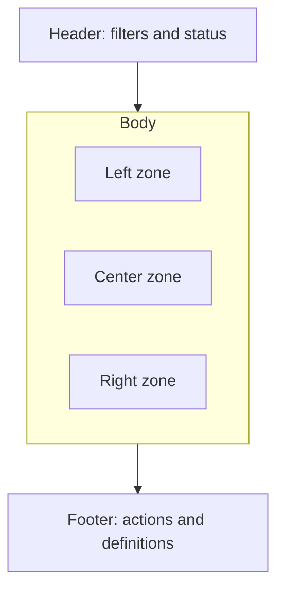

# Volume 07 - Dashboard & Reporting Templates

| Field | Value |
|---|---|
| Document ID | WORLD-VOL07-A6 |
| Title | Dashboard & Reporting Templates |
| Version | 1.0 |
| Status | Approved |
| Classification | Internal |
| Founder | Mahesh Choudhary |

## Purpose

This appendix provides reusable dashboard and reporting templates for WORLD's industry solutions. It standardizes how executive, operational, and compliance information is presented across the 18 industries so that every deployment starts from a consistent, role-appropriate layout that draws on the industry KPIs and the Dashboards and Reporting modules of Volume 06.

## Scope

The appendix defines template structures - audience, purpose, layout, and content - rather than pixel-level designs. Layouts are described in tables using a simple zone model. Templates are starting points that industry chapters and customer deployments refine. Data sources are the business modules of Volume 06; metric definitions follow WORLD-VOL07-A5 and WORLD-VOL06-A4.

## Template Model

| Element | Meaning |
|---|---|
| Template | The named, reusable dashboard or report. |
| Audience | The primary role the template serves. |
| Cadence | How often the view is consumed or the report is run. |
| Zone | A named region of the layout (for example, Header, Left, Center, Right, Footer). |

## Executive Dashboard Template

Audience: Owner, CEO, or industry business head. Cadence: Daily summary with monthly trend.

| Zone | Content | Primary Source Module |
|---|---|---|
| Header | Period selector, entity or site filter, and refresh status. | Dashboards |
| Top Band | Headline KPIs: revenue, gross margin, cash position, and one industry-signature KPI. | Finance, Reporting |
| Left | Revenue and margin trend against budget and prior period. | Finance, Budgeting |
| Center | Industry performance panel (for example, OEE, RevPAR, or Occupancy). | Dashboards |
| Right | Exceptions and alerts requiring executive attention. | Notifications, AI Integration |
| Footer | Data freshness, definitions link, and drill-through actions. | Dashboards |

## Operations Dashboard Template

Audience: Operations manager, plant or site lead, or service head. Cadence: Real-time to daily.

| Zone | Content | Primary Source Module |
|---|---|---|
| Header | Shift, line, site, or route selector and live status indicators. | Dashboards |
| Top Band | Operational KPIs: throughput, yield or fill rate, and on-time performance. | Production, Logistics, Sales |
| Left | Work queue: open orders, jobs, or tasks by status and priority. | Workflow, Task Management |
| Center | Process monitor: capacity, utilization, and bottleneck view. | Production Planning, Maintenance |
| Right | Quality and safety signals: non-conformances and downtime events. | Quality, Maintenance |
| Footer | Escalation actions and handover notes. | Approvals, Notifications |

## Compliance Dashboard Template

Audience: Quality, compliance, or regulatory officer. Cadence: Daily monitoring with periodic attestation.

| Zone | Content | Primary Source Module |
|---|---|---|
| Header | Standard or regulation filter and reporting period. | Dashboards |
| Top Band | Compliance posture: open findings, overdue actions, and audit readiness. | Quality, Approvals |
| Left | Requirement register: applicable standards and control status. | Documents, Workflow |
| Center | Traceability and records: batch, lot, or case audit trails. | Inventory, Quality |
| Right | Deviations and CAPA: status, owner, and due date. | Quality, Task Management |
| Footer | Attestation, e-signature, and export for regulators. | Approvals, Reporting |

## Standard Report Templates

| Report | Audience | Purpose | Key Contents |
|---|---|---|---|
| Executive Performance Summary | Leadership | Periodic performance narrative. | Headline KPIs, variance to budget, trends, and commentary. |
| Operations Performance Report | Operations management | Operational review and planning. | Throughput, yield, on-time metrics, downtime, and exceptions. |
| Compliance & Audit Report | Compliance function | Evidence for audits and inspections. | Requirement status, records, deviations, CAPA, and attestations. |
| Financial Position Report | Finance leadership | Financial health and controls. | P&L, cash, receivables and payables aging, and budget variance. |
| Inventory & Fulfilment Report | Supply chain management | Stock and service oversight. | Stock levels, turnover, fill rate, and aging (see Volume 06). |
| Industry Signature Report | Industry business head | Vertical-specific insight. | The industry's defining KPIs from WORLD-VOL07-A5. |

## Layout Reference

## Cross-References

- [Industry KPI Catalog](/docs/blueprint/volume-07-industry-solutions/appendices/industry-kpi-catalog.md)
- [Compliance Catalog](/docs/blueprint/volume-07-industry-solutions/appendices/compliance-catalog.md)
- [Industry-ERP Module Matrix](/docs/blueprint/volume-07-industry-solutions/appendices/industry-erp-module-matrix.md)
- [Volume 06 - Business Modules Overview](/docs/blueprint/volume-06-business-modules/README.md)

## References

- [Volume 01 - Vision and Philosophy](/docs/blueprint/volume-01-vision-and-philosophy/README.md)
- [Document Standards](/docs/governance/document-standards.md)

## Change Log

| Version | Date | Author | Summary |
|---|---|---|---|
| 1.0 | 2026-07-12 | Lead Software Engineer | Initial approved version. |
