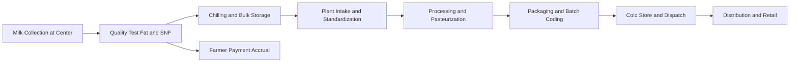

# Volume 07 - Dairy

| Field | Value |
|---|---|
| Document ID | WORLD-VOL07-001 |
| Title | Dairy |
| Version | 1.0 |
| Status | Approved |
| Classification | Internal |
| Founder | Mahesh Choudhary |

## Purpose

This chapter defines how WORLD is configured for the dairy industry. It maps the dairy business model, organization, and end-to-end processes onto WORLD's Business Modules (Volume 06), the ERP Foundation (Volume 05), the AI Business Partner (Volume 03), and Business Intelligence (Volume 04). The objective is a ready-to-deploy dairy solution that manages milk procurement, cold-chain processing, and multi-channel distribution as governed facts, with the AI Business Partner acting as an operating partner across the value chain.

## Scope

The chapter covers fluid milk and manufactured dairy products (curd, ghee, butter, cheese, milk powder, and value-added beverages). It spans farmer and cooperative procurement, chilling and processing, quality control, packaging, cold-chain distribution, and farmer settlement. It does not restate module internals documented in Volume 06; it specifies the industry configuration and the cross-module orchestration required for a dairy enterprise.

## Industry Overview

Dairy is a perishable, procurement-intensive, cold-chain industry. Raw milk is collected at high frequency from a dispersed base of producers, priced on measured quality attributes such as fat and Solids-Not-Fat (SNF), and must be chilled, tested, and processed within tight time windows to avoid spoilage. Demand is seasonal and daily, while supply flushes and leans with the agricultural cycle. Margins are thin and depend on procurement discipline, yield, route efficiency, and shelf-life management.

## Business Model

The dominant model is procure-process-distribute. The enterprise aggregates milk from farmers, village-level collection societies, or contract suppliers; converts it into a portfolio of products with differing shelf lives and margins; and sells through distributors, retail, institutional buyers, and direct-to-consumer channels. Revenue is driven by product mix and yield; cost is dominated by raw-milk procurement priced on quality, plus energy for chilling and processing. Farmer trust, transparent quality-based payment, and unbroken cold chain are the core competitive levers.

## Organization

A dairy enterprise typically operates village collection centers, bulk chilling centers, one or more processing plants, cold stores, and a distribution network. Functionally it is organized into Procurement and Farmer Relations, Quality, Production, Cold-Chain Logistics, Sales and Distribution, and Finance. In WORLD, each collection center, chilling center, and plant is modeled as a location dimension on the ERP Foundation (Volume 05), so every transaction carries company, tenant, and location context.

## Processes

The core cycle is: collect and test milk, chill, transport to the plant, standardize and process, package with batch and expiry coding, store under temperature control, and dispatch through the cold chain. In parallel, each accepted collection accrues a quality-based payable to the farmer, and every batch carries genealogy from raw intake to finished pack for recall readiness.

**Enterprise example:** A cooperative collects 42,000 litres across 180 village centers in a morning shift. Each collection is tested for fat and SNF; a center recording 4.1 percent fat and 8.6 percent SNF is priced automatically against the published rate chart. Milk is chilled to 4 degrees Celsius, hauled to the plant, standardized, pasteurized, and split into pouch milk, curd, and ghee lines. A batch of 12,000 pouches is coded with a two-day shelf life, and the AI Business Partner routes it first to high-velocity urban retail to minimize expiry write-off. Farmer payments for the shift settle the same day.

## Required ERP Modules

| Business Need | WORLD Module (Volume 06) | Role in Dairy |
|---|---|---|
| Milk procurement and farmer pricing | Procurement | Quality-based collection, rate charts, payables |
| Raw and finished stock, shelf life | Inventory | Batch, expiry, and location stock control |
| Processing and standardization | Manufacturing / Production | Recipe execution, yield, batch genealogy |
| Quality testing and release | Quality | Fat/SNF testing, disposition, recall |
| Cold-chain delivery | Logistics / Dispatch | Temperature-controlled routing and delivery |
| Settlement and costing | Finance | Farmer payment, product costing, margins |

Key references: [Procurement](/docs/blueprint/volume-06-business-modules/section-a-supply-chain-and-procurement/01-procurement.md), [Manufacturing](/docs/blueprint/volume-06-business-modules/section-c-manufacturing-and-operations/12-manufacturing.md), [Quality](/docs/blueprint/volume-06-business-modules/section-c-manufacturing-and-operations/13-quality.md), and [Logistics](/docs/blueprint/volume-06-business-modules/section-a-supply-chain-and-procurement/04-logistics.md).

## Required AI Features

The AI Business Partner (Volume 03) forecasts daily and seasonal demand by product and route, predicts procurement volumes from historical supply and weather signals, and recommends standardization ratios to maximize yield within quality limits. It flags collections trending outside quality norms, predicts spoilage risk for near-expiry batches, and optimizes cold-chain routing to move short-life stock first. It reconciles farmer payments and surfaces anomalies such as unusual fat swings, acting as an always-on operating partner rather than a passive report.

## KPIs

| KPI | Definition | Target |
|---|---|---|
| Average Fat and SNF | Weighted quality of collected milk | Meet rate-chart bands |
| Procurement Cost per Litre | Total milk cost / litres collected | Minimize |
| Processing Yield | Finished output / raw milk input | Maximize |
| Spoilage and Expiry Loss | Value written off / value produced | < 1% |
| Cold-Chain Compliance | Deliveries within temperature limits | > 99% |
| Farmer Payment Cycle | Time from collection to settlement | Same or next day |

## Compliance

Dairy operations are governed by food-safety and quality standards. Relevant frameworks include FSSAI regulations, HACCP hazard controls, ISO 22000 food-safety management, and applicable milk-product quality orders and labelling rules. WORLD enforces batch traceability, mandatory quality disposition, and immutable audit trails on the ERP Foundation so that recall, inspection, and certification obligations are met from source milk to finished pack.

## Dashboards

Operational dashboards present live procurement volume and quality by center, plant yield and downtime, cold-store temperature status, near-expiry stock, and route-level delivery performance. Executive dashboards track procurement cost, product-mix margin, and spoilage. Dashboards are delivered through the Dashboards module and Business Intelligence (Volume 04) with drill-down to the underlying governed transactions.

## Reporting

Standard reports include daily procurement and quality registers, farmer payment statements, batch genealogy and recall reports, yield and loss analysis, and cold-chain compliance summaries. Reports are generated through the Reporting module and are available for regulatory submission, cooperative audits, and management review.

## Future Roadmap

Planned enhancements include IoT-based tank and vehicle temperature telemetry fused into the AI spoilage model, automated fat/SNF analyzers integrated at collection, predictive demand-sensing for direct-to-consumer subscriptions, and blockchain-anchored farm-to-pack traceability for premium and export lines.

## Cross-References

- [Inventory](/docs/blueprint/volume-06-business-modules/section-a-supply-chain-and-procurement/02-inventory.md)
- [Production](/docs/blueprint/volume-06-business-modules/section-c-manufacturing-and-operations/10-production.md)
- [Finance](/docs/blueprint/volume-06-business-modules/section-d-finance/15-finance.md)
- [Volume 03 - AI Business Partner](/docs/blueprint/volume-03-ai-business-partner/README.md)

## References

- [Volume 01 - Vision and Philosophy](/docs/blueprint/volume-01-vision-and-philosophy/README.md)
- [Document Standards](/docs/governance/document-standards.md)

## Change Log

| Version | Date | Author | Notes |
|---|---|---|---|
| 1.0 | 2026-07-12 | Lead Software Engineer | Initial approved version. |
