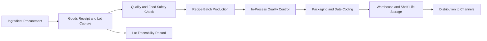

# Volume 07 - Food Processing

| Field | Value |
|---|---|
| Document ID | WORLD-VOL07-003 |
| Title | Food Processing |
| Version | 1.0 |
| Status | Approved |
| Classification | Internal |
| Founder | Mahesh Choudhary |

## Purpose

This chapter defines how WORLD is configured for the food processing industry. It maps the food processing business model, organization, and processes onto WORLD's Business Modules (Volume 06), the ERP Foundation (Volume 05), the AI Business Partner (Volume 03), and Business Intelligence (Volume 04). The goal is a compliant, traceable, recipe-driven solution that manages perishable inputs, batch production, quality, and shelf-life distribution as governed facts.

## Scope

The chapter covers processed and packaged foods such as bakery, snacks, sauces, ready-to-eat meals, beverages, and preserved products. It spans raw-material procurement, recipe and batch production, quality and food safety, packaging and coding, warehousing, and cold or ambient distribution. Module internals are documented in Volume 06; this chapter specifies the industry configuration and cross-module orchestration.

## Industry Overview

Food processing converts agricultural inputs into packaged consumer products through formulations and batch processes. It is defined by perishability, strict food-safety regulation, lot traceability, and shelf-life management. Ingredient prices and availability fluctuate with harvests, while retail and consumer demand is promotion-sensitive and seasonal. Yield, giveaway control, allergen management, and recall readiness are central operational concerns.

## Business Model

The model is source-formulate-produce-distribute. The enterprise buys perishable and commodity ingredients, converts them via recipes into branded products, and sells through retail, foodservice, and distribution channels. Revenue is driven by brand, product mix, and promotions; cost is dominated by ingredients, packaging, and processing energy. Competitive advantage lies in consistent quality, food safety, and reliable shelf-life performance across the distribution network.

## Organization

A food processor is organized into Procurement, R&D and Formulation, Production, Quality and Food Safety, Packaging, Warehouse and Logistics, Sales, and Finance. Plants, production lines, cold stores, and warehouses are modeled as location and resource dimensions on the ERP Foundation (Volume 05). Recipes, bills of material, and lot master data anchor traceability from ingredient to finished pack.

## Processes

The cycle runs from ingredient procurement and lot capture, through incoming quality checks, recipe-based batch production, in-process controls, packaging with date and lot coding, shelf-life-aware warehousing, and channel distribution. Every batch maintains forward and backward lot genealogy for rapid recall.

**Enterprise example:** A sauce manufacturer receives a tomato-paste lot, captures its lot number and expiry at goods receipt, and clears it through incoming quality. A 3,000-litre batch is produced against a controlled recipe; in-process checks confirm pH and viscosity within limits. The batch is filled into 15,000 bottles, coded with lot and best-before dates, and stored FEFO. The AI Business Partner allocates near-dated stock to fast-moving accounts and warns that a spice ingredient will fall short of next week's plan, prompting an early purchase order.

## Required ERP Modules

| Business Need | WORLD Module (Volume 06) | Role in Food Processing |
|---|---|---|
| Ingredient sourcing | Procurement | Supplier and lot-controlled purchasing |
| Lot and shelf-life stock | Inventory | FEFO, expiry, and lot tracking |
| Recipe batch production | Manufacturing / Production | Formulation execution and genealogy |
| Food safety and release | Quality | Incoming, in-process, and final control |
| Distribution | Logistics / Dispatch | Ambient and cold-chain delivery |
| Costing and settlement | Finance | Batch costing and margin analysis |

Key references: [Procurement](/docs/blueprint/volume-06-business-modules/section-a-supply-chain-and-procurement/01-procurement.md), [Manufacturing](/docs/blueprint/volume-06-business-modules/section-c-manufacturing-and-operations/12-manufacturing.md), and [Quality](/docs/blueprint/volume-06-business-modules/section-c-manufacturing-and-operations/13-quality.md).

## Required AI Features

The AI Business Partner (Volume 03) forecasts demand by SKU and channel including promotional uplift, plans batch sizes to balance freshness against efficiency, and predicts ingredient shortages from supply and consumption trends. It optimizes FEFO allocation to minimize expiry write-off, detects quality drift from in-process parameters, and supports instant recall scoping by tracing affected lots across the genealogy. It monitors yield and giveaway to protect margin, operating as a continuous food-operations partner.

## KPIs

| KPI | Definition | Target |
|---|---|---|
| Batch Yield | Output / theoretical recipe output | Maximize |
| Right First Time | Batches released without rework | > 98% |
| Shelf-Life Loss | Expired stock value / produced value | < 1% |
| Ingredient Cost Ratio | Ingredient cost / net sales | Minimize |
| Traceability Time | Time to trace an affected lot | < 1 hour |
| Food Safety Incidents | Confirmed safety non-conformances | Zero |

## Compliance

Food processing is governed by rigorous food-safety regimes. Relevant frameworks include FSSAI licensing and standards, HACCP hazard analysis, ISO 22000 and FSSC 22000 food-safety management, Good Manufacturing Practice (GMP), and allergen labelling requirements. WORLD enforces lot traceability, mandatory quality gates, controlled recipes, and immutable audit trails on the ERP Foundation to meet inspection, certification, and recall obligations.

## Dashboards

Dashboards present line yield and giveaway, in-process quality trends, near-expiry stock by warehouse, batch release status, and channel fill rates. Executive views track product-mix margin, ingredient cost, and food-safety status, delivered through the Dashboards module and Business Intelligence (Volume 04) with drill-down to governed transactions.

## Reporting

Standard reports include lot genealogy and recall reports, batch production and yield analysis, incoming and in-process quality registers, shelf-life and expiry reports, and food-safety compliance summaries, generated through the Reporting module for audit and regulatory submission.

## Future Roadmap

Planned enhancements include inline sensor and vision-based quality capture, AI-driven recipe optimization for cost and nutrition, demand-sensing linked to retailer point-of-sale data, and end-to-end digital traceability for export and premium ranges.

## Cross-References

- [Inventory](/docs/blueprint/volume-06-business-modules/section-a-supply-chain-and-procurement/02-inventory.md)
- [Production](/docs/blueprint/volume-06-business-modules/section-c-manufacturing-and-operations/10-production.md)
- [Warehouse](/docs/blueprint/volume-06-business-modules/section-a-supply-chain-and-procurement/03-warehouse.md)
- [Volume 03 - AI Business Partner](/docs/blueprint/volume-03-ai-business-partner/README.md)

## References

- [Volume 01 - Vision and Philosophy](/docs/blueprint/volume-01-vision-and-philosophy/README.md)
- [Document Standards](/docs/governance/document-standards.md)

## Change Log

| Version | Date | Author | Notes |
|---|---|---|---|
| 1.0 | 2026-07-12 | Lead Software Engineer | Initial approved version. |
