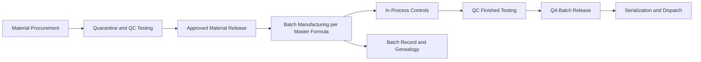

# Volume 07 - Pharmaceutical

| Field | Value |
|---|---|
| Document ID | WORLD-VOL07-004 |
| Title | Pharmaceutical |
| Version | 1.0 |
| Status | Approved |
| Classification | Internal |
| Founder | Mahesh Choudhary |

## Purpose

This chapter defines how WORLD is configured for the pharmaceutical industry. It maps the pharmaceutical business model, organization, and processes onto WORLD's Business Modules (Volume 06), the ERP Foundation (Volume 05), the AI Business Partner (Volume 03), and Business Intelligence (Volume 04). The objective is a validated, compliance-first solution that manages regulated production, quality, and distribution with complete traceability and electronic records.

## Scope

The chapter covers manufacturing of formulations and active pharmaceutical ingredients (APIs), including tablets, capsules, injectables, and liquids. It spans procurement of regulated materials, batch manufacturing, quality control and assurance, batch release, serialization, and cold or ambient distribution. Module internals are documented in Volume 06; this chapter specifies the regulated industry configuration and cross-module orchestration.

## Industry Overview

Pharmaceutical manufacturing is among the most tightly regulated of all industries. Every step operates under Good Manufacturing Practice, with mandatory batch records, quality control testing, deviation and change control, and qualified-person batch release. Products require lot and expiry control, serialization for anti-counterfeiting, and often cold-chain handling. Data integrity and audit readiness are as important as physical output.

## Business Model

The model is develop-manufacture-validate-distribute under regulatory license. Value derives from approved products manufactured to validated processes and released against specification. Revenue depends on product portfolio, market approvals, and reliable supply; cost is driven by regulated materials, quality operations, and compliance overhead. Competitive advantage lies in quality reputation, regulatory standing, and supply reliability. WORLD supports own-manufacturing and contract manufacturing models.

## Organization

A pharmaceutical enterprise is organized into Procurement, Production, Quality Control, Quality Assurance, Regulatory Affairs, Warehouse, Distribution, and Finance, with an independent quality function holding release authority. Plants, controlled warehouses, and quarantine areas are modeled as location dimensions on the ERP Foundation (Volume 05). Approved specifications, master formulae, and batch records anchor the regulated process.

## Processes

The cycle runs from procurement into quarantine and QC testing, material release, batch manufacturing to the master formula, in-process controls, finished QC testing, independent QA release, and serialized dispatch. Every step generates controlled records with full genealogy and electronic signatures.

**Enterprise example:** An incoming API lot is received into quarantine and cannot be consumed until QC testing confirms identity and assay and QA releases it. A tablet batch of 500,000 units is manufactured against the approved master formula with in-process weight and hardness checks recorded electronically. Finished testing confirms dissolution within specification, QA releases the batch, and serialized packs are dispatched. A minor deviation on compression force is logged, investigated, and closed under change control. The AI Business Partner flags that the batch's stability-related parameter is trending toward the specification edge and recommends tighter in-process sampling.

## Required ERP Modules

| Business Need | WORLD Module (Volume 06) | Role in Pharmaceutical |
|---|---|---|
| Regulated material sourcing | Procurement | Approved-vendor, lot-controlled buying |
| Quarantine and lot stock | Inventory | Quarantine, expiry, and lot status |
| Batch manufacturing | Manufacturing / Production | Master-formula execution and genealogy |
| QC, QA, and release | Quality | Testing, disposition, batch release |
| Serialized distribution | Logistics / Dispatch | Cold-chain and track-and-trace |
| Costing and controls | Finance | Batch costing and financial control |

Key references: [Manufacturing](/docs/blueprint/volume-06-business-modules/section-c-manufacturing-and-operations/12-manufacturing.md), [Quality](/docs/blueprint/volume-06-business-modules/section-c-manufacturing-and-operations/13-quality.md), and [Procurement](/docs/blueprint/volume-06-business-modules/section-a-supply-chain-and-procurement/01-procurement.md).

## Required AI Features

The AI Business Partner (Volume 03) operates strictly within validated, governed boundaries. It predicts quality deviations from in-process trends, recommends sampling intensity, and surfaces batches trending toward specification limits before release. It forecasts demand and plans supply to prevent stock-outs of critical medicines, optimizes cold-chain routing, and assists deviation triage and root-cause analysis. All AI recommendations are advisory and subject to qualified-person authority, preserving data integrity and human accountability.

## KPIs

| KPI | Definition | Target |
|---|---|---|
| Right First Time Batches | Batches released without deviation rework | > 98% |
| Batch Release Cycle Time | Manufacture to QA release | Minimize |
| Deviation Closure Time | Time to close a deviation | Within SLA |
| Out-of-Specification Rate | OOS results / tests performed | Minimize |
| Cold-Chain Compliance | Shipments within temperature limits | > 99% |
| Audit Findings | Critical observations per audit | Zero |

## Compliance

The industry operates under GMP and GxP frameworks and electronic-records rules. Relevant standards include current Good Manufacturing Practice, WHO-GMP, ICH quality guidelines, and electronic-records and signature expectations equivalent to 21 CFR Part 11, along with serialization mandates. WORLD supports these through validated workflows, quarantine and release controls, electronic batch records, audit trails, and immutable governed facts on the ERP Foundation.

## Dashboards

Dashboards present batch status through quarantine, manufacturing, testing, and release; deviation and change-control queues; OOS trends; cold-chain status; and supply coverage for critical products. Executive views track release cycle time and audit readiness, delivered through the Dashboards module and Business Intelligence (Volume 04).

## Reporting

Standard reports include electronic batch records, QC and stability testing reports, deviation and change-control logs, serialization and distribution reports, and regulatory and audit summaries, generated through the Reporting module for inspection and submission.

## Future Roadmap

Planned enhancements include AI-assisted deviation investigation, predictive stability modelling, continuous-manufacturing process analytics, and fully electronic, validated review-by-exception batch release orchestrated with the AI Business Partner under qualified-person control.

## Cross-References

- [Inventory](/docs/blueprint/volume-06-business-modules/section-a-supply-chain-and-procurement/02-inventory.md)
- [Production](/docs/blueprint/volume-06-business-modules/section-c-manufacturing-and-operations/10-production.md)
- [Finance](/docs/blueprint/volume-06-business-modules/section-d-finance/15-finance.md)
- [Volume 03 - AI Business Partner](/docs/blueprint/volume-03-ai-business-partner/README.md)

## References

- [Volume 01 - Vision and Philosophy](/docs/blueprint/volume-01-vision-and-philosophy/README.md)
- [Document Standards](/docs/governance/document-standards.md)

## Change Log

| Version | Date | Author | Notes |
|---|---|---|---|
| 1.0 | 2026-07-12 | Lead Software Engineer | Initial approved version. |
