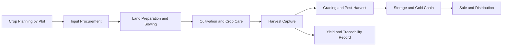

# Volume 07 - Agriculture

| Field | Value |
|---|---|
| Document ID | WORLD-VOL07-005 |
| Title | Agriculture |
| Version | 1.0 |
| Status | Approved |
| Classification | Internal |
| Founder | Mahesh Choudhary |

## Purpose

This chapter defines how WORLD is configured for the agriculture industry. It maps the agricultural business model, organization, and processes onto WORLD's Business Modules (Volume 06), the ERP Foundation (Volume 05), the AI Business Partner (Volume 03), and Business Intelligence (Volume 04). The objective is a season-aware solution that manages inputs, cultivation, harvest, post-harvest handling, and market sale as governed facts across dispersed operations.

## Scope

The chapter covers crop production and agribusiness operations, including input supply, cultivation, harvest, grading, storage, and sale of produce. It spans farm and plot management, input procurement, cultivation planning, harvest capture, post-harvest processing and storage, and distribution to buyers and markets. Module internals are documented in Volume 06; this chapter specifies the industry configuration and cross-module orchestration.

## Industry Overview

Agriculture is a biological, seasonal, and geographically dispersed industry exposed to weather, pests, and volatile commodity prices. Operations follow crop cycles from land preparation to harvest, with outcomes dependent on input timing, water, and agronomy. Produce is perishable and quality-graded, and value depends on yield, grade, and access to markets at favorable prices. Traceability from farm to buyer is increasingly required for premium and export channels.

## Business Model

The model is plan-cultivate-harvest-sell, often combined with input supply and aggregation. Value is created by producing graded produce at controlled cost and selling into the best available market window. Revenue depends on yield, grade, and price realization; cost is dominated by seeds, fertilizer, crop protection, water, labor, and machinery. Competitive advantage comes from agronomic discipline, input efficiency, post-harvest loss control, and market timing. WORLD supports own-farm, contract-farming, and aggregation models.

## Organization

An agricultural enterprise is organized into Input Supply and Procurement, Farm and Agronomy Operations, Harvest and Post-Harvest, Storage and Logistics, Sales and Aggregation, and Finance. Farms, plots, and storage yards are modeled as location dimensions on the ERP Foundation (Volume 05). Crop plans, plot master data, and input catalogs anchor planning and traceability.

## Processes

The cycle runs from plot-level crop planning and input procurement, through land preparation and sowing, cultivation and crop care, harvest capture, grading and post-harvest handling, storage, and sale. Each plot maintains a record of inputs applied, operations performed, and yield achieved for costing and traceability.

**Enterprise example:** An agribusiness plans wheat across 40 plots covering 600 hectares. Input procurement stages seed and fertilizer to each plot, and cultivation operations are recorded against plot cost centers. At harvest, 2,400 tonnes are captured and graded, with grade-A produce routed to premium buyers and the balance to bulk sale. Post-harvest storage is managed to limit loss, and the AI Business Partner recommends holding a portion of stock two weeks based on a predicted price rise, while alerting that a pest-pressure signal on eight plots warrants an early protective spray.

## Required ERP Modules

| Business Need | WORLD Module (Volume 06) | Role in Agriculture |
|---|---|---|
| Input sourcing | Procurement | Seed, fertilizer, and crop-protection buying |
| Input and produce stock | Inventory | Plot-level input and graded-produce stock |
| Harvest and grading output | Production | Harvest capture, grading, and costing |
| Produce quality and grade | Quality | Grading, quality control, and disposition |
| Storage and delivery | Warehouse / Logistics | Storage, cold chain, and distribution |
| Costing and settlement | Finance | Plot costing, farmer and buyer settlement |

Key references: [Procurement](/docs/blueprint/volume-06-business-modules/section-a-supply-chain-and-procurement/01-procurement.md), [Inventory](/docs/blueprint/volume-06-business-modules/section-a-supply-chain-and-procurement/02-inventory.md), and [Logistics](/docs/blueprint/volume-06-business-modules/section-a-supply-chain-and-procurement/04-logistics.md).

## Required AI Features

The AI Business Partner (Volume 03) recommends crop plans and input schedules by plot from soil, weather, and historical yield data, forecasts yield and harvest timing, and predicts pest and disease pressure to prompt timely intervention. It optimizes input usage to reduce cost and waste, advises on optimal sale timing from commodity-price signals, and minimizes post-harvest loss through storage and allocation guidance. It operates as a continuous agronomy and market partner across dispersed operations.

## KPIs

| KPI | Definition | Target |
|---|---|---|
| Yield per Hectare | Produce output / area cultivated | Maximize |
| Input Cost per Hectare | Input spend / area cultivated | Minimize |
| Grade-A Ratio | Premium-grade output / total output | Maximize |
| Post-Harvest Loss | Loss quantity / harvested quantity | Minimize |
| Price Realization | Actual price vs. market benchmark | At or above benchmark |
| Plot Margin | Revenue minus cost per plot | Maximize |

## Compliance

Agriculture is governed by food-safety, input, and sustainability frameworks. Relevant standards include Good Agricultural Practices such as GLOBALG.A.P., FSSAI requirements for produce entering the food chain, agrochemical residue and maximum-residue-limit rules, and organic or export certification where applicable. WORLD supports these through plot-level input traceability, quality grading records, and immutable audit trails on the ERP Foundation for certification and buyer assurance.

## Dashboards

Dashboards present crop-plan progress by plot, input consumption and cost, expected versus actual yield, grade distribution, storage levels and loss, and price and sales realization. Executive views track plot margin and portfolio performance, delivered through the Dashboards module and Business Intelligence (Volume 04) with drill-down to governed transactions.

## Reporting

Standard reports include plot cost and margin statements, input application and traceability records, harvest and grading summaries, post-harvest loss analysis, and sales realization reports, generated through the Reporting module for management review, certification, and buyer audits.

## Future Roadmap

Planned enhancements include satellite and drone imagery fused into the AI yield and pest models, IoT soil-moisture and weather-station integration, variable-rate input recommendations, and market-linkage tools that match graded produce to buyers in real time under the AI Business Partner's guidance.

## Cross-References

- [Warehouse](/docs/blueprint/volume-06-business-modules/section-a-supply-chain-and-procurement/03-warehouse.md)
- [Production](/docs/blueprint/volume-06-business-modules/section-c-manufacturing-and-operations/10-production.md)
- [Finance](/docs/blueprint/volume-06-business-modules/section-d-finance/15-finance.md)
- [Volume 03 - AI Business Partner](/docs/blueprint/volume-03-ai-business-partner/README.md)

## References

- [Volume 01 - Vision and Philosophy](/docs/blueprint/volume-01-vision-and-philosophy/README.md)
- [Document Standards](/docs/governance/document-standards.md)

## Change Log

| Version | Date | Author | Notes |
|---|---|---|---|
| 1.0 | 2026-07-12 | Lead Software Engineer | Initial approved version. |
