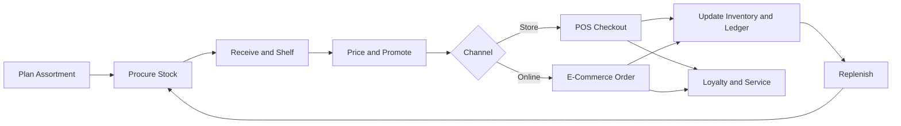

# Volume 07 - Retail

| Field | Value |
|---|---|
| Document ID | WORLD-VOL07-006 |
| Title | Retail |
| Version | 1.0 |
| Status | Approved |
| Classification | Internal |
| Founder | Mahesh Choudhary |

## Purpose

Define how WORLD is configured and applied for the retail industry. This chapter maps the retail business model, organization, and store-to-shelf processes to the required ERP modules (Volume 06) and AI features (Volume 03), and specifies the KPIs, compliance obligations, dashboards, reporting, and roadmap that make WORLD an operational AI Business Partner for retailers.

## Scope

Covers omnichannel retail: physical stores, e-commerce, and mobile, spanning merchandising, pricing and promotions, checkout, inventory, replenishment, customer loyalty, and store operations. Applies to single-store operators, multi-store chains, and franchise networks. Excludes wholesale trade (WORLD-VOL07-007) and pure distribution (WORLD-VOL07-008), which are documented separately.

## Industry Overview

Retail sells finished goods directly to end consumers across many channels and touchpoints. It is characterized by high transaction volume, low margins per unit, perishable attention spans, and intense seasonality. Success depends on having the right product, at the right price, in the right place, at the right moment, while keeping working capital tied up in inventory to a minimum. WORLD treats the retailer as a single operating system in which every sale, whether at a counter, on a phone, or on a website, updates one ledger, one inventory position, and one customer record.

## Business Model

Retailers earn the spread between landed cost and shelf price, amplified by volume, loyalty, and disciplined markdown management. Revenue is driven by footfall, conversion, basket size, and repeat purchase, while cost is driven by shrinkage, markdowns, and store labor. WORLD models each store as a profit center, each channel as a revenue stream, and each SKU as a margin-bearing asset, giving the operator a live view of contribution by store, channel, category, and customer segment.

## Organization

A typical retail organization spans central merchandising and buying, store operations, e-commerce, supply chain, marketing, and finance. WORLD maps these to roles with scoped permissions: the Buyer curates assortment and negotiates cost, the Store Manager owns floor execution and labor, the Cashier completes transactions, the E-Commerce Manager owns the online storefront, and the CFO owns margin and cash. A regional structure aggregates stores into districts and regions for planning and performance management.

## Processes

The core retail cycle runs from assortment planning and procurement through replenishment, in-store and online selling, and post-sale service and returns.

## Required ERP Modules

Retail is assembled primarily from the Sales & Customer and Supply Chain sections of Volume 06.

| Capability | Module | Reference |
|---|---|---|
| In-store checkout | POS | [POS](/docs/blueprint/volume-06-business-modules/section-b-sales-and-customer/08-pos.md) |
| Online storefront | E-Commerce | [E-Commerce](/docs/blueprint/volume-06-business-modules/section-b-sales-and-customer/09-e-commerce.md) |
| Customer and loyalty | CRM | [CRM](/docs/blueprint/volume-06-business-modules/section-b-sales-and-customer/06-crm.md) |
| Stock accuracy and replenishment | Inventory | [Inventory](/docs/blueprint/volume-06-business-modules/section-a-supply-chain-and-procurement/02-inventory.md) |
| Assortment sourcing | Procurement | [Procurement](/docs/blueprint/volume-06-business-modules/section-a-supply-chain-and-procurement/01-procurement.md) |
| Margin and cash | Finance | [Finance](/docs/blueprint/volume-06-business-modules/section-d-finance/15-finance.md) |

POS, E-Commerce, and CRM share one basket and one customer identity, so a purchase started online and completed in store posts to the same ledger and loyalty account.

## Required AI Features

The AI Business Partner (Volume 03) reasons over live retail data to forecast demand, optimize price and promotion, prevent stockouts, and detect shrinkage. It recommends assortment changes by store cluster, schedules labor against forecast footfall, and personalizes offers by customer segment. Example: for a festival weekend the AI Business Partner forecasts a 40 percent footfall rise at three flagship stores, recommends opening additional checkout terminals from 11:00, pre-triggers replenishment for the ten fastest-moving SKUs, and pushes a targeted promotion to lapsed loyalty members within a five-kilometer radius.

## KPIs

| KPI | Definition |
|---|---|
| Sales per square meter | Net sales divided by selling floor area |
| Conversion rate | Transactions divided by footfall |
| Average basket value | Net sales divided by transactions |
| Inventory turnover | Cost of goods sold divided by average inventory |
| Shrinkage rate | Unaccounted stock loss as a share of sales |
| Gross margin | Sales less landed cost, as a percentage |

## Compliance

Retail operations must satisfy consumer protection and fair-pricing rules, tax and invoicing regulations, product labeling and safety standards, and data-protection obligations for customer information. WORLD enforces tax and invoice policy through the Business Foundation (Volume 02), maintains an immutable audit trail on the ERP Foundation (Volume 05), and applies role-based access so that customer data is handled on a least-privilege basis.

## Dashboards

A Store Manager dashboard shows live sales, conversion, basket trends, terminal status, and AI-recommended staffing and restock actions. A Merchandising dashboard shows sell-through, markdown exposure, and out-of-stock rates by category. An Executive dashboard aggregates contribution by store, channel, and region.

## Reporting

Standard reports include daily sales summary, category sell-through, markdown and promotion effectiveness, shrinkage analysis, and channel contribution. Reports are generated through the Reporting module and are available on demand or on schedule to head office and store leadership.

## Future Roadmap

Planned evolution includes self-checkout and mobile POS, computer-vision shelf monitoring, fully autonomous replenishment, dynamic electronic shelf pricing, and unified inventory that treats every store as a fulfillment node for online orders.

## Cross-References

- [POS](/docs/blueprint/volume-06-business-modules/section-b-sales-and-customer/08-pos.md)
- [E-Commerce](/docs/blueprint/volume-06-business-modules/section-b-sales-and-customer/09-e-commerce.md)
- [CRM](/docs/blueprint/volume-06-business-modules/section-b-sales-and-customer/06-crm.md)
- [Volume 05 - ERP Foundation](/docs/blueprint/volume-05-erp-foundation/README.md)

## References

- [Volume 01 - Vision and Philosophy](/docs/blueprint/volume-01-vision-and-philosophy/README.md)
- [Document Standards](/docs/governance/document-standards.md)

## Change Log

| Version | Date | Author | Notes |
|---|---|---|---|
| 1.0 | 2026-07-12 | Lead Software Engineer | Initial approved version. |
