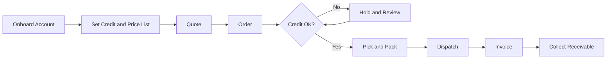

# Volume 07 - Wholesale

| Field | Value |
|---|---|
| Document ID | WORLD-VOL07-007 |
| Title | Wholesale |
| Version | 1.0 |
| Status | Approved |
| Classification | Internal |
| Founder | Mahesh Choudhary |

## Purpose

Define how WORLD is configured and applied for the wholesale industry. This chapter maps the wholesale business model, organization, and bulk-trade processes to the required ERP modules (Volume 06) and AI features (Volume 03), and specifies the KPIs, compliance, dashboards, reporting, and roadmap that make WORLD an operational AI Business Partner for wholesalers.

## Scope

Covers business-to-business trade of goods in bulk to retailers, institutions, and resellers, spanning catalog and price-list management, quotation, credit-based ordering, bulk fulfillment, and receivables. Applies to cash-and-carry operators, stockist wholesalers, and buying groups. Excludes direct-to-consumer retail (WORLD-VOL07-006) and manufacturer-led distribution networks (WORLD-VOL07-008).

## Industry Overview

Wholesale sits between producers and downstream sellers, aggregating supply and breaking bulk into commercially useful lots. It is defined by high order values, negotiated and tiered pricing, extended credit terms, and thin margins recovered through volume and inventory velocity. The wholesaler competes on availability, price, credit, and reliability of fulfillment. WORLD models the wholesaler as a working-capital engine in which every order, credit line, and stock position is visible and optimized in real time.

## Business Model

Wholesalers profit from the margin between purchase and resale prices, magnified by volume and turnover, and shaped by credit exposure. Revenue depends on account depth, order frequency, and price-list discipline, while cost and risk are driven by inventory holding, obsolescence, and bad debt. WORLD models each customer account as a credit-bearing relationship, each price list as a governed policy, and each SKU as a velocity-classified asset, giving the operator live control over margin and receivables.

## Organization

A wholesale organization spans buying and category management, sales and key-account management, warehouse and fulfillment, credit control, and finance. WORLD maps these to scoped roles: the Buyer manages supplier terms and stock cover, the Account Manager owns customer relationships and quotations, the Credit Controller governs limits and collections, and the Warehouse Manager owns picking, packing, and dispatch accuracy.

## Processes

The core wholesale cycle runs from customer onboarding and credit setup through quotation, order, credit check, bulk fulfillment, invoicing, and collection.

## Required ERP Modules

Wholesale is assembled primarily from the Sales, Supply Chain, and Finance sections of Volume 06.

| Capability | Module | Reference |
|---|---|---|
| Quotation and B2B order | Sales | [Sales](/docs/blueprint/volume-06-business-modules/section-b-sales-and-customer/07-sales.md) |
| Account and price relationship | CRM | [CRM](/docs/blueprint/volume-06-business-modules/section-b-sales-and-customer/06-crm.md) |
| Bulk stock and velocity | Inventory | [Inventory](/docs/blueprint/volume-06-business-modules/section-a-supply-chain-and-procurement/02-inventory.md) |
| Pick, pack, dispatch | Warehouse | [Warehouse](/docs/blueprint/volume-06-business-modules/section-a-supply-chain-and-procurement/03-warehouse.md) |
| Credit, invoicing, collections | Finance | [Finance](/docs/blueprint/volume-06-business-modules/section-d-finance/15-finance.md) |

Sales, CRM, and Finance share one account identity, so a negotiated price list, credit limit, and outstanding balance are enforced together at the moment an order is placed.

## Required AI Features

The AI Business Partner (Volume 03) forecasts account-level demand, recommends optimal price tiers and reorder points, flags credit risk before it becomes bad debt, and detects slow-moving stock before it becomes obsolete. Example: the AI Business Partner detects that a long-standing retail chain has stretched its average payment days from 30 to 52 while increasing order size, recommends tightening the credit limit and shifting the account to partial advance, and simultaneously proposes a volume rebate on a slow-moving category the account already buys, protecting both margin and the relationship.

## KPIs

| KPI | Definition |
|---|---|
| Inventory turnover | Cost of goods sold divided by average inventory |
| Days sales outstanding | Average days to collect receivables |
| Order fill rate | Order lines fulfilled complete and on time |
| Gross margin | Sales less landed cost, as a percentage |
| Bad debt ratio | Written-off receivables as a share of sales |
| Average order value | Net sales divided by number of orders |

## Compliance

Wholesale operations must satisfy commercial tax and e-invoicing rules, credit and lending regulations where financing is offered, product traceability requirements for regulated categories, and contract and warranty obligations. WORLD enforces tax and pricing policy through the Business Foundation (Volume 02), records every transaction on the immutable ledger of the ERP Foundation (Volume 05), and applies segregation of duties between order entry, credit approval, and dispatch.

## Dashboards

A Sales dashboard shows order pipeline, quote conversion, and account contribution. A Credit dashboard shows exposure, overdue aging, and at-risk accounts with AI-flagged actions. A Warehouse dashboard shows fill rate, dispatch accuracy, and stock cover by velocity class.

## Reporting

Standard reports include price-list compliance, receivables aging, order fill and backorder analysis, inventory velocity and obsolescence, and account profitability. Reports are produced through the Reporting module on demand or on schedule for commercial and finance leadership.

## Future Roadmap

Planned evolution includes self-service B2B ordering portals, AI-negotiated tiered pricing, embedded trade financing, predictive credit scoring integrated at order entry, and automated replenishment proposals synchronized with each account's own sell-through.

## Cross-References

- [Sales](/docs/blueprint/volume-06-business-modules/section-b-sales-and-customer/07-sales.md)
- [CRM](/docs/blueprint/volume-06-business-modules/section-b-sales-and-customer/06-crm.md)
- [Inventory](/docs/blueprint/volume-06-business-modules/section-a-supply-chain-and-procurement/02-inventory.md)
- [Volume 04 - Business Intelligence & Decision Science](/docs/blueprint/volume-04-business-intelligence-and-decision-science/README.md)

## References

- [Volume 01 - Vision and Philosophy](/docs/blueprint/volume-01-vision-and-philosophy/README.md)
- [Document Standards](/docs/governance/document-standards.md)

## Change Log

| Version | Date | Author | Notes |
|---|---|---|---|
| 1.0 | 2026-07-12 | Lead Software Engineer | Initial approved version. |
