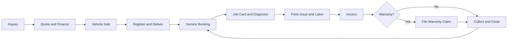

# Volume 07 - Automobile

| Field | Value |
|---|---|
| Document ID | WORLD-VOL07-009 |
| Title | Automobile |
| Version | 1.0 |
| Status | Approved |
| Classification | Internal |
| Founder | Mahesh Choudhary |

## Purpose

Define how WORLD is configured and applied for the automobile industry. This chapter maps the automotive dealership and after-sales business model, organization, and vehicle-lifecycle processes to the required ERP modules (Volume 06) and AI features (Volume 03), and specifies the KPIs, compliance, dashboards, reporting, and roadmap that make WORLD an operational AI Business Partner for automotive businesses.

## Scope

Covers the automotive sales and service value chain: vehicle sales, spare-parts trade, workshop and service operations, warranty and insurance handling, and financing facilitation. Applies to franchised dealerships, multi-brand outlets, and independent service and parts businesses. Excludes vehicle manufacturing, which is documented under the production and process industries section.

## Industry Overview

The automotive trade combines high-value vehicle sales with a long, recurring after-sales relationship built on service and spare parts. It is defined by unit-level asset tracking (chassis and engine identity), regulated registration and warranty, financing dependence, and an after-sales stream that often outperforms vehicle margins. Businesses compete on brand, service quality, parts availability, and total cost of ownership. WORLD models the automotive business as a lifecycle engine in which each vehicle, from sale through every service visit, is a single tracked relationship.

## Business Model

Automotive businesses earn thin margins on vehicle sales and richer, recurring margins on service labor, spare parts, and value-added products such as insurance and extended warranty. Revenue depends on unit sales, workshop throughput, and parts attachment, while profitability depends on inventory carrying cost for vehicles and parts, technician utilization, and warranty recovery. WORLD models each vehicle as a lifecycle asset, each service job as a labor-and-parts profit line, and each customer as a multi-year relationship.

## Organization

An automotive organization spans vehicle sales, the spare-parts department, the service workshop, warranty and insurance administration, and finance. WORLD maps these to scoped roles: the Sales Consultant owns vehicle deals and delivery, the Parts Manager owns parts inventory and attachment, the Service Advisor owns the customer's service experience, the Technician executes repair jobs, and the Warranty Officer recovers claims from principals and insurers.

## Processes

The automotive lifecycle runs from vehicle inquiry and sale through registration and delivery, and then into recurring service, parts, and warranty over the ownership period.

## Required ERP Modules

Automotive is assembled from the Sales, Supply Chain, and after-sales-oriented modules of Volume 06.

| Capability | Module | Reference |
|---|---|---|
| Vehicle sale and quotation | Sales | [Sales](/docs/blueprint/volume-06-business-modules/section-b-sales-and-customer/07-sales.md) |
| Customer and vehicle history | CRM | [CRM](/docs/blueprint/volume-06-business-modules/section-b-sales-and-customer/06-crm.md) |
| Spare-parts stock | Inventory | [Inventory](/docs/blueprint/volume-06-business-modules/section-a-supply-chain-and-procurement/02-inventory.md) |
| Counter parts sale | POS | [POS](/docs/blueprint/volume-06-business-modules/section-b-sales-and-customer/08-pos.md) |
| Service job scheduling | Projects | [Projects](/docs/blueprint/volume-06-business-modules/section-f-projects-and-productivity/24-projects.md) |
| Financing and warranty settlement | Finance | [Finance](/docs/blueprint/volume-06-business-modules/section-d-finance/15-finance.md) |

Sales, CRM, and Inventory share one vehicle and customer identity, so a service visit years after purchase resolves the exact model, warranty status, and parts fitment from the original sale.

## Required AI Features

The AI Business Partner (Volume 03) predicts service due dates and proactively books appointments, forecasts spare-parts demand by model, optimizes technician scheduling for workshop throughput, and validates warranty claims against job-card evidence. Example: the AI Business Partner identifies a cohort of vehicles approaching a scheduled major service, forecasts the specific parts each job will consume, pre-positions those parts at the branch, sends personalized service reminders through CRM, and sequences workshop bays so technician utilization stays high across the resulting demand spike.

## KPIs

| KPI | Definition |
|---|---|
| Vehicles sold per period | Count of delivered vehicles |
| Service retention rate | Share of sold vehicles returning for service |
| Technician utilization | Billed labor hours divided by available hours |
| Parts attachment rate | Parts revenue per service job |
| Warranty recovery days | Average days to settle warranty claims |
| Gross margin per unit | Margin on vehicle plus attached products |

## Compliance

Automotive operations must satisfy vehicle registration and road-worthiness regulations, unit-level identity tracking of chassis and engine numbers, emission and safety standards, financing and insurance disclosure rules, and warranty terms with principals. WORLD tracks unit identity and batch-controlled parts through Inventory, records financing and warranty settlement on the ERP Foundation (Volume 05), and enforces segregation between sale, service authorization, and warranty approval.

## Dashboards

A Sales dashboard shows the inquiry-to-delivery funnel, stock aging, and finance penetration. A Workshop dashboard shows bay occupancy, job status, and technician utilization. An After-Sales dashboard shows parts availability, service retention, and warranty claim aging with AI-flagged exceptions.

## Reporting

Standard reports include vehicle sales and stock aging, workshop throughput and job profitability, parts availability and fast-mover analysis, warranty claim reconciliation, and customer service-retention analysis. Reports are produced through the Reporting module on demand or on schedule for sales, service, and finance leadership.

## Future Roadmap

Planned evolution includes connected-vehicle telematics feeding predictive maintenance, AI-driven trade-in valuation, automated warranty adjudication, digital service records portable across the vehicle's life, and unified fulfillment that sources a needed part from the nearest branch in real time.

## Cross-References

- [Sales](/docs/blueprint/volume-06-business-modules/section-b-sales-and-customer/07-sales.md)
- [CRM](/docs/blueprint/volume-06-business-modules/section-b-sales-and-customer/06-crm.md)
- [Inventory](/docs/blueprint/volume-06-business-modules/section-a-supply-chain-and-procurement/02-inventory.md)
- [Volume 03 - AI Business Partner](/docs/blueprint/volume-03-ai-business-partner/README.md)

## References

- [Volume 01 - Vision and Philosophy](/docs/blueprint/volume-01-vision-and-philosophy/README.md)
- [Document Standards](/docs/governance/document-standards.md)

## Change Log

| Version | Date | Author | Notes |
|---|---|---|---|
| 1.0 | 2026-07-12 | Lead Software Engineer | Initial approved version. |
