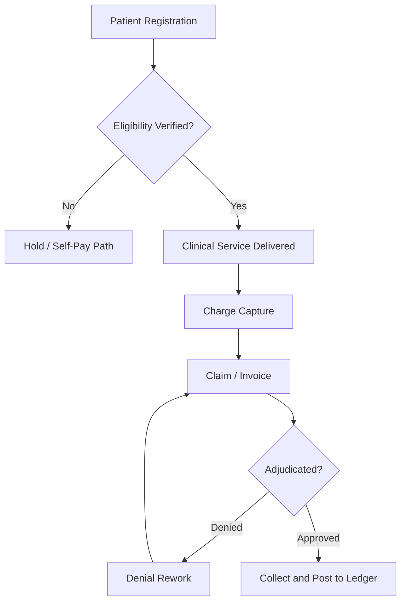

# Volume 07 - Healthcare

| Field | Value |
|---|---|
| Document ID | WORLD-VOL07-010 |
| Title | Healthcare |
| Version | 1.0 |
| Status | Approved |
| Classification | Internal |
| Founder | Mahesh Choudhary |

## Purpose

This chapter defines how WORLD is configured and applied for healthcare provider organizations - hospitals, clinics, diagnostic centers, and multi-specialty groups. It maps the healthcare business model, organization, and clinical-administrative processes onto the required Business Modules (Volume 06), the ERP Foundation (Volume 05), and the AI Business Partner (Volume 03), and specifies the KPIs, compliance obligations, dashboards, reporting, and roadmap that make WORLD operable in a regulated care setting.

## Scope

Scope covers the administrative, financial, workforce, supply, and asset operations of a care provider, together with the AI capabilities that assist clinicians and administrators. It excludes the electronic medical record (EMR) as a clinical system of record and medical device firmware; WORLD integrates with certified EMR and laboratory systems rather than replacing them. Clinical decision-making remains a licensed human responsibility, with the AI Business Partner acting in an assistive, governed capacity.

## Industry Overview

Healthcare providers deliver care through a tightly coupled chain of patient access, clinical service, and revenue recovery, while operating under strict privacy, safety, and accreditation regimes. Providers face persistent pressure on margins, workforce availability, and the cost of consumables and high-value equipment. WORLD treats each patient interaction, supply movement, and financial event as a governed, auditable transaction, giving leadership a unified operational view across departments that traditionally run on disconnected systems.

## Business Model

Revenue arises from consultations, procedures, diagnostics, inpatient stays, and pharmacy, settled through a mix of self-pay, insurance, and government schemes. The economic engine is the revenue cycle: register the patient, deliver the service, capture the charge, adjudicate the claim, and collect the balance. Cost is dominated by clinical labor, consumables, and capital equipment. WORLD models these flows so that service delivery, cost capture, and cash collection remain continuously reconciled.

## Organization

A typical provider is organized into clinical departments (outpatient, inpatient, surgery, diagnostics, pharmacy) and administrative functions (patient access, revenue cycle, supply chain, biomedical engineering, finance, and human resources). Clinical governance sits alongside operational management, and both draw authority and structure from the Business Foundation (Volume 02).

## Processes

The core operational flow is patient-access-to-collection, running in parallel with supply replenishment and equipment upkeep.

## Required ERP Modules

Healthcare configurations draw on the following Business Modules from Volume 06.

| Module | Role in Healthcare |
|---|---|
| CRM | Patient master, appointments, and communication |
| Inventory | Pharmacy stock and clinical consumables with expiry control |
| Assets | Biomedical equipment register and maintenance |
| Finance | Revenue cycle, claims, and payer settlement |
| HR | Clinical and support workforce, credentials, and rostering |

Key linked modules: [CRM](/docs/blueprint/volume-06-business-modules/section-b-sales-and-customer/06-crm.md), [Inventory](/docs/blueprint/volume-06-business-modules/section-a-supply-chain-and-procurement/02-inventory.md), and [Assets](/docs/blueprint/volume-06-business-modules/section-d-finance/19-assets.md). Finance and HR extend the model to revenue recovery and licensed-workforce governance.

## Required AI Features

The AI Business Partner (Volume 03) reasons over these modules to reduce administrative burden and protect margin. It predicts appointment no-shows and proposes overbooking, flags claims likely to be denied before submission, forecasts consumable demand against expiry, and schedules preventive maintenance on critical equipment. All actions are assistive and auditable, respecting the safety and governance controls defined in Volume 03. **Enterprise example:** a 400-bed hospital connects WORLD to its EMR and claims gateway; the partner detects that a batch of cardiology claims share a coding pattern historically linked to a 30% denial rate, drafts corrected claims for coder review, and routes them for one-click resubmission - recovering revenue that would otherwise have aged past appeal deadlines.

## KPIs

| KPI | Definition | Target |
|---|---|---|
| Bed Occupancy Rate | Occupied bed-days over available bed-days | Tracked daily |
| Average Length of Stay | Mean inpatient days per discharge | Benchmarked by specialty |
| Claim Denial Rate | Denied claims over submitted claims | < 5% |
| Days in Accounts Receivable | Average days to collect settled revenue | < 45 days |
| Consumable Expiry Loss | Value of expired stock over stock value | < 1% |

## Compliance

Healthcare operations demand rigorous protection of patient data and clinical safety. WORLD applies role-based access, encryption, and immutable audit trails so that provider organizations can meet HIPAA-style privacy and security obligations for protected health information, data-protection regimes such as GDPR where applicable, and facility accreditation standards (for example, JCI or NABH-equivalent frameworks). Controlled-substance handling, consent capture, and record-retention rules are enforced through the ERP Foundation. Specific regulatory thresholds are configured per jurisdiction rather than hard-coded.

## Dashboards

A clinical-operations dashboard surfaces occupancy, admission and discharge flow, theater utilization, and emergency wait times. A revenue-cycle dashboard tracks charge capture, denial trends, and receivables aging with drill-down to individual claims. An asset-and-supply dashboard monitors equipment uptime and consumable expiry risk.

## Reporting

Standard reports include the revenue-cycle summary, payer-mix and reimbursement analysis, clinical-utilization report, consumable-consumption and expiry report, and workforce-credential expiry report. Reporting is delivered through the Business Intelligence layer (Volume 04) and the Reporting module, with export formats suitable for regulator and accreditor submission.

## Future Roadmap

Planned evolution includes deeper EMR interoperability via FHIR-based exchange, predictive capacity planning across departments, autonomous denial-management agents, and value-based-care analytics that link clinical outcomes to cost. Each capability advances within the assistive, governed model rather than substituting for clinical judgment.

## Cross-References

- [Volume 06 - CRM](/docs/blueprint/volume-06-business-modules/section-b-sales-and-customer/06-crm.md)
- [Volume 06 - Inventory](/docs/blueprint/volume-06-business-modules/section-a-supply-chain-and-procurement/02-inventory.md)
- [Volume 03 - AI Business Partner](/docs/blueprint/volume-03-ai-business-partner/README.md)
- [Volume 04 - Business Intelligence](/docs/blueprint/volume-04-business-intelligence/README.md)

## References

- [Volume 01 - Vision and Philosophy](/docs/blueprint/volume-01-vision-and-philosophy/README.md)
- [Document Standards](/docs/governance/document-standards.md)

## Change Log

| Version | Date | Author | Notes |
|---|---|---|---|
| 1.0 | 2026-07-12 | Lead Software Engineer | Initial approved version. |
