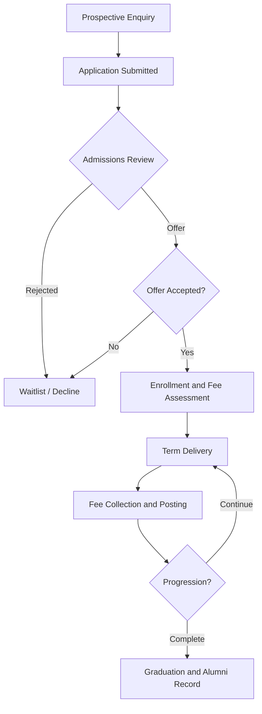

# Volume 07 - Education

| Field | Value |
|---|---|
| Document ID | WORLD-VOL07-011 |
| Title | Education |
| Version | 1.0 |
| Status | Approved |
| Classification | Internal |
| Founder | Mahesh Choudhary |

## Purpose

This chapter defines how WORLD is configured and applied for education institutions - schools, colleges, universities, and training providers. It maps the education business model, organization, and academic-administrative processes onto the required Business Modules (Volume 06), the ERP Foundation (Volume 05), and the AI Business Partner (Volume 03), and specifies the KPIs, compliance obligations, dashboards, reporting, and roadmap that make WORLD operable across the student lifecycle.

## Scope

Scope covers admissions, enrollment, student records, fee and finance operations, faculty and staff workforce, facilities, and the AI capabilities that assist administrators and educators. It excludes the delivery of instructional content and formal pedagogy; WORLD integrates with learning-management systems (LMS) rather than replacing them. Assessment and academic judgment remain the responsibility of qualified educators, with the AI Business Partner acting in an assistive, governed capacity.

## Industry Overview

Education institutions manage a long, relationship-driven lifecycle from enquiry to alumnus, funded by tuition, grants, and endowments, and governed by accreditation and student-protection regimes. They operate cyclical, calendar-bound processes - admissions intake, term scheduling, fee collection, and examinations - that must run reliably at scale. WORLD unifies these into governed transactions so that academic, financial, and operational data share one trusted model.

## Business Model

Revenue derives from tuition and fees, supplemented by grants, sponsorships, and auxiliary services such as housing and transport. The economic cycle is enrollment-driven: recruit and admit students, deliver programs across terms, collect fees on schedule, and retain students through to completion. Cost is dominated by faculty and staff compensation, facilities, and academic delivery. WORLD keeps enrollment, service delivery, and fee collection continuously reconciled.

## Organization

Institutions are organized into academic units (faculties, departments, programs) and administrative functions (admissions, registrar, bursar/finance, human resources, facilities, and student services). Academic governance operates alongside operational management, both drawing structure and authority from the Business Foundation (Volume 02).

## Processes

The core operational flow is enquiry-to-enrollment, feeding term delivery and fee collection.

## Required ERP Modules

Education configurations draw on the following Business Modules from Volume 06.

| Module | Role in Education |
|---|---|
| CRM | Prospect, applicant, and student relationship management |
| Finance | Fee assessment, collection, grants, and scholarships |
| HR | Faculty and staff lifecycle and credentials |
| Documents | Transcripts, certificates, and record retention |
| Assets | Campus facilities and equipment register |

Key linked modules: [CRM](/docs/blueprint/volume-06-business-modules/section-b-sales-and-customer/06-crm.md), [Finance](/docs/blueprint/volume-06-business-modules/section-d-finance/15-finance.md), and [Documents](/docs/blueprint/volume-06-business-modules/section-f-projects-and-productivity/26-documents.md). HR governs the academic workforce, and Assets underpins facilities operations.

## Required AI Features

The AI Business Partner (Volume 03) reasons over these modules to improve access, retention, and financial health. It scores applicant fit and predicts yield, identifies students at risk of dropout from attendance and fee-payment signals, forecasts fee collections against the term calendar, and optimizes classroom and timetable allocation. All actions are assistive and auditable under the governance controls of Volume 03. **Enterprise example:** a university connects WORLD to its LMS and fee ledger; the partner flags a cohort whose declining engagement and late fee installments predict attrition, drafts targeted outreach for the student-success team, and models the tuition-revenue impact of retaining them - turning a reactive process into an early, evidence-based intervention.

## KPIs

| KPI | Definition | Target |
|---|---|---|
| Enrollment Yield | Enrolled students over offers made | Tracked per intake |
| Student Retention Rate | Students continuing term over term | > 90% |
| Fee Collection Rate | Fees collected over fees assessed | > 98% |
| Student-to-Faculty Ratio | Enrolled students per faculty member | Benchmarked by program |
| Graduation Rate | Students completing over cohort intake | Tracked by cohort |

## Compliance

Education operations require protection of student records and adherence to accreditation. WORLD applies role-based access, encryption, and immutable audit trails to support student-record privacy obligations such as FERPA-style protections and data-protection regimes like GDPR where applicable. Programmatic and institutional accreditation standards, examination-integrity rules, and record-retention schedules are enforced through the ERP Foundation. Jurisdiction-specific thresholds are configured rather than hard-coded, so an institution can satisfy its national regulator and accrediting body.

## Dashboards

An admissions dashboard surfaces the enquiry-to-enrollment funnel, yield, and program demand. A student-success dashboard tracks retention, attendance, and at-risk cohorts with drill-down to individuals. A finance dashboard monitors fee assessment, collection aging, scholarship utilization, and grant burn.

## Reporting

Standard reports include the admissions-funnel report, enrollment and headcount census, fee-collection and aging report, scholarship-and-grant utilization report, and faculty-workload analysis. Reporting is delivered through the Business Intelligence layer (Volume 04) and the Reporting module, with formats suited to accreditor and government submission.

## Future Roadmap

Planned evolution includes deeper LMS interoperability, predictive enrollment planning across multiple intakes, autonomous fee-reminder and financial-aid agents, and outcomes analytics linking graduate success to program design. Each capability advances within the assistive, governed model rather than substituting for academic judgment.

## Cross-References

- [Volume 06 - CRM](/docs/blueprint/volume-06-business-modules/section-b-sales-and-customer/06-crm.md)
- [Volume 06 - Finance](/docs/blueprint/volume-06-business-modules/section-d-finance/15-finance.md)
- [Volume 03 - AI Business Partner](/docs/blueprint/volume-03-ai-business-partner/README.md)
- [Volume 02 - Business Foundation](/docs/blueprint/volume-02-business-foundation/README.md)

## References

- [Volume 01 - Vision and Philosophy](/docs/blueprint/volume-01-vision-and-philosophy/README.md)
- [Document Standards](/docs/governance/document-standards.md)

## Change Log

| Version | Date | Author | Notes |
|---|---|---|---|
| 1.0 | 2026-07-12 | Lead Software Engineer | Initial approved version. |
