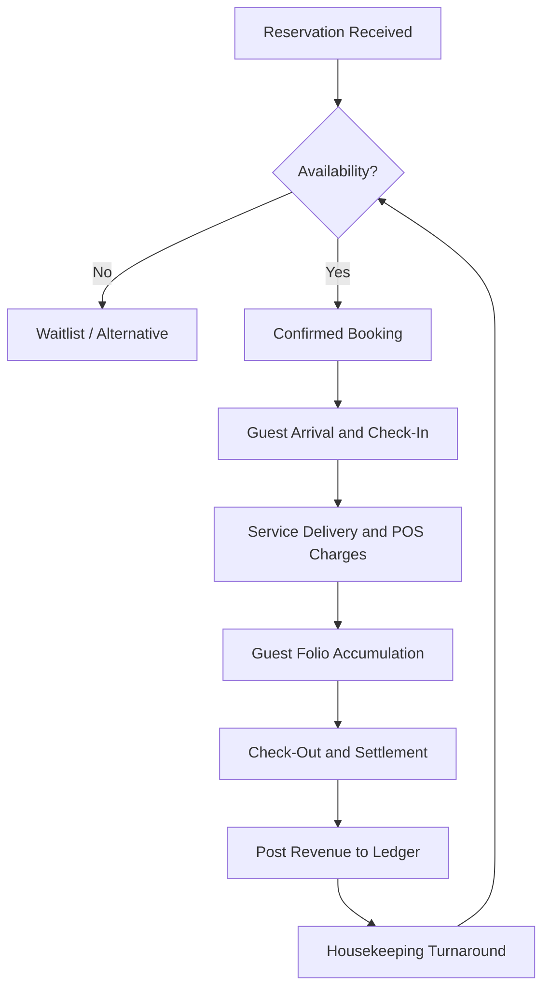

# Volume 07 - Hospitality

| Field | Value |
|---|---|
| Document ID | WORLD-VOL07-012 |
| Title | Hospitality |
| Version | 1.0 |
| Status | Approved |
| Classification | Internal |
| Founder | Mahesh Choudhary |

## Purpose

This chapter defines how WORLD is configured and applied for hospitality businesses - hotels, resorts, restaurants, and food-and-beverage operators. It maps the hospitality business model, organization, and guest-service processes onto the required Business Modules (Volume 06), the ERP Foundation (Volume 05), and the AI Business Partner (Volume 03), and specifies the KPIs, compliance obligations, dashboards, reporting, and roadmap that make WORLD operable across the guest lifecycle.

## Scope

Scope covers reservations, front-office and guest service, food-and-beverage operations, housekeeping, procurement and inventory, workforce, and the AI capabilities that assist operators. It integrates with property-management systems (PMS) and channel managers where present rather than replacing distribution networks. Guest experience remains a human-led craft, with the AI Business Partner acting in an assistive, governed capacity.

## Industry Overview

Hospitality sells a perishable product - a room-night or a table - that cannot be recovered once unsold, making occupancy, rate, and service quality the central levers of profitability. Operations are labor-intensive, seasonal, and highly sensitive to reputation. WORLD unifies reservations, service delivery, supply, and settlement into governed transactions so that operators can price dynamically, control cost, and protect the guest experience from a single trusted data model.

## Business Model

Revenue arises from room-nights, food-and-beverage covers, events, and ancillary services, sold through direct and third-party channels. The economic engine is yield management: fill perishable capacity at the best achievable rate while controlling variable cost per occupied unit. Cost is dominated by labor, food and consumables, and utilities. WORLD keeps reservations, point-of-sale activity, supply consumption, and settlement continuously reconciled.

## Organization

A property is organized into revenue-generating departments (rooms, food and beverage, events) and support functions (housekeeping, procurement, maintenance, finance, and human resources). Front-of-house and back-of-house operations coordinate around the guest, drawing structure and authority from the Business Foundation (Volume 02).

## Processes

The core operational flow is reservation-to-settlement, supported by supply replenishment and housekeeping readiness.

## Required ERP Modules

Hospitality configurations draw on the following Business Modules from Volume 06.

| Module | Role in Hospitality |
|---|---|
| POS | Food-and-beverage and ancillary charge capture |
| CRM | Guest profiles, preferences, and loyalty |
| Inventory | Food, beverage, and consumable stock control |
| Procurement | Supplier sourcing and replenishment |
| HR | Rostering and workforce for a labor-intensive operation |

Key linked modules: [POS](/docs/blueprint/volume-06-business-modules/section-b-sales-and-customer/08-pos.md), [CRM](/docs/blueprint/volume-06-business-modules/section-b-sales-and-customer/06-crm.md), and [Inventory](/docs/blueprint/volume-06-business-modules/section-a-supply-chain-and-procurement/02-inventory.md). Procurement and HR extend the model to cost control and shift-based staffing.

## Required AI Features

The AI Business Partner (Volume 03) reasons over these modules to lift yield and contain cost. It forecasts demand and recommends dynamic room and menu pricing, predicts no-shows and optimizes overbooking, forecasts food demand to curb waste, and builds labor rosters matched to occupancy. All actions are assistive and auditable under the governance controls of Volume 03. **Enterprise example:** a resort connects WORLD to its PMS and POS; ahead of a holiday weekend the partner detects rising demand and a soft mid-week trough, proposes a dynamic rate ladder and a targeted loyalty offer for repeat guests, forecasts the kitchen's produce order to the adjusted covers, and drafts a matching housekeeping roster - lifting RevPAR while cutting spoilage.

## KPIs

| KPI | Definition | Target |
|---|---|---|
| Occupancy Rate | Rooms sold over rooms available | Tracked daily |
| Average Daily Rate (ADR) | Room revenue over rooms sold | Benchmarked by segment |
| RevPAR | Room revenue over rooms available | Tracked daily |
| Food Cost Percentage | Food cost over food revenue | < 32% |
| Guest Satisfaction Score | Mean guest-feedback rating | Tracked continuously |

## Compliance

Hospitality operations must protect guest data and payment security and meet food-safety and licensing rules. WORLD applies role-based access, encryption, and immutable audit trails to support PCI DSS payment-card security, data-protection regimes such as GDPR where applicable, and food-safety frameworks such as HACCP for kitchen operations. Liquor licensing, occupancy limits, and tax rules are enforced through the ERP Foundation. Jurisdiction-specific thresholds are configured rather than hard-coded, so each property satisfies its local authorities.

## Dashboards

A revenue dashboard surfaces occupancy, ADR, RevPAR, and channel mix with pace against forecast. An operations dashboard tracks housekeeping turnaround, food-and-beverage covers, and service incidents. A cost dashboard monitors food cost, labor cost per occupied room, and supplier price movement.

## Reporting

Standard reports include the daily flash and manager's report, channel-production and commission analysis, food-and-beverage cost report, labor-productivity report, and guest-satisfaction trend. Reporting is delivered through the Business Intelligence layer (Volume 04) and the Reporting module, with export formats suited to owner and brand reporting.

## Future Roadmap

Planned evolution includes deeper channel-manager and PMS interoperability, autonomous revenue-management agents, predictive maintenance for property assets, and personalized guest-journey orchestration. Each capability advances within the assistive, governed model rather than substituting for hospitality judgment.

## Cross-References

- [Volume 06 - POS](/docs/blueprint/volume-06-business-modules/section-b-sales-and-customer/08-pos.md)
- [Volume 06 - Procurement](/docs/blueprint/volume-06-business-modules/section-a-supply-chain-and-procurement/01-procurement.md)
- [Volume 03 - AI Business Partner](/docs/blueprint/volume-03-ai-business-partner/README.md)
- [Volume 04 - Business Intelligence](/docs/blueprint/volume-04-business-intelligence/README.md)

## References

- [Volume 01 - Vision and Philosophy](/docs/blueprint/volume-01-vision-and-philosophy/README.md)
- [Document Standards](/docs/governance/document-standards.md)

## Change Log

| Version | Date | Author | Notes |
|---|---|---|---|
| 1.0 | 2026-07-12 | Lead Software Engineer | Initial approved version. |
