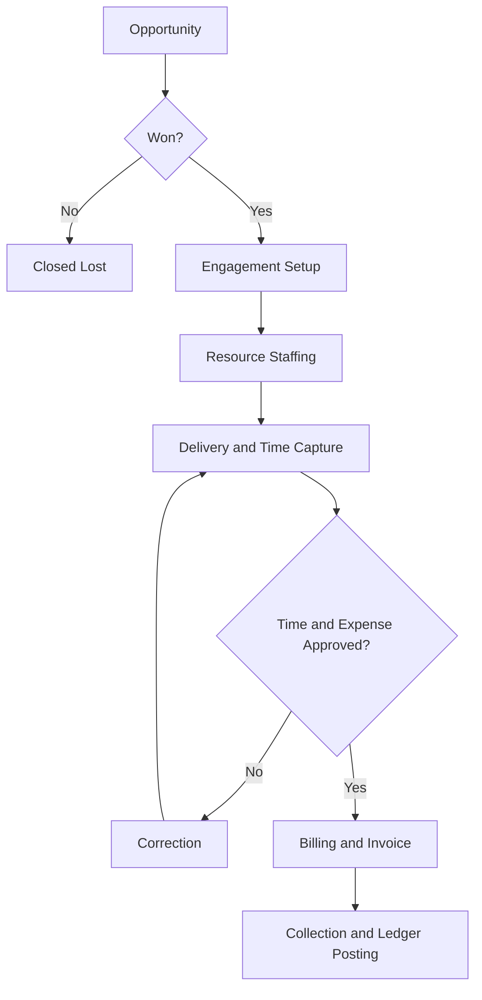

# Volume 07 - Professional Services

| Field | Value |
|---|---|
| Document ID | WORLD-VOL07-013 |
| Title | Professional Services |
| Version | 1.0 |
| Status | Approved |
| Classification | Internal |
| Founder | Mahesh Choudhary |

## Purpose

This chapter defines how WORLD is configured and applied for professional-services firms - consulting, legal, accounting, engineering, agency, and IT-services organizations. It maps the professional-services business model, organization, and engagement processes onto the required Business Modules (Volume 06), the ERP Foundation (Volume 05), and the AI Business Partner (Volume 03), and specifies the KPIs, compliance obligations, dashboards, reporting, and roadmap that make WORLD operable across the engagement lifecycle.

## Scope

Scope covers opportunity and engagement management, project delivery, time and expense capture, billing, resource management, and the AI capabilities that assist principals and delivery teams. It excludes the specific methodologies and professional deliverables of each discipline; WORLD governs the commercial and operational fabric around expert work rather than performing that work. Professional judgment remains with licensed practitioners, with the AI Business Partner acting in an assistive, governed capacity.

## Industry Overview

Professional-services firms sell the expertise and time of skilled people, making billable utilization, realization, and talent retention the central drivers of profitability. Revenue and cost are both concentrated in the workforce, so small shifts in utilization or scope leakage move the margin materially. WORLD unifies the sell-deliver-bill cycle into governed transactions so that pipeline, staffing, delivery, and cash remain continuously reconciled on one trusted model.

## Business Model

Revenue arises from engagements priced as time-and-materials, fixed-fee, or retainer, delivered by consultants against a plan. The economic engine is utilization and realization: keep skilled people billably deployed, convert worked hours into invoiced revenue, and collect promptly. Cost is dominated by professional salaries and, secondarily, by subcontractors and delivery expenses. WORLD keeps the pipeline, resourcing, time capture, and billing aligned so that leakage is visible and controllable.

## Organization

A firm is organized into client-facing practices or service lines and support functions (resource management, finance, human resources, and knowledge management). Engagement leadership, delivery teams, and firm management coordinate around the client engagement, drawing structure and authority from the Business Foundation (Volume 02).

## Processes

The core operational flow is opportunity-to-cash, spanning sale, staffing, delivery, and billing.

## Required ERP Modules

Professional-services configurations draw on the following Business Modules from Volume 06.

| Module | Role in Professional Services |
|---|---|
| Projects | Engagement structure, plan, and profitability |
| CRM | Client relationships and opportunity pipeline |
| HR | Consultant workforce, skills, and utilization |
| Documents | Engagement deliverables and record retention |
| Finance | Billing, revenue recognition, and collection |

Key linked modules: [Projects](/docs/blueprint/volume-06-business-modules/section-f-projects-and-productivity/24-projects.md), [CRM](/docs/blueprint/volume-06-business-modules/section-b-sales-and-customer/06-crm.md), and [HR](/docs/blueprint/volume-06-business-modules/section-e-human-capital/20-hr.md). Documents and Finance extend the model to deliverable governance and revenue recovery.

## Required AI Features

The AI Business Partner (Volume 03) reasons over these modules to protect utilization and margin. It forecasts pipeline and recommends staffing against skills and availability, flags engagements drifting toward budget or scope overrun, predicts bench time and proposes redeployment, and drafts invoices from approved time and expense. All actions are assistive and auditable under the governance controls of Volume 03. **Enterprise example:** a consulting firm running dozens of concurrent engagements connects WORLD to its time-capture and CRM data; the partner detects that a fixed-fee engagement has consumed 70% of its budget at 50% completion, alerts the engagement lead, models the margin impact of the current run-rate, and drafts a scoped change-order for client discussion - converting a silent write-off into a governed commercial decision.

## KPIs

| KPI | Definition | Target |
|---|---|---|
| Billable Utilization | Billable hours over available hours | > 75% |
| Realization Rate | Invoiced value over standard value of hours | > 90% |
| Engagement Margin | Gross margin per engagement | Tracked per engagement |
| Days Sales Outstanding | Average days to collect invoiced revenue | < 45 days |
| Bench Time | Non-billable available hours over total | Minimized |

## Compliance

Professional-services firms must protect client confidentiality, manage conflicts of interest, and meet the standards of their professional bodies. WORLD applies role-based access, ethical-wall segregation, encryption, and immutable audit trails to support client confidentiality, data-protection regimes such as GDPR where applicable, and where relevant, information-security certification such as ISO 27001 and SOC 2 assurance. Engagement-letter terms, independence rules, and record-retention schedules are enforced through the ERP Foundation, with jurisdiction- and profession-specific requirements configured rather than hard-coded.

## Dashboards

A delivery dashboard surfaces utilization, engagement health, and budget-versus-actual with drill-down to individual engagements. A pipeline dashboard tracks opportunity value, win rate, and forecast coverage. A finance dashboard monitors realization, work-in-progress, invoicing, and receivables aging.

## Reporting

Standard reports include the utilization and realization report, engagement-profitability report, work-in-progress and unbilled analysis, pipeline and forecast report, and receivables-aging report. Reporting is delivered through the Business Intelligence layer (Volume 04) and the Reporting module, with formats suited to partner and management review.

## Future Roadmap

Planned evolution includes autonomous resource-optimization agents, predictive engagement-risk scoring, knowledge-reuse recommendation across past engagements, and integrated scenario planning for capacity and hiring. Each capability advances within the assistive, governed model rather than substituting for professional judgment.

## Cross-References

- [Volume 06 - Projects](/docs/blueprint/volume-06-business-modules/section-f-projects-and-productivity/24-projects.md)
- [Volume 06 - CRM](/docs/blueprint/volume-06-business-modules/section-b-sales-and-customer/06-crm.md)
- [Volume 03 - AI Business Partner](/docs/blueprint/volume-03-ai-business-partner/README.md)
- [Volume 04 - Business Intelligence](/docs/blueprint/volume-04-business-intelligence/README.md)

## References

- [Volume 01 - Vision and Philosophy](/docs/blueprint/volume-01-vision-and-philosophy/README.md)
- [Document Standards](/docs/governance/document-standards.md)

## Change Log

| Version | Date | Author | Notes |
|---|---|---|---|
| 1.0 | 2026-07-12 | Lead Software Engineer | Initial approved version. |
