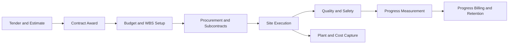

# Volume 07 - Construction

| Field | Value |
|---|---|
| Document ID | WORLD-VOL07-014 |
| Title | Construction |
| Version | 1.0 |
| Status | Approved |
| Classification | Internal |
| Founder | Mahesh Choudhary |

## Purpose

This chapter defines how WORLD is configured for the construction industry. It maps the construction business model, organization, and processes onto WORLD's Business Modules (Volume 06), the ERP Foundation (Volume 05), the AI Business Partner (Volume 03), and Business Intelligence (Volume 04). The result is an integrated construction solution that runs estimating, procurement, project execution, subcontractor management, and progress billing as a single governed system, with the AI Business Partner protecting schedule, cost, and cash flow across every project.

## Scope

The chapter covers general contracting, civil and infrastructure works, commercial and residential building, and specialty trades operating on a project or contract basis. It spans bidding and estimating, contract award, procurement of materials and plant, site execution, subcontractor coordination, quality and safety, progress measurement, and milestone billing. Module internals are documented in Volume 06; this chapter specifies the industry configuration and cross-module orchestration.

## Industry Overview

Construction delivers unique, one-off assets against fixed-price or cost-plus contracts, executed at dispersed sites over long durations. Competitiveness depends on accurate estimating, disciplined cost control, schedule certainty, and disciplined cash management, because margins are thin and rework, delay, and scope change erode profit quickly. Firms coordinate their own crews, subcontractors, suppliers, and heavy plant against a critical-path schedule while managing retention, variations, and safety exposure. Real-time visibility of committed cost versus budget is the decisive advantage.

## Business Model

The core model is bid-build-bill. Value is created by converting a design and a contract into a completed structure at controlled cost. Revenue is recognized on progress against the contract, typically through periodic valuations, milestones, or percentage-of-completion. Cost is dominated by materials, subcontracts, direct labor, and plant. Firms compete on estimating accuracy, execution reliability, safety record, and the ability to absorb and price variations. WORLD supports lump-sum, cost-plus, and unit-rate contracts within a single project ledger.

## Organization

A construction enterprise is organized into Estimating and Pre-Construction, Procurement, Project Delivery, Site Operations, Plant and Equipment, Quality and Safety, Commercial and Contracts, and Finance. Projects, phases, cost centers, and work breakdown structures are modeled as project and cost dimensions on the ERP Foundation (Volume 05). The work breakdown structure connects estimate, budget, procurement commitment, and actual cost so that every transaction rolls up to the contract.

## Processes

The cycle runs from tender and estimate through contract award, budget and work-breakdown setup, procurement and subcontract letting, site execution, quality and safety verification, progress measurement, and milestone billing with retention. Plant usage and site cost capture feed continuously back into the project ledger so committed and actual cost are always current.

**Enterprise example:** A contractor wins a fixed-price bridge contract valued in the tens of millions. The approved estimate becomes the project budget and work breakdown structure; procurement lets subcontracts for piling and steel and raises purchase orders for concrete against committed budget lines. As site teams confirm poured volumes and plant hours, actual cost accrues against each WBS element. At month end, a progress valuation is measured, retention is withheld, and an application for payment is billed. The AI Business Partner flags that steel commitments are trending eight percent over budget and recommends a variation claim before the overrun is realized.

## Required ERP Modules

| Business Need | WORLD Module (Volume 06) | Role in Construction |
|---|---|---|
| Project structure and cost control | Projects | WBS, budget, cost-to-complete |
| Material and subcontract sourcing | Procurement | Purchase orders and subcontracts |
| Site material control | Inventory | Site stores and consumption |
| Plant and equipment upkeep | Assets | Plant register and depreciation |
| Contract billing and cash | Finance | Progress billing and retention |

Key references: [Projects](/docs/blueprint/volume-06-business-modules/section-f-projects-and-productivity/24-projects.md), [Procurement](/docs/blueprint/volume-06-business-modules/section-a-supply-chain-and-procurement/01-procurement.md), and [Assets](/docs/blueprint/volume-06-business-modules/section-d-finance/19-assets.md).

## Required AI Features

The AI Business Partner (Volume 03) improves estimating by learning from historical actuals, predicts cost-to-complete and final margin from live commitments, and detects schedule slippage against the critical path before it cascades. It recommends procurement timing to protect both price and delivery, forecasts project cash flow including retention release, and flags safety and quality risks from site reports. It proposes variation claims when scope drift is detected and functions as a continuous commercial partner that protects contract margin.

## KPIs

| KPI | Definition | Target |
|---|---|---|
| Cost Performance Index | Earned value over actual cost | > 1.0 |
| Schedule Performance Index | Earned value over planned value | > 1.0 |
| Gross Margin at Completion | Forecast margin versus tender | Protect or improve |
| Committed Cost Ratio | Committed over budget | Within tolerance |
| Retention Outstanding | Value held pending release | Minimize aging |
| Safety Incident Rate | Recordable incidents per hours worked | Minimize |

## Compliance

Construction operates under building codes, occupational health and safety law, and environmental regulation. Relevant frameworks include ISO 9001 quality management, ISO 45001 occupational health and safety, and ISO 14001 environmental management, alongside jurisdictional building regulations and permit regimes. WORLD supports these through controlled quality and safety records, permit and inspection tracking, certified progress valuations, and immutable audit trails on the ERP Foundation.

## Dashboards

Dashboards present project cost versus budget, committed cost, earned value, and forecast margin by contract. Site views track progress, plant utilization, subcontractor performance, and safety incidents. Executive views track portfolio margin, cash position, and retention exposure, delivered via the Dashboards module and Business Intelligence (Volume 04).

## Reporting

Standard reports include cost value reconciliation, progress valuations and applications for payment, committed-cost and subcontract registers, retention aging, and safety and quality registers. These support commercial review, audit, and financial close through the Reporting module.

## Future Roadmap

Planned enhancements include Building Information Modeling integration for model-linked cost, drone and photogrammetry progress capture, IoT plant telemetry for utilization and predictive maintenance, autonomous earned-value forecasting, and generative variation and claim drafting driven by the AI Business Partner.

## Cross-References

- [Projects](/docs/blueprint/volume-06-business-modules/section-f-projects-and-productivity/24-projects.md)
- [Assets](/docs/blueprint/volume-06-business-modules/section-d-finance/19-assets.md)
- [Finance](/docs/blueprint/volume-06-business-modules/section-d-finance/15-finance.md)
- [Volume 03 - AI Business Partner](/docs/blueprint/volume-03-ai-business-partner/README.md)

## References

- [Volume 01 - Vision and Philosophy](/docs/blueprint/volume-01-vision-and-philosophy/README.md)
- [Document Standards](/docs/governance/document-standards.md)

## Change Log

| Version | Date | Author | Notes |
|---|---|---|---|
| 1.0 | 2026-07-12 | Lead Software Engineer | Initial approved version. |
