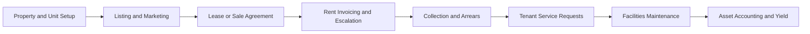

# Volume 07 - Real Estate

| Field | Value |
|---|---|
| Document ID | WORLD-VOL07-015 |
| Title | Real Estate |
| Version | 1.0 |
| Status | Approved |
| Classification | Internal |
| Founder | Mahesh Choudhary |

## Purpose

This chapter defines how WORLD is configured for the real estate industry. It maps the real estate business model, organization, and processes onto WORLD's Business Modules (Volume 06), the ERP Foundation (Volume 05), the AI Business Partner (Volume 03), and Business Intelligence (Volume 04). The result is an integrated real estate solution that runs property and lease management, sales, tenant service, facilities maintenance, and financial control as a single governed system, with the AI Business Partner optimizing occupancy, yield, and asset value continuously.

## Scope

The chapter covers commercial and residential property owners and operators, developers, and property managers handling leasing, sales, and asset operations. It spans property and unit master data, listing and sales, lease origination and renewal, rent invoicing and collection, tenant service, facilities and maintenance, and asset accounting. Module internals are documented in Volume 06; this chapter specifies the industry configuration and cross-module orchestration.

## Industry Overview

Real estate creates value by acquiring, developing, leasing, and operating physical property to generate rental income and capital appreciation. Competitiveness depends on occupancy, rental yield, tenant retention, and disciplined operating cost. Operators manage long-lived assets with complex lease terms, escalations, service charges, and regulatory obligations, while balancing tenant satisfaction against net operating income. Accurate lease administration and predictive maintenance of the asset base are decisive advantages.

## Business Model

The core model is acquire-lease-operate, complemented by develop-and-sell for developers. Value is created through recurring rental income and appreciation of the underlying asset. Revenue is dominated by rent, service charges, and sale proceeds; cost is dominated by financing, maintenance, utilities, and management overhead. Operators compete on location, asset quality, tenant experience, and cost efficiency. WORLD supports lease, sale, and mixed-use portfolios within a single property ledger.

## Organization

A real estate enterprise is organized into Acquisitions and Development, Leasing and Sales, Property Management, Facilities and Maintenance, Tenant Services, and Finance. Properties, buildings, units, and leases are modeled as asset and contract dimensions on the ERP Foundation (Volume 05). The property-unit-lease hierarchy connects occupancy, billing, and maintenance so that every transaction rolls up to the asset and the portfolio.

## Processes

The cycle runs from property and unit setup through listing and marketing, lease or sale agreement, rent invoicing with contractual escalation, collection and arrears management, tenant service, facilities maintenance, and asset accounting that measures yield. Maintenance and service activity feed back into asset value and operating cost.

**Enterprise example:** An operator manages a commercial tower with two hundred leased units. A new five-year lease is originated with an annual escalation clause and a service-charge schedule; the system generates the rent invoice run automatically each month and applies the escalation on the anniversary. A tenant raises a service request for an air-handling fault, which becomes a maintenance work order against the building asset. Arrears on three units are flagged for collection. The AI Business Partner predicts that two leases expiring in six months carry high vacancy risk and recommends early renewal offers to protect occupancy and net operating income.

## Required ERP Modules

| Business Need | WORLD Module (Volume 06) | Role in Real Estate |
|---|---|---|
| Property and asset register | Assets | Asset lifecycle and depreciation |
| Tenant and lead management | CRM | Prospects, tenants, and renewals |
| Rent billing and collection | Finance | Invoicing, escalation, arrears |
| Building upkeep | Maintenance | Service and preventive work orders |
| Development projects | Projects | Development cost and delivery |

Key references: [Assets](/docs/blueprint/volume-06-business-modules/section-d-finance/19-assets.md), [CRM](/docs/blueprint/volume-06-business-modules/section-b-sales-and-customer/06-crm.md), and [Maintenance](/docs/blueprint/volume-06-business-modules/section-c-manufacturing-and-operations/14-maintenance.md).

## Required AI Features

The AI Business Partner (Volume 03) forecasts occupancy and rental demand, recommends optimal pricing and renewal terms, and predicts tenant churn from payment and service behavior. It prioritizes collections on arrears most likely to age, schedules predictive maintenance to protect asset value, and forecasts net operating income and yield by property. It surfaces underperforming assets in the portfolio and recommends capital or disposal action, functioning as a continuous asset-management partner.

## KPIs

| KPI | Definition | Target |
|---|---|---|
| Occupancy Rate | Leased area over total area | > 95% |
| Net Operating Income | Rental income less operating cost | Maximize |
| Rent Collection Rate | Collected over billed rent | > 98% |
| Tenant Retention Rate | Renewed over expiring leases | Maximize |
| Arrears Aging | Value of overdue rent by age | Minimize |
| Maintenance Response Time | Request to resolution | Minimize |

## Compliance

Real estate operates under tenancy law, building safety and fire codes, and financial reporting standards for investment property. Relevant frameworks include IFRS 16 lease accounting and investment-property standards, ISO 41001 facilities management, and jurisdictional tenancy and building-safety regulation. WORLD supports these through controlled lease records, compliant lease accounting, inspection and certificate tracking, and immutable audit trails on the ERP Foundation.

## Dashboards

Dashboards present occupancy and vacancy by property, rent roll and collection status, arrears aging, service-request backlog, and net operating income. Executive views track portfolio yield, retention, and asset value, delivered via the Dashboards module and Business Intelligence (Volume 04).

## Reporting

Standard reports include rent roll, lease expiry and renewal schedules, arrears and collection registers, service-charge reconciliation, and asset and depreciation reports. These support portfolio review, audit, and financial close through the Reporting module.

## Future Roadmap

Planned enhancements include IoT building-management integration for energy and occupancy sensing, digital-twin asset models, automated valuation modeling, tenant self-service portals with conversational support, and predictive portfolio optimization driven by the AI Business Partner.

## Cross-References

- [Assets](/docs/blueprint/volume-06-business-modules/section-d-finance/19-assets.md)
- [CRM](/docs/blueprint/volume-06-business-modules/section-b-sales-and-customer/06-crm.md)
- [Finance](/docs/blueprint/volume-06-business-modules/section-d-finance/15-finance.md)
- [Volume 04 - Business Intelligence](/docs/blueprint/volume-04-business-intelligence/README.md)

## References

- [Volume 01 - Vision and Philosophy](/docs/blueprint/volume-01-vision-and-philosophy/README.md)
- [Document Standards](/docs/governance/document-standards.md)

## Change Log

| Version | Date | Author | Notes |
|---|---|---|---|
| 1.0 | 2026-07-12 | Lead Software Engineer | Initial approved version. |
