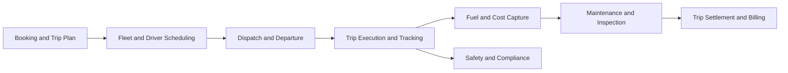

# Volume 07 - Transportation

| Field | Value |
|---|---|
| Document ID | WORLD-VOL07-017 |
| Title | Transportation |
| Version | 1.0 |
| Status | Approved |
| Classification | Internal |
| Founder | Mahesh Choudhary |

## Purpose

This chapter defines how WORLD is configured for the transportation industry. It maps the transportation business model, organization, and processes onto WORLD's Business Modules (Volume 06), the ERP Foundation (Volume 05), the AI Business Partner (Volume 03), and Business Intelligence (Volume 04). The result is an integrated transportation solution that runs trip planning, fleet dispatch, driver management, maintenance, and settlement as a single governed system, with the AI Business Partner optimizing utilization, fuel, and on-time performance continuously.

## Scope

The chapter covers freight carriers, fleet operators, passenger and transit operators, and vehicle-hire businesses running scheduled and on-demand transport. It spans booking and trip planning, fleet and driver scheduling, dispatch and trip execution, fuel and maintenance management, safety and compliance, and trip settlement and billing. Module internals are documented in Volume 06; this chapter specifies the industry configuration and cross-module orchestration.

## Industry Overview

Transportation moves goods or people between origins and destinations, competing on reliability, cost per trip, and safety. Operators run capital-intensive fleets under variable demand, regulated driver hours, fluctuating fuel prices, and strict safety obligations. Success depends on high asset utilization, optimized scheduling, disciplined maintenance, and accurate settlement. Real-time visibility of vehicles, drivers, and trips across the operation is the decisive advantage.

## Business Model

The core model is schedule-dispatch-move-settle, monetized through per-trip, per-kilometer, or contract rates. Value is created by maximizing revenue-earning vehicle time while controlling fuel, maintenance, and driver cost. Revenue depends on trip volume, lane or route mix, and utilization; cost is dominated by fuel, drivers, vehicle finance, and maintenance. Operators compete on reliability, coverage, and cost efficiency. WORLD supports contract, spot, and scheduled operations within a single trip ledger.

## Organization

A transportation enterprise is organized into Booking and Planning, Fleet Operations and Dispatch, Driver Management, Maintenance and Workshop, Safety and Compliance, and Finance. Vehicles, drivers, routes, and depots are modeled as resource and location dimensions on the ERP Foundation (Volume 05). The trip record connects booking, dispatch, fuel, maintenance, and billing so that every event rolls up to the vehicle, the driver, and the contract.

## Processes

The cycle runs from booking and trip planning through fleet and driver scheduling, dispatch and departure, trip execution with live tracking, fuel and cost capture, maintenance and inspection, and trip settlement and billing. Safety and compliance checks run throughout, and telematics events stream into the trip record.

**Enterprise example:** A freight carrier operates a fleet of two hundred trucks on regional lanes. A shipper booking is planned into a trip and assigned to an available vehicle and a compliant driver whose remaining hours are checked automatically. The truck is dispatched, telematics track progress and fuel burn, and a roadside inspection is logged against the vehicle. On completion the trip is settled at the contract rate, driver pay is accrued, and fuel and toll costs are captured against the trip. The AI Business Partner reassigns a following load to a nearer idle vehicle to cut empty running and flags one truck for early workshop booking based on engine telemetry.

## Required ERP Modules

| Business Need | WORLD Module (Volume 06) | Role in Transportation |
|---|---|---|
| Vehicle register and finance | Assets | Fleet lifecycle and depreciation |
| Trip dispatch and routing | Dispatch | Scheduling and trip execution |
| Freight and consignment linkage | Logistics | Load and consignment management |
| Vehicle upkeep | Maintenance | Preventive and workshop repair |
| Trip billing and settlement | Finance | Rating, invoicing, and driver pay |

Key references: [Dispatch](/docs/blueprint/volume-06-business-modules/section-a-supply-chain-and-procurement/05-dispatch.md), [Assets](/docs/blueprint/volume-06-business-modules/section-d-finance/19-assets.md), and [Maintenance](/docs/blueprint/volume-06-business-modules/section-c-manufacturing-and-operations/14-maintenance.md).

## Required AI Features

The AI Business Partner (Volume 03) forecasts trip demand, optimizes vehicle and driver scheduling within hours-of-service limits, and minimizes empty running through intelligent load assignment. It predicts fuel consumption, detects unsafe driving patterns from telematics, and recommends predictive maintenance before breakdown. It optimizes routing against traffic and cost, forecasts trip profitability, and flags compliance risk before it occurs, functioning as a continuous fleet-optimization partner.

## KPIs

| KPI | Definition | Target |
|---|---|---|
| Fleet Utilization | Revenue hours over available hours | Maximize |
| On-Time Performance | Trips completed within schedule | > 96% |
| Empty Running Ratio | Unladen distance over total distance | Minimize |
| Fuel Efficiency | Distance per unit of fuel | Maximize |
| Cost per Kilometer | Total cost over distance run | Minimize |
| Safety Incident Rate | Incidents per distance run | Minimize |

## Compliance

Transportation operates under vehicle safety, driver-hours, and emissions regulation. Relevant frameworks include ISO 39001 road-traffic safety management, ISO 9001 quality management, driver hours-of-service and tachograph rules, and vehicle roadworthiness and emissions standards. WORLD supports these through controlled driver-hours and inspection records, licence and certificate tracking, maintenance compliance, and immutable audit trails on the ERP Foundation.

## Dashboards

Dashboards present live fleet position and trip status, vehicle and driver utilization, fuel consumption, on-time performance, and maintenance due. Executive views track cost per kilometer, fleet profitability, and safety exposure, delivered via the Dashboards module and Business Intelligence (Volume 04).

## Reporting

Standard reports include trip and settlement registers, fleet and driver utilization, fuel and cost analysis, maintenance and inspection registers, and safety and compliance reports. These support operational review, audit, and financial close through the Reporting module.

## Future Roadmap

Planned enhancements include deep telematics fusion for real-time condition monitoring, autonomous scheduling and dynamic dispatch, electric-fleet charging optimization, predictive driver-safety coaching, and generative exception handling driven by the AI Business Partner.

## Cross-References

- [Dispatch](/docs/blueprint/volume-06-business-modules/section-a-supply-chain-and-procurement/05-dispatch.md)
- [Assets](/docs/blueprint/volume-06-business-modules/section-d-finance/19-assets.md)
- [Maintenance](/docs/blueprint/volume-06-business-modules/section-c-manufacturing-and-operations/14-maintenance.md)
- [Volume 03 - AI Business Partner](/docs/blueprint/volume-03-ai-business-partner/README.md)

## References

- [Volume 01 - Vision and Philosophy](/docs/blueprint/volume-01-vision-and-philosophy/README.md)
- [Document Standards](/docs/governance/document-standards.md)

## Change Log

| Version | Date | Author | Notes |
|---|---|---|---|
| 1.0 | 2026-07-12 | Lead Software Engineer | Initial approved version. |
