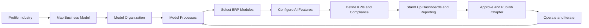

# Volume 07 - Future Industry Framework

| Field | Value |
|---|---|
| Document ID | WORLD-VOL07-018 |
| Title | Future Industry Framework |
| Version | 1.0 |
| Status | Approved |
| Classification | Internal |
| Founder | Mahesh Choudhary |

## Purpose

This chapter defines the extensibility framework for onboarding any industry that is not explicitly documented elsewhere in Volume 07. Rather than a single vertical, it specifies a repeatable, governed method for profiling a new industry and configuring WORLD to serve it. Each preceding chapter in this volume is an instance of this framework; this chapter is the template that produced them. It maps the industry-configuration method onto WORLD's Business Modules (Volume 06), the ERP Foundation (Volume 05), the AI Business Partner (Volume 03), and Business Intelligence (Volume 04), so that any new vertical can be delivered as an integrated, first-class solution.

## Scope

The chapter covers the end-to-end method for adding a new industry: profiling the vertical, mapping its business model and organization, modeling its processes, selecting and configuring the required ERP module set, specifying AI features, defining KPIs and compliance controls, and standing up dashboards and reporting. It applies to any sector — regulated or unregulated, product or service, asset-heavy or asset-light. The internals of individual modules remain documented in Volume 06; this chapter specifies the onboarding method and its deliverables.

## Industry Overview

Profiling an industry is the first step. The objective is a concise characterization of how the vertical creates and captures value, and where its operational risk concentrates. The analyst answers a fixed set of questions: What is transformed, and by whom? What are the dominant cost and revenue drivers? What regulatory regime applies? What is the critical operational constraint — throughput, utilization, compliance, or perishability? The output is a one-paragraph industry profile plus a completed onboarding checklist that governs the remaining sections.

| Onboarding Step | Deliverable | Owner | Exit Criterion |
|---|---|---|---|
| 1. Profile industry | Industry profile paragraph | Industry Analyst | Value chain and constraints described |
| 2. Map business model | Value-creation statement | Solution Architect | Revenue and cost drivers named |
| 3. Model organization | Org and master-data map | Solution Architect | Roles and dimensions defined |
| 4. Model processes | Process flow diagram | Process Lead | End-to-end cycle validated |
| 5. Select modules | Module selection table | Solution Architect | Vol 06 modules mapped to needs |
| 6. Specify AI features | AI capability list | AI Lead | Partner behaviors defined |
| 7. Define KPIs | KPI table with targets | Business Owner | Metrics measurable in WORLD |
| 8. Map compliance | Control matrix | Compliance Officer | Standards and controls mapped |
| 9. Stand up BI | Dashboards and reports | BI Lead | Live views and reports published |
| 10. Approve and publish | Volume 07 chapter | Lead Software Engineer | Document approved |

## Business Model

The method captures the vertical's business model as a single value-creation statement: what inputs are converted into what outputs, for whom, and how revenue and cost behave. The analyst classifies the model along standard axes — product versus service, make-to-stock versus make-to-order, recurring versus transactional, and asset-heavy versus asset-light. This classification determines default WORLD postures for planning, costing, and revenue recognition, and it directly informs which modules are mandatory versus optional in later steps.

## Organization

The method maps the vertical's operating structure onto WORLD's location, resource, and role dimensions on the ERP Foundation (Volume 05). Functions such as planning, sourcing, operations, quality, sales, and finance are expressed as organizational units; physical and logical entities — plants, branches, fleets, sites, or service teams — become location and resource dimensions. Vertical-specific master data (for example bills of material, service catalogs, or asset registers) is identified as the backbone that connects planning to execution.

## Processes

The method models the vertical's core operating cycle as an end-to-end flow before any module is configured, ensuring plan-to-execution feedback is designed in from the start.

The onboarding cycle runs from industry profiling through model, organization, and process mapping, into module selection, AI configuration, and KPI and compliance definition, and closes with business intelligence and formal publication. Operation feeds back into process modeling so the configuration improves continuously.

**Worked example:** Consider onboarding *renewable energy asset operations* (solar and wind farms), a vertical not otherwise covered. Profiling identifies the value chain as generation, dispatch, and maintenance of distributed assets, with revenue driven by energy yield and availability, and cost dominated by maintenance and grid compliance. The critical constraint is asset uptime under weather variability. The business model is asset-heavy and recurring-revenue. The organization maps generation sites as locations and turbines and inverters as resources, with an asset register as master data. The process cycle is forecast-generation, dispatch, monitor, and maintain.

## Required ERP Modules

The method selects the minimum viable module set from Volume 06 that satisfies the vertical's mapped needs, then configures each with industry defaults. Modules are chosen against business needs rather than adopted wholesale, keeping the solution lean.

| Business Need | WORLD Module (Volume 06) | Role for a New Vertical |
|---|---|---|
| Demand and output planning | Production Planning | Forecast and schedule the core operating cycle |
| Input sourcing | Procurement | Requisitions, purchase orders, supplier management |
| Core execution | Manufacturing or Services | Execute and confirm the value-creating activity |
| Asset availability | Maintenance | Preventive and predictive upkeep of critical assets |
| Financial control | Finance | Costing, settlement, and revenue recognition |
| Insight and control | Dashboards and Reporting | Live monitoring and governed reporting |

For the renewable-energy example, the mandatory set is Maintenance (turbine and inverter upkeep), Production Planning (generation forecasting and dispatch), and Finance (yield-based revenue recognition), with Procurement for spares. Key references: [Maintenance](/docs/blueprint/volume-06-business-modules/section-c-manufacturing-and-operations/14-maintenance.md) and [Production Planning](/docs/blueprint/volume-06-business-modules/section-c-manufacturing-and-operations/11-production-planning.md).

## Required AI Features

The method specifies how the AI Business Partner (Volume 03) is adapted to the vertical. In every industry the Partner forecasts demand or output, optimizes the core schedule against the critical constraint, predicts failures before they interrupt operation, and analyzes cost and margin variance. The analyst records the vertical-specific behaviors: for renewable energy, the Partner forecasts generation from weather data, schedules maintenance windows around low-yield periods, and predicts inverter degradation for the Maintenance module — all within governed policy.

## KPIs

The method defines a compact KPI set that is measurable directly in WORLD and tied to the vertical's critical constraint.

| KPI | Definition | Target |
|---|---|---|
| Output or Service Attainment | Actual versus planned output | > 95% |
| Asset Availability | Uptime of critical assets | > 97% |
| First Pass Quality | Output meeting standard without rework | > 98% |
| Cycle or Response Time | Core operating cycle duration | Minimize |
| Unit Cost Variance | Actual versus standard cost | Within tolerance |

## Compliance

The method maps the vertical's regulatory regime to WORLD controls. Cross-industry baselines include ISO 9001 quality management, ISO 45001 occupational health and safety, and applicable data-protection law. The analyst adds sector-specific standards — for renewable energy, grid-interconnection codes and environmental permitting. Each obligation is realized as a WORLD control: mandatory dispositions, calibration and maintenance records, and immutable audit trails on the ERP Foundation.

## Dashboards

The method stands up dashboards that surface the vertical's critical constraint and KPIs in real time. Standard views include operational status, asset availability, output attainment, quality, and cost variance, with executive views for utilization and margin. For renewable energy this includes live generation versus forecast, turbine availability, and yield by site, delivered via the Dashboards module and Business Intelligence (Volume 04).

## Reporting

The method defines governed reports supporting operational review, audit, and financial close: execution and settlement reports, utilization and load reports, compliance and non-conformance registers, and cost roll-ups. These are published through the Reporting module and are consistent across every onboarded vertical, ensuring comparability.

## Future Roadmap

Planned enhancements to the framework include a guided onboarding wizard that generates a draft chapter from a completed profile, a reusable industry-template library, AI-assisted module selection from the business-model classification, and automated conformance checks that validate a new chapter against the document standard before publication.

## Cross-References

- [Finance](/docs/blueprint/volume-06-business-modules/section-b-finance-and-accounting/05-finance.md)
- [Maintenance](/docs/blueprint/volume-06-business-modules/section-c-manufacturing-and-operations/14-maintenance.md)
- [Manufacturing (Chapter 02)](/docs/blueprint/volume-07-industry-solutions/section-a-production-and-process-industries/02-manufacturing.md)
- [Volume 03 - AI Business Partner](/docs/blueprint/volume-03-ai-business-partner/README.md)

## References

- [Volume 01 - Vision and Philosophy](/docs/blueprint/volume-01-vision-and-philosophy/README.md)
- [Document Standards](/docs/governance/document-standards.md)

## Change Log

| Version | Date | Author | Notes |
|---|---|---|---|
| 1.0 | 2026-07-12 | Lead Software Engineer | Initial approved version. |
