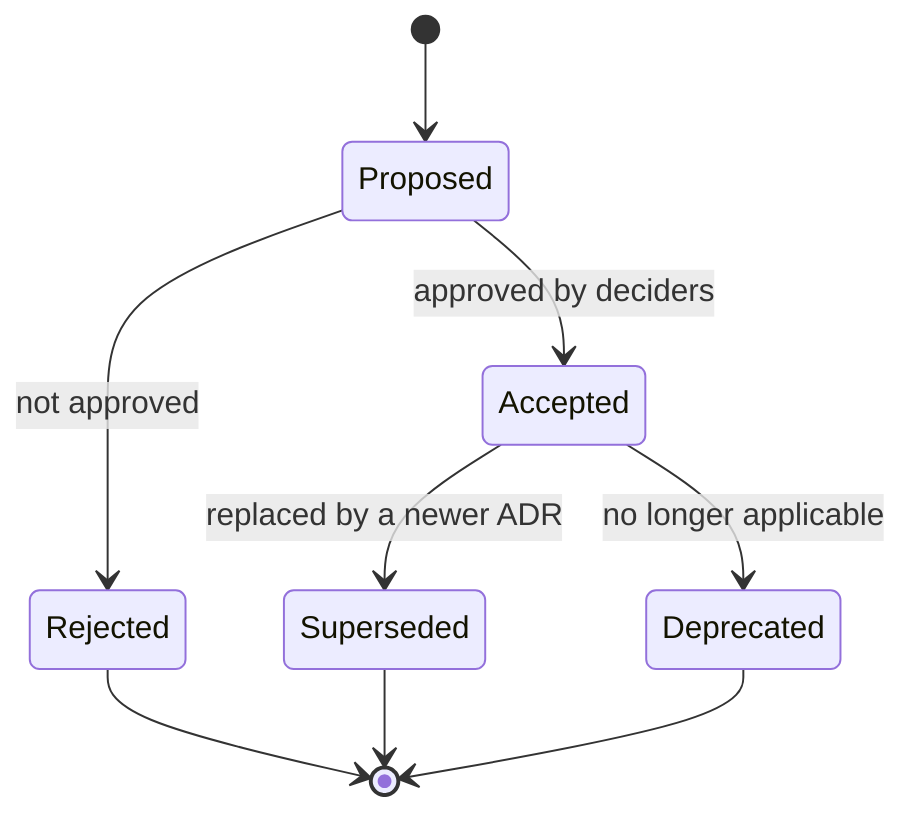

# Volume 08 - Architecture Decision Record Template

| Field | Value |
|---|---|
| Document ID | WORLD-VOL08-A3 |
| Title | Architecture Decision Record Template |
| Version | 1.0 |
| Status | Approved |
| Classification | Internal |
| Founder | Mahesh Choudhary |

## Purpose

This appendix defines the standard Architecture Decision Record (ADR) template for Project WORLD and provides a fully worked sample. An ADR captures one significant architectural decision, the context that forced it, the decision itself, and the consequences that follow. The purpose is institutional memory: a new engineer, an auditor, or the AI Business Partner can read the ADR log and understand not only *what* the architecture is, but *why* it is that way and *what was rejected*. ADRs are the mechanism by which the principles of Section A are lawfully balanced or superseded, as described in Chapter 28.

## Scope

The document specifies the required fields of a WORLD ADR, the allowed values for status, the authoring and review workflow, and a filled example. It applies to every decision that materially affects structure, cross-cutting concerns, technology selection criteria, or the evolution of WORLD. It does not replace design documents or chapter content; an ADR is a record of a decision, not a specification of the whole design.

## ADR Template

Every WORLD ADR uses the following structure. Copy this block into a new file named `NNNN-short-title.md` in the decision log, where `NNNN` is the next zero-padded sequence number.

| Field | Value |
|---|---|
| ADR ID | WORLD-ADR-NNNN |
| Title | A short, decision-oriented title (a verb phrase). |
| Status | Proposed / Accepted / Superseded / Deprecated / Rejected |
| Date | YYYY-MM-DD |
| Deciders | Named roles accountable for the decision. |
| Supersedes / Superseded By | Cross-reference to related ADRs, if any. |

**Context.** State the forces at play: the requirement, constraint, or problem; the relevant principles; and why a decision is needed now. Describe the situation factually and neutrally, without presuming the outcome.

**Decision.** State the decision in the active voice: "We will ...". Be specific and unambiguous. One ADR records one decision.

**Consequences.** Describe the results, both positive and negative, that follow from the decision. Include new obligations, risks accepted, and follow-up work created. Good ADRs are honest about the downside.

**Alternatives Considered.** List the options that were evaluated and rejected, each with a one-line reason for rejection. This is what makes the record trustworthy.

### Status Lifecycle

## Sample ADR

| Field | Value |
|---|---|
| ADR ID | WORLD-ADR-0007 |
| Title | Adopt a Modular Monolith as the default deployment style |
| Status | Accepted |
| Date | 2026-05-18 |
| Deciders | Lead Software Engineer; Platform Architecture Council |
| Supersedes / Superseded By | Supersedes WORLD-ADR-0003 (interim "services-first" stance). |

**Context.** WORLD comprises thirty-two business modules and four platform engines that must evolve independently yet remain transactionally coherent for core ERP operations. The team must choose a default deployment style. The *loose coupling* and *designed for evolution* principles (Section A) favor strong module boundaries, while the same principles caution against premature distribution. Early adoption of fine-grained microservices would impose network boundaries, distributed transactions, and operational overhead on a product that has not yet reached the scale or team topology that justifies them.

**Decision.** We will adopt a Modular Monolith as the default deployment style for WORLD. Modules will be separated by enforced internal boundaries (explicit public contracts, no cross-module database access) so that any module can later be extracted into an independent service without redesign. Distribution will be an opt-in decision, recorded per module in a dedicated ADR, taken only when a concrete scaling, isolation, or team-autonomy driver is demonstrated.

**Consequences.** Positive: a single deployable simplifies transactions, local testing, and operations while the product matures; strong internal boundaries preserve the option to distribute later. Negative: the whole application scales and deploys as one unit, so a heavy module cannot yet scale in isolation, and boundary discipline must be enforced by architecture tests rather than by the network. Follow-up: introduce automated boundary-conformance checks in the build, and define the extraction criteria that will trigger a per-module distribution ADR.

**Alternatives Considered.**

| Alternative | Reason for Rejection |
|---|---|
| Fine-grained microservices from day one | Imposes distributed-systems cost and operational overhead before scale or team topology justifies it. |
| Unstructured monolith (no enforced boundaries) | Would decay into a big ball of mud and foreclose future extraction. |
| Serverless functions per capability | Fragmented execution model conflicts with long-running ERP transactions and complicates the platform engines. |

## Cross-References

- [Architecture Decision Records (Chapter 28)](/docs/blueprint/volume-08-architecture/section-g-governance-and-evolution/28-architecture-decision-records.md)
- [Modular Monolith](/docs/blueprint/volume-08-architecture/section-b-architectural-styles-and-patterns/09-modular-monolith.md)
- [Architecture Principles](/docs/blueprint/volume-08-architecture/section-a-architecture-foundations/01-architecture-principles.md)

## References

- [Volume 01 - Vision and Philosophy](/docs/blueprint/volume-01-vision-and-philosophy/README.md)
- [Document Standards](/docs/governance/document-standards.md)

## Change Log

| Version | Date | Author | Notes |
|---|---|---|---|
| 1.0 | 2026-07-12 | Lead Software Engineer | Initial approved version. |
