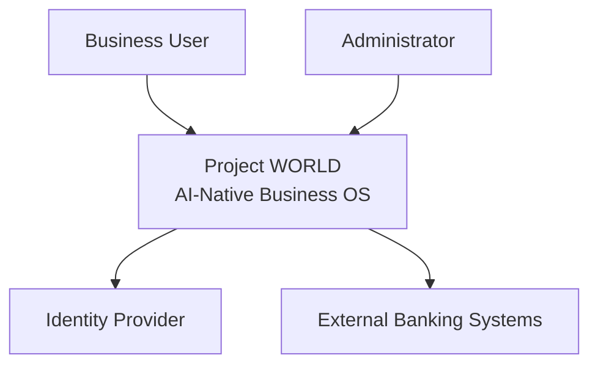
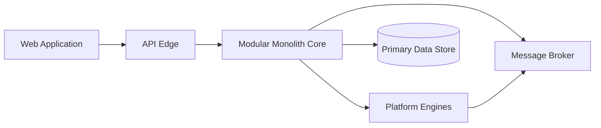
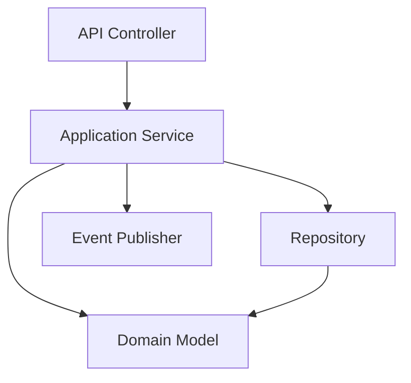
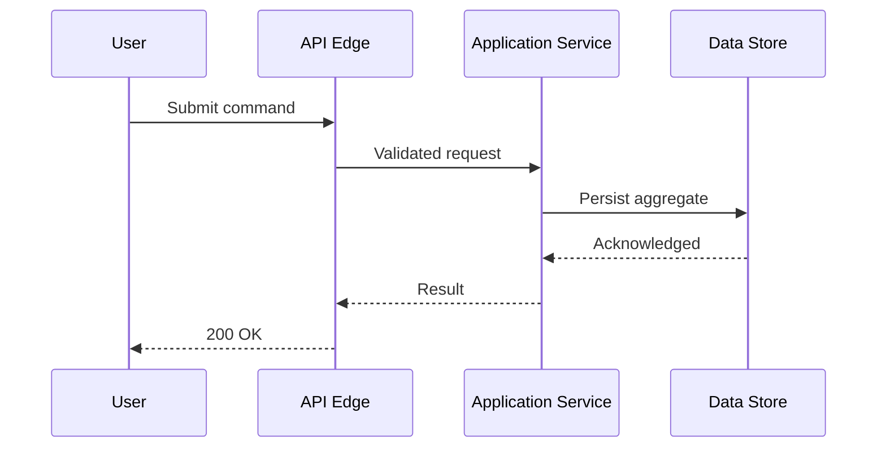
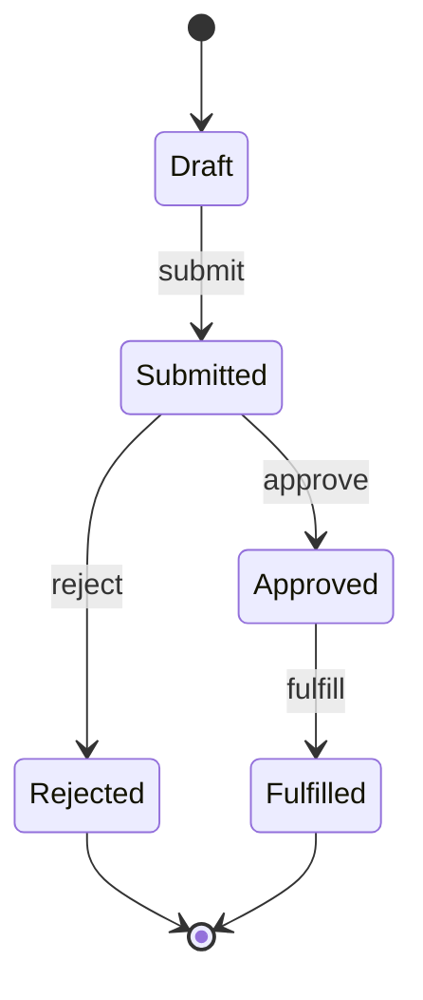
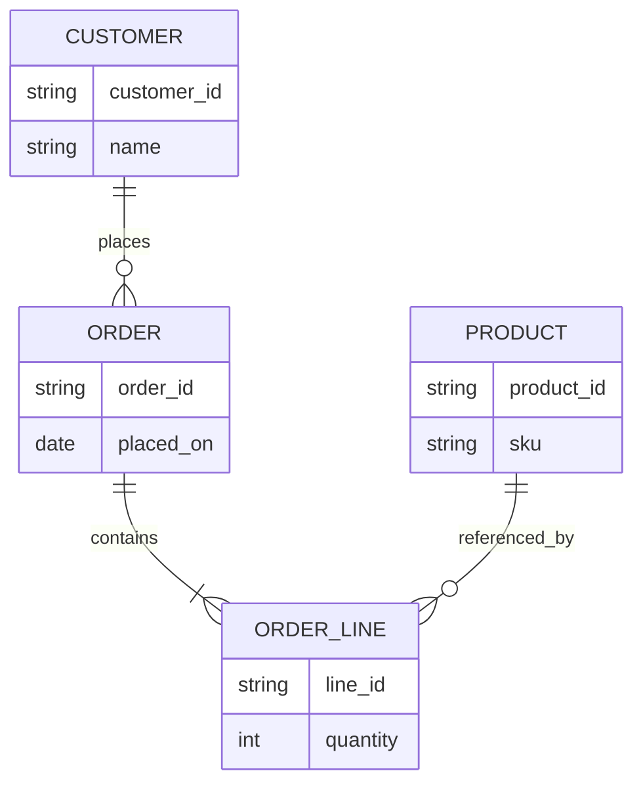
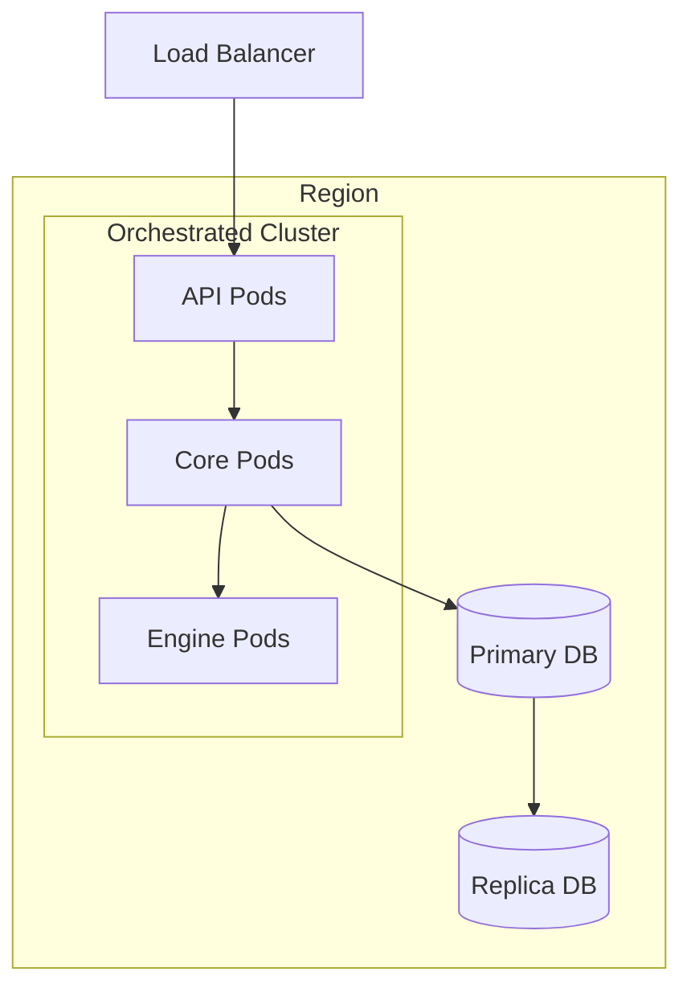

# Volume 08 - Diagram Catalog

| Field | Value |
|---|---|
| Document ID | WORLD-VOL08-A4 |
| Title | Diagram Catalog |
| Version | 1.0 |
| Status | Approved |
| Classification | Internal |
| Founder | Mahesh Choudhary |

## Purpose

This appendix catalogs the standard diagram types used to describe Project WORLD's architecture and gives a canonical, syntactically valid Mermaid example of each. Its purpose is to standardize how architecture is drawn, so that a diagram in one chapter can be read the same way as a diagram in another. Consistent diagram types make the architecture reviewable, teachable, and machine-readable, and they let the AI Business Partner and human engineers reason about the same visual language.

## Scope

The catalog covers the diagram types WORLD uses: the C4 hierarchy (System Context, Container, Component), plus Sequence, State, Entity-Relationship, and Deployment diagrams. For each it states intent, when to use it, and a Mermaid example. It does not mandate a drawing tool; Mermaid is the default because it is text-based and version-controllable, but any tool that produces the same diagram type is acceptable. It does not cover business process notation beyond what the Workflow Engine chapter defines.

## Diagram Types

| Diagram | Level | Primary Question It Answers | When to Use |
|---|---|---|---|
| C4 System Context | 1 | Who uses the system and what does it depend on? | Framing scope for any audience, including non-technical stakeholders. |
| C4 Container | 2 | What are the deployable/runtime pieces and how do they talk? | Explaining the high-level shape of a system or engine. |
| C4 Component | 3 | What are the major parts inside one container? | Designing the internals of a service or module. |
| Sequence | - | In what order do participants interact over time? | Specifying a request flow, protocol, or interaction. |
| State | - | What states can an entity be in and how does it transition? | Modeling lifecycles (orders, ADRs, workflows). |
| Entity-Relationship | - | What are the data entities and their relationships? | Designing a data model or bounded-context schema. |
| Deployment | - | Where does software run and on what infrastructure? | Describing runtime topology, scaling, and DR. |

### C4 - System Context

Use to frame the whole system and its external actors and dependencies. Highest-level view; hides all internal structure.

### C4 - Container

Use to show the deployable and runtime pieces of a system and the main communication between them.

### C4 - Component

Use to show the major internal components of a single container, such as one module or engine.

### Sequence

Use to specify the time-ordered interaction between participants in a flow.

### State

Use to model the lifecycle of an entity as states and transitions.

### Entity-Relationship

Use to model data entities and their relationships within a bounded context.

### Deployment

Use to show where software runs and how the runtime topology is arranged.

## Cross-References

- [System Context](/docs/blueprint/volume-08-architecture/section-a-architecture-foundations/02-system-context.md)
- [Deployment Architecture](/docs/blueprint/volume-08-architecture/section-f-operations-and-scale/26-deployment-architecture.md)
- [Patterns Catalog](/docs/blueprint/volume-08-architecture/appendices/patterns-catalog.md)

## References

- [Volume 01 - Vision and Philosophy](/docs/blueprint/volume-01-vision-and-philosophy/README.md)
- [Document Standards](/docs/governance/document-standards.md)

## Change Log

| Version | Date | Author | Notes |
|---|---|---|---|
| 1.0 | 2026-07-12 | Lead Software Engineer | Initial approved version. |
