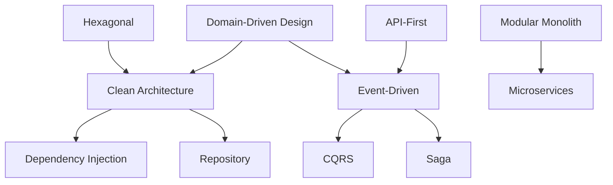

# Volume 08 - Patterns Catalog

| Field | Value |
|---|---|
| Document ID | WORLD-VOL08-A6 |
| Title | Patterns Catalog |
| Version | 1.0 |
| Status | Approved |
| Classification | Internal |
| Founder | Mahesh Choudhary |

## Purpose

This appendix catalogs the architectural styles and patterns used across Volume 08 in a single reference. For each entry it states the intent, when to use it, and the chapter that defines it in full. Its purpose is navigation and consistency: an engineer choosing an approach can scan this catalog, confirm the intent matches the problem, and follow the link to the defining chapter. The catalog also makes the deliberate relationships between patterns visible, so that they are combined coherently rather than accumulated at random.

## Scope

The catalog covers the styles of Section B (Clean, Hexagonal, DDD, Microservices, Modular Monolith), the application patterns of Section C (API-First, Event-Driven, CQRS, Repository, Dependency Injection), and the platform and cross-cutting patterns that recur in Sections D through F. It summarizes each; it does not restate the full chapter. Where a pattern has many variants in the literature, the entry describes the WORLD-canonical usage. Business patterns (Volume 05 and 06) are out of scope.

## Architectural Styles

| Pattern | Intent | When to Use | Defined In |
|---|---|---|---|
| Clean Architecture | Keep business rules independent of frameworks by pointing all dependencies inward. | As the default internal layering for any module or service. | Chapter 05 |
| Hexagonal (Ports and Adapters) | Isolate the application core behind ports, with swappable adapters per technology. | When a component must integrate with volatile external technologies. | Chapter 06 |
| Domain-Driven Design | Structure software around bounded contexts and a ubiquitous language. | When modeling complex business domains with rich rules. | Chapter 07 |
| Microservices | Compose the system from small, independently deployable, data-owning services. | When a capability has a proven driver for independent scaling or team autonomy. | Chapter 08 |
| Modular Monolith | Deliver one deployable with strongly bounded internal modules. | As the default deployment style before distribution is justified. | Chapter 09 |

## Application Patterns

| Pattern | Intent | When to Use | Defined In |
|---|---|---|---|
| API-First | Design and agree the contract before implementing the capability. | For every externally or cross-module consumed capability. | Chapter 10 |
| Event-Driven Architecture | Communicate through published domain events for loose coupling and auditability. | When components must react to state changes without tight coupling. | Chapter 11 |
| CQRS | Separate the write model from the read model. | When read and write workloads or shapes diverge significantly. | Chapter 12 |
| Repository | Mediate between the domain and persistence with a collection-like interface. | Whenever aggregates are persisted, to keep the domain storage-agnostic. | Chapter 13 |
| Dependency Injection | Supply a component's dependencies from outside rather than constructing them. | Universally, to enable testability and loose coupling. | Chapter 14 |

## Platform and Cross-Cutting Patterns

| Pattern | Intent | When to Use | Defined In |
|---|---|---|---|
| Workflow Orchestration | Coordinate long-running, multi-step processes through an explicit engine. | When a process spans steps, actors, and time. | Chapter 15 |
| Rules Engine | Externalize decisions as declarative rules evaluated against facts. | When business decisions change independently of code. | Chapter 16 |
| Knowledge Graph | Represent entities and relationships as a semantic graph for reasoning. | When the AI Partner needs connected, queryable context. | Chapter 17 |
| AI Layer Integration | Expose observable state, events, and governed actions to the AI. | For every module, to make the platform AI-native. | Chapter 18 |
| Token-Based Authentication | Establish identity with short-lived, verifiable tokens. | At every request edge, for all principals. | Chapter 19 |
| Role-Based Authorization | Decide access from roles and policies against the Security Context. | For every access decision after authentication. | Chapter 20 |
| Structured Logging | Emit correlated, structured, auditable log records. | For every auditable action across the platform. | Chapter 21 |
| Observability (Metrics and Tracing) | Infer internal state from correlated telemetry signals. | For all production services. | Chapter 22 |
| Caching | Keep computed or fetched data close to consumers to cut latency and load. | When read cost or latency is significant and staleness is tolerable. | Chapter 23 |
| Horizontal Scaling and Load Balancing | Handle load by adding instances behind a balancer. | When demand grows beyond a single instance. | Chapter 24 |
| Circuit Breaker and Resilience | Fail fast and degrade gracefully when a dependency is unhealthy. | When calling any dependency that can fail or slow. | Chapter 24 |
| Saga | Maintain cross-service consistency via local transactions and compensations. | When a transaction spans service or context boundaries. | Chapter 11 |

## Pattern Relationships

## Cross-References

- [Architecture Principles](/docs/blueprint/volume-08-architecture/section-a-architecture-foundations/01-architecture-principles.md)
- [Architecture Glossary](/docs/blueprint/volume-08-architecture/appendices/architecture-glossary.md)
- [Diagram Catalog](/docs/blueprint/volume-08-architecture/appendices/diagram-catalog.md)

## References

- [Volume 01 - Vision and Philosophy](/docs/blueprint/volume-01-vision-and-philosophy/README.md)
- [Document Standards](/docs/governance/document-standards.md)

## Change Log

| Version | Date | Author | Notes |
|---|---|---|---|
| 1.0 | 2026-07-12 | Lead Software Engineer | Initial approved version. |
