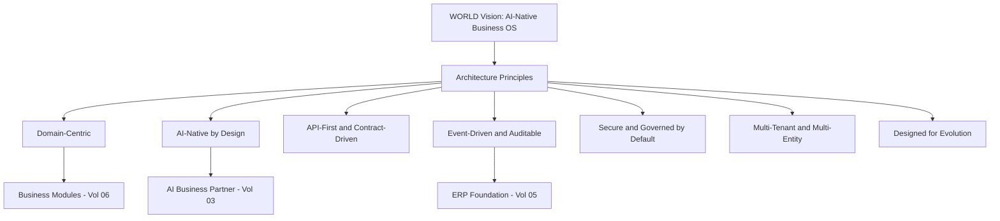

# Volume 08 - Architecture Principles

| Field | Value |
|---|---|
| Document ID | WORLD-VOL08-001 |
| Title | Architecture Principles |
| Version | 1.0 |
| Status | Approved |
| Classification | Internal |
| Founder | Mahesh Choudhary |

## Purpose

This chapter establishes the foundational principles that govern every architectural decision in Project WORLD. Principles are the constitution of the architecture: durable, technology-independent rules that outlast any specific framework, cloud, or release. They translate the WORLD vision, an AI-native business operating system delivered as an AI Business Partner, into engineering constraints that every subsequent chapter, volume, and code review must honor. Where a later design choice conflicts with a principle here, the principle prevails unless a formal Architecture Decision Record (Chapter 28) supersedes it.

## Scope

The chapter defines the WORLD architecture principles, their rationale, and how they are applied and traded off. It covers principles spanning domain, application, data, AI, and operational concerns. It does not prescribe concrete technologies, schemas, or infrastructure, which are governed by Volumes 09 through 12. It applies to all engines, modules, and services that constitute WORLD.

## Concept

An architecture principle is a foundational statement of intent, paired with a rationale and implications, that constrains design without dictating implementation. Good principles are few, memorable, non-contradictory, and testable: an engineer must be able to look at a design and judge whether it complies. Principles differ from patterns and standards. A principle states *why* and *what must always hold*; a pattern (Volume 08, Section B) offers a reusable *how*; a standard (Appendix E) fixes a concrete choice. Principles exist because large systems decay when every team optimizes locally. By fixing a small set of shared commitments, WORLD keeps thirty-two business modules and four platform engines coherent as they evolve independently.

## Application in WORLD

WORLD adopts ten principles, each directly serving the AI Business Partner and the ERP Foundation.

Each principle is operationalized. *Domain-centric* means code is organized around business domains, not technical layers, so the ERP model of Volume 05 is the primary structure. *AI-native by design* means every module exposes machine-readable state, events, and actions so the AI Business Partner can observe, reason, and act, never as a bolt-on. *API-first* means capabilities are defined as contracts before implementation. *Event-driven and auditable* means state changes emit immutable events, giving both the audit trail and the AI its factual substrate. *Secure and governed by default* means authorization, tenancy isolation, and human-in-the-loop approval are structural, not optional.

## Key Components

| # | Principle | Statement | Primary Beneficiary |
|---|---|---|---|
| 1 | Domain-Centric | Structure the system around business domains and bounded contexts | ERP Foundation (Vol 05) |
| 2 | AI-Native by Design | Expose observable state, events, and governed actions to the AI | AI Business Partner (Vol 03) |
| 3 | API-First | Define contracts before implementation; no hidden integration | Ecosystem and modules |
| 4 | Event-Driven | Emit immutable domain events for every material state change | Audit, BI (Vol 04), AI |
| 5 | Secure by Default | Deny by default; isolate tenants; log every access | Governance and trust |
| 6 | Multi-Entity | Support multi-company, plant, currency, and language natively | Enterprise scale (Vol 05) |
| 7 | Loose Coupling | Depend on abstractions and contracts, not implementations | Independent evolution |
| 8 | Data as an Asset | Treat data as durable, governed, and single-sourced | Intelligence and reuse |
| 9 | Automation-Ready | Make every process orchestratable by workflow and rules engines | Operational efficiency |
| 10 | Designed for Evolution | Prefer reversible, incremental change over irreversible bets | Longevity |

**Enterprise example:** A manufacturer adds a new plant in a new country. Because WORLD is *multi-entity* and *domain-centric*, the plant is configured as an organizational dimension without forking code; because it is *event-driven and AI-native*, the AI Business Partner immediately observes the new plant's production and inventory events and begins recommending replenishment, all under *secure-by-default* tenancy isolation, with no schema migration in the core.

## Trade-offs & Considerations

Principles are not free. AI-native observability increases event volume and storage cost, addressed by the caching and data strategies of later chapters. Strict loose coupling adds indirection that can slow simple changes, so WORLD favors a modular monolith (Chapter 09) before microservices (Chapter 08). Deny-by-default security raises onboarding friction, mitigated by role templates in Volume 05. The governing rule is that principles may be balanced against one another through a recorded Architecture Decision Record, but never silently violated.

## Relationship to Other Layers

These principles are the contract between the architecture and the rest of WORLD. The AI Business Partner (Volume 03) depends on the AI-native and event-driven principles to reason and act. The ERP Foundation (Volume 05) is realized through the domain-centric and multi-entity principles. The Business Modules (Volume 06) inherit all ten as design constraints. Downstream technology volumes (Database, API, Infrastructure, Security) must demonstrate conformance to this chapter.

## Cross-References

- [System Context](/docs/blueprint/volume-08-architecture/section-a-architecture-foundations/02-system-context.md)
- [Enterprise Architecture](/docs/blueprint/volume-08-architecture/section-a-architecture-foundations/03-enterprise-architecture.md)
- [Volume 03 - AI Business Partner](/docs/blueprint/volume-03-ai-business-partner/README.md)
- [Volume 05 - ERP Foundation](/docs/blueprint/volume-05-erp-foundation/README.md)

## References

- [Volume 01 - Vision and Philosophy](/docs/blueprint/volume-01-vision-and-philosophy/README.md)
- [Document Standards](/docs/governance/document-standards.md)

## Change Log

| Version | Date | Author | Notes |
|---|---|---|---|
| 1.0 | 2026-07-12 | Lead Software Engineer | Initial approved version. |
