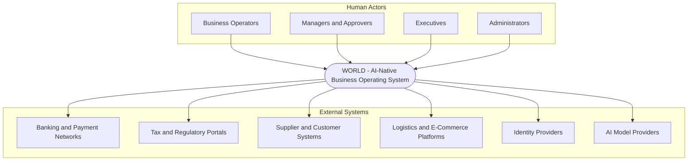

# Volume 08 - System Context

| Field | Value |
|---|---|
| Document ID | WORLD-VOL08-002 |
| Title | System Context |
| Version | 1.0 |
| Status | Approved |
| Classification | Internal |
| Founder | Mahesh Choudhary |

## Purpose

This chapter defines the system context of WORLD: the boundary that separates what the platform is responsible for from the people and external systems it interacts with. Before decomposing internal structure, an architecture must first agree on its edges. The context view fixes the actors, the external dependencies, and the flows of information and value across the boundary, giving every later chapter a shared understanding of what sits inside WORLD and what it must integrate with.

## Scope

The chapter covers the primary human actors, external systems, and the WORLD platform boundary, expressed as a C4-style system context diagram. It defines the nature of each interaction at a conceptual level. It does not specify API contracts, message formats, or integration middleware, which belong to Volume 11 (API) and the integration chapters; nor does it decompose WORLD internally, which is the role of the enterprise and domain architecture chapters that follow.

## Concept

A system context is the outermost view in the C4 model. It treats the system as a single opaque box and asks two questions: who uses it, and what does it depend on. The value of this view is discipline. By naming every actor and external system explicitly, the architecture prevents hidden dependencies and clarifies ownership. In WORLD the context is distinctive because the AI Business Partner is not an external actor bolted onto a passive system; it is the primary interface through which humans experience the platform. Users increasingly delegate intent to the AI Business Partner, which in turn operates the ERP Foundation on their behalf under governance.

## Application in WORLD

The following C4-style context diagram positions WORLD, its human actors, and its external systems.

Human actors interact primarily by expressing intent, which the AI Business Partner interprets and executes against the ERP Foundation. External systems are integrated through governed, contract-based interfaces: banking networks for settlement, regulatory portals for statutory filing, supplier and customer systems for commerce, logistics and e-commerce platforms for fulfilment, identity providers for authentication, and AI model providers for the reasoning capacity of the AI Business Partner.

## Key Components

| Element | Type | Interaction with WORLD |
|---|---|---|
| Business Operators | Human actor | Execute daily operations via UI and AI Business Partner |
| Managers and Approvers | Human actor | Review, approve, and govern actions and exceptions |
| Executives | Human actor | Consume intelligence and steer via decision support |
| Administrators | Human actor | Configure tenancy, roles, and platform policy |
| Banking and Payment Networks | External system | Payments, reconciliation, settlement |
| Tax and Regulatory Portals | External system | Statutory filing and compliance exchange |
| Supplier and Customer Systems | External system | Orders, invoices, and B2B document flow |
| Logistics and E-Commerce Platforms | External system | Fulfilment, shipping, and online sales |
| Identity Providers | External system | Federated authentication and single sign-on |
| AI Model Providers | External system | Foundation model inference for the AI Business Partner |

**Enterprise example:** An operator tells the AI Business Partner to pay approved supplier invoices for the week. WORLD, inside its boundary, validates the invoices against the ERP records, routes them to a manager for approval, then crosses its boundary to instruct the banking network to settle payment and later reconciles the confirmation, filing any statutory withholding to the regulatory portal. Every crossing of the boundary is a governed, audited interaction.

## Trade-offs & Considerations

A clean context boundary requires that all external interaction pass through explicit, governed interfaces, which adds integration overhead compared with direct coupling. Dependence on external AI model providers introduces latency, cost, and provider-risk considerations, mitigated by the AI Layer abstraction (Chapter 18). Treating the AI Business Partner as the primary interface demands rigorous authorization so that delegated intent never bypasses approval controls. The context view is deliberately stable: adding a new integration should extend this map, not reshape it.

## Relationship to Other Layers

The context defines the outer edge that the enterprise architecture (Chapter 03) decomposes internally. The AI Business Partner (Volume 03) is the mediating interface for human actors. The ERP Foundation (Volume 05) is the system of record that external commerce and finance systems ultimately read from and write to. Detailed integration contracts are specified in the API volume (Volume 11).

## Cross-References

- [Architecture Principles](/docs/blueprint/volume-08-architecture/section-a-architecture-foundations/01-architecture-principles.md)
- [Enterprise Architecture](/docs/blueprint/volume-08-architecture/section-a-architecture-foundations/03-enterprise-architecture.md)
- [Volume 03 - AI Business Partner](/docs/blueprint/volume-03-ai-business-partner/README.md)
- [Volume 06 - Business Modules](/docs/blueprint/volume-06-business-modules/README.md)

## References

- [Volume 01 - Vision and Philosophy](/docs/blueprint/volume-01-vision-and-philosophy/README.md)
- [Document Standards](/docs/governance/document-standards.md)

## Change Log

| Version | Date | Author | Notes |
|---|---|---|---|
| 1.0 | 2026-07-12 | Lead Software Engineer | Initial approved version. |
