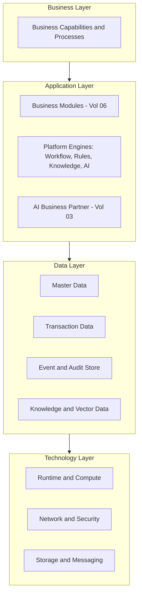

# Volume 08 - Enterprise Architecture

| Field | Value |
|---|---|
| Document ID | WORLD-VOL08-003 |
| Title | Enterprise Architecture |
| Version | 1.0 |
| Status | Approved |
| Classification | Internal |
| Founder | Mahesh Choudhary |

## Purpose

This chapter defines the enterprise architecture of WORLD across its four canonical layers: business, application, data, and technology. Where the system context (Chapter 02) fixed the boundary, this chapter opens the box and describes how WORLD is organized internally as a set of aligned layers. Its purpose is to give every stakeholder, from a module engineer to a platform architect, a single coherent model of how business capability is realized in software, data, and infrastructure.

## Scope

The chapter covers the business layer (capabilities and processes), the application layer (modules and engines), the data layer (the information the platform stewards), and the technology layer (the runtime foundation), plus the principle of layer alignment that binds them. It stays at the architectural level; concrete schemas, API specifications, and infrastructure blueprints are the subject of Volumes 09 through 12.

## Concept

Enterprise architecture is the practice of describing a system through layered viewpoints so that business intent and technical realization remain traceable to one another. The four-layer model, drawn from established enterprise-architecture practice, separates concerns without separating purpose: each layer serves the one above and is enabled by the one below. The discipline it enforces is *vertical traceability*, a business capability can be traced down to the applications that implement it, the data they steward, and the technology that runs them. WORLD applies this so that no capability exists without a clear home, and no component exists without a business reason.

## Application in WORLD

In WORLD the business layer is the set of enterprise capabilities defined by the Business Foundation and realized through Volume 06 modules. The application layer holds those modules, the four platform engines, and the AI Business Partner, which orchestrates across them. The data layer stewards master, transaction, event, and knowledge data as a governed asset. The technology layer provides compute, storage, messaging, network, and security. The AI Business Partner is deliberately positioned in the application layer with reach across all others, because its role is to observe data, invoke applications, and honor business intent.

## Key Components

| Layer | Contains | Realizes | Governed By |
|---|---|---|---|
| Business | Capabilities, processes, roles | Enterprise strategy and operating model | Volume 02, Volume 05 |
| Application | Modules, engines, AI Business Partner | Business capabilities as software | Volume 06, Volume 08 |
| Data | Master, transaction, event, knowledge data | Information as a durable asset | Volume 09 (Database) |
| Technology | Compute, storage, messaging, network, security | Reliable, secure runtime | Volumes 10 to 12 |

**Enterprise example:** Consider the capability *procure-to-pay*. In the business layer it is a governed process with buyer and approver roles. In the application layer it is realized by the Procurement, Inventory, and Finance modules coordinated by the Workflow and Rules engines, with the AI Business Partner recommending suppliers and flagging anomalies. In the data layer it stewards supplier master data, purchase-order transactions, and an immutable event trail. In the technology layer it runs on shared compute, a message bus for events, and encrypted storage. One capability, cleanly traceable through all four layers.

## Trade-offs & Considerations

Layering improves clarity and traceability but can tempt teams toward rigid, slow-changing stacks. WORLD keeps the layers logical rather than physical: a modular monolith may collapse several layers into one deployable unit for performance while preserving the conceptual separation. Strict top-down dependency is enforced, applications may depend on data and technology, but the technology layer must never encode business rules. The main consideration is discipline: cross-layer shortcuts erode traceability and are permitted only through a recorded decision.

## Relationship to Other Layers

This enterprise model frames every other Volume 08 chapter: architectural styles (Section B) shape the application layer, the platform engines (Section D) are its core, and the cross-cutting concerns (Section E) span all four layers. The AI Business Partner (Volume 03) lives in the application layer and reasons over the data layer. The ERP Foundation (Volume 05) supplies the business and data layer backbone, and the Business Modules (Volume 06) populate the application layer.

## Cross-References

- [System Context](/docs/blueprint/volume-08-architecture/section-a-architecture-foundations/02-system-context.md)
- [Domain Architecture](/docs/blueprint/volume-08-architecture/section-a-architecture-foundations/04-domain-architecture.md)
- [Volume 05 - ERP Foundation](/docs/blueprint/volume-05-erp-foundation/README.md)
- [Volume 06 - Business Modules](/docs/blueprint/volume-06-business-modules/README.md)

## References

- [Volume 01 - Vision and Philosophy](/docs/blueprint/volume-01-vision-and-philosophy/README.md)
- [Document Standards](/docs/governance/document-standards.md)

## Change Log

| Version | Date | Author | Notes |
|---|---|---|---|
| 1.0 | 2026-07-12 | Lead Software Engineer | Initial approved version. |
