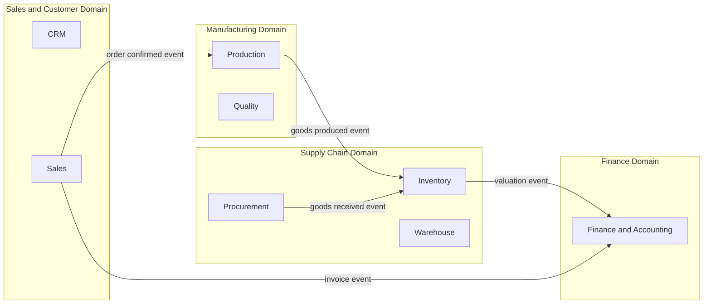

# Volume 08 - Domain Architecture

| Field | Value |
|---|---|
| Document ID | WORLD-VOL08-004 |
| Title | Domain Architecture |
| Version | 1.0 |
| Status | Approved |
| Classification | Internal |
| Founder | Mahesh Choudhary |

## Purpose

This chapter defines the domain architecture of WORLD: how the enterprise is decomposed into bounded contexts, each owning a coherent slice of business meaning, and how those contexts relate. Domain architecture is where the domain-centric principle (Chapter 01) becomes concrete structure. It ensures that the thirty-two Business Modules of Volume 06 and the domains of the ERP Foundation (Volume 05) are organized around business capability rather than technical convenience, giving the AI Business Partner a clean, well-bounded model to reason over.

## Scope

The chapter covers the identification of bounded contexts, their alignment to the Volume 05 and Volume 06 domains, the relationships and integration patterns between them, and the ubiquitous language that binds each. It applies Domain-Driven Design at the strategic level. Tactical patterns (aggregates, entities, repositories) are detailed in Section B, Chapter 07, and physical data ownership is specified in Volume 09.

## Concept

Domain-Driven Design (DDD) addresses complexity by aligning software structure with the structure of the business. Its central strategic tool is the *bounded context*: an explicit boundary within which a domain model and its ubiquitous language are consistent and unambiguous. The same word, *order*, may mean different things in Sales and in Production; bounded contexts let each hold its own precise meaning without collision. Contexts communicate through defined contracts and integration relationships rather than shared internals. This is the antidote to the tangled, big-ball-of-mud model that defeats large ERP systems, and it is essential for WORLD because clear boundaries are what make the platform observable and safely operable by AI.

## Application in WORLD

WORLD groups its bounded contexts into domain clusters that mirror the Volume 06 sections and rest on the ERP Foundation.

Each context owns its master data, transactions, rules, and events. Contexts integrate asynchronously through domain events, the event-driven principle, so that a confirmed sales order triggers production, production replenishes inventory, and inventory movements post value to finance, without any context reaching into another's internals. The AI Business Partner subscribes to these events across contexts to build its cross-domain understanding.

## Key Components

| Bounded Context | Core Responsibility | Aligned Modules (Vol 06) | Key Published Events |
|---|---|---|---|
| Supply Chain | Sourcing, stock, storage | Procurement, Inventory, Warehouse | Goods received, stock moved |
| Sales and Customer | Demand, orders, relationships | CRM, Sales, POS | Order confirmed, invoice raised |
| Manufacturing | Production and quality | Production, Manufacturing, Quality | Order released, goods produced |
| Finance | Accounting and settlement | Finance, Accounting, Banking | Journal posted, payment settled |
| Human Capital | Workforce and payroll | HR, Payroll, Attendance | Employee hired, payroll run |
| Platform Services | Orchestration and messaging | Workflow, Approvals, Notifications | Task routed, approval granted |

**Enterprise example:** A confirmed customer order in the Sales context publishes an *order confirmed* event. The Manufacturing context consumes it, plans and releases a production order, and on completion publishes *goods produced*, which the Supply Chain context consumes to increase inventory. The resulting valuation posts to the Finance context. No context queries another's database; each reacts to events within its own boundary and language. The AI Business Partner, observing all four event streams, detects that projected stock will breach the safety level and proposes an earlier production release, which a manager approves.

## Trade-offs & Considerations

Strong context boundaries add integration effort and can introduce eventual consistency, where finance sees a movement moments after inventory records it. WORLD accepts this in exchange for autonomy and auditability, reserving synchronous consistency for genuinely invariant operations. Boundaries must be drawn along business capability, not org charts; mis-drawn contexts create chatty coupling. A shared kernel of enterprise master data (organization, currency, calendar) from Volume 05 is deliberately common to all contexts to avoid duplication, and its ownership is governed centrally.

## Relationship to Other Layers

Domain architecture populates the application and data layers of the enterprise model (Chapter 03) with well-bounded units. It realizes the domain-centric and event-driven principles (Chapter 01) and provides the strategic frame that the Domain-Driven Design chapter (Chapter 07) implements tactically. It maps directly onto the ERP Foundation domains (Volume 05) and the Business Modules (Volume 06), and it gives the AI Business Partner (Volume 03) a clean, contextual model of the enterprise to reason and act upon.

## Cross-References

- [Architecture Principles](/docs/blueprint/volume-08-architecture/section-a-architecture-foundations/01-architecture-principles.md)
- [Enterprise Architecture](/docs/blueprint/volume-08-architecture/section-a-architecture-foundations/03-enterprise-architecture.md)
- [Volume 05 - ERP Foundation](/docs/blueprint/volume-05-erp-foundation/README.md)
- [Volume 06 - Business Modules](/docs/blueprint/volume-06-business-modules/README.md)

## References

- [Volume 01 - Vision and Philosophy](/docs/blueprint/volume-01-vision-and-philosophy/README.md)
- [Document Standards](/docs/governance/document-standards.md)

## Change Log

| Version | Date | Author | Notes |
|---|---|---|---|
| 1.0 | 2026-07-12 | Lead Software Engineer | Initial approved version. |
